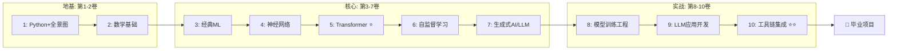

# AI/ML 技术百科全书 — 体系设计规范

> **项目**: love-story (青书)
> **创建日期**: 2026-06-01
> **状态**: 设计已批准，待创建实施计划

---

## TL;DR

在 love-story 项目中创建一套从零基础到 AI 工具链集成的 **10卷渐进式学习体系**，覆盖数学基础 → 经典 ML → 神经网络 → Transformer → 自监督学习 → 生成式 AI → 模型训练工程 → LLM 应用开发 → 工具链集成的完整链路。

---

## 一、核心设计原则

### 1.1 学习路径设计原则

- **渐进式**: 每一步回答"为什么需要下一步"，形成自然的动机链
- **按需数学**: 数学只在需要的时候引入，不提前堆砌
- **先理解后实践**: 先建立直觉和理论理解，再动手写代码
- **可验证里程碑**: 每卷结束有可自检的能力点

### 1.2 内容质量规范

| 要求 | 标准 |
|:---|:---|
| **理论准确性** | ⭐ 所有经典理论概念必须经过原始论文或权威教科书验证 |
| **代码正确性** | ⭐ 所有代码必须可真实运行，不可有伪代码或幻觉 API |
| **术语规范** | 关键术语首次出现标注英文原文，后续统一使用 |
| **引用溯源** | 重要理论/公式标注来源 |
| **版本追踪** | 依赖库标注版本号 |

### 1.3 语言规范

- **正文语言**: 中文为主体
- **术语处理**: 首次出现标注英文；难以翻译的外文论述以英文为主、中文注释辅助
- **代码/公式**: 英文原始符号
- **通用保留**: transformer、self-attention 等学界通用英文术语直接用英文

### 1.4 质量保障流程

每章写作流程：

```
┌──────────┐    ┌──────────────┐    ┌──────────┐    ┌──────────┐
│ 撰写初稿  │───→│ Oracle 校对  │───→│ 修复问题  │───→│ 最终定稿  │
│           │    │ (事实核查)   │    │ (修正)    │    │ (入库)    │
└──────────┘    └──────────────┘    └──────────┘    └──────────┘
                      │
                      ↓ 发现问题
                ┌──────────────┐
                │ ERR: 事实错误  │
                │ AMB: 表述模糊  │
                │ REF: 引用缺失  │
                │ CODE: 代码问题  │
                └──────────────┘
```

---

## 二、范围定义

### IN（本体系包含）
- 10卷渐进式学习体系，从数学基础到 AI 工具链集成
- 所有核心概念的数学推导和直觉解释
- 每章配套的可运行 Python 代码
- 架构图/流程图/公式（Mermaid + LaTeX）
- 每章经过 Oracle 事实校对 + Momus 对抗式审查

### OUT（本体系不包含）
- **硬件/GPU编程**: CUDA、cuDNN、TensorRT 底层优化（如有涉及在代码注释中说明即可）
- **非 Python 框架**: TensorFlow（仅对比时提及）、Java ML、R、Julia 等
- **生产级 MLOps**: Kubernetes 部署、CI/CD、模型监控、A/B 测试平台
- **特定云平台教程**: AWS SageMaker、GCP Vertex AI、阿里云 PAI 等
- **商业产品评测**: 各类 AI 产品的横向对比评测
- **低代码/无代码 AI 平台**: 不需代码的平台不在讨论范围
- **非 Transformer 架构的全面覆盖**: Mamba/RWKV/xLSTM 等作为补充阅读，不单独成章
- **数学完整教科书**: 不按数学系标准覆盖全部证明，只覆盖 ML 需要的部分

### 学习路径（已确认）



---

## 三、体系结构（10卷30+章）

### 目录结构

```
ai/
├── 00-README.md                  ← 总入口 + 学习路径图
├── 01-overview/                  ← 第一卷
│   ├── 00-index.md               ← 卷索引
│   ├── 01-intro-to-ai-world.md
│   ├── 02-python-quickstart.md
│   ├── 03-numpy-and-linalg.md
│   ├── 04-visualization.md
│   ├── 05-first-ml-pipeline.py
│   └── code/
│
├── 02-mathematics/
│   ├── 00-index.md
│   ├── 01-linear-algebra.md
│   ├── 02-probability.md
│   ├── 03-calculus-and-optimization.md
│   ├── 04-information-theory.md
│   └── 05-statistics-basics.md
│
├── 03-classical-ml/
│   ├── 00-index.md
│   ├── 01-linear-models.md
│   ├── 02-model-evaluation.md
│   ├── 03-tree-and-ensemble.md
│   ├── 04-svm-and-kernel.md
│   ├── 05-unsupervised-learning.md
│   └── 06-ml-project-template.py
│
├── 04-neural-networks/
│   ├── 00-index.md
│   ├── 01-perceptron-and-mlp.md
│   ├── 02-backpropagation.md
│   ├── 03-training-techniques.md
│   ├── 04-convolutional-networks.md
│   └── 05-rnn-and-sequence.md
│
├── 05-transformer/
│   ├── 00-index.md
│   ├── 01-attention-mechanism.md
│   ├── 02-transformer-architecture.md
│   ├── 03-variants-evolution.md
│   └── 04-implement-transformer.py
│
├── 06-self-supervised/
│   ├── 00-index.md
│   ├── 01-pretraining-paradigm.md
│   ├── 02-contrastive-learning.md
│   ├── 03-masked-modeling.md
│   ├── 04-autoregressive-modeling.md
│   └── 05-pretrain-finetune.py
│
├── 07-generative-ai/
│   ├── 00-index.md
│   ├── 01-vae.md
│   ├── 02-gan.md
│   ├── 03-diffusion-models.md
│   ├── 04-large-language-models.md
│   └── 05-lora-and-finetuning.md
│
├── 08-model-training/
│   ├── 00-index.md
│   ├── 01-pytorch-deep-dive.md
│   ├── 02-training-loop-mastery.md
│   ├── 03-distributed-training.md
│   ├── 04-data-pipeline.md
│   ├── 05-deployment-basics.md
│   └── 06-python-ml-ecosystem.md
│
├── 09-llm-application/
│   ├── 00-index.md
│   ├── 01-prompt-engineering.md
│   ├── 02-rag.md
│   ├── 03-tool-calling.md
│   ├── 04-agent-systems.md
│   └── 05-evaluation-and-monitoring.md
│
└── 10-toolchain-integration/
    ├── 00-index.md
    ├── 01-ai-coding-assistants.md
    ├── 02-agent-harness-deep-dive.md
    ├── 03-mcp-and-tools.md
    ├── 04-skill-and-prompt-system.md
    ├── 05-build-your-own-tool.md
    └── 06-conclusion-and-roadmap.md
```

---

## 三、学习路径总图


---

## 四、写作流程与质量门禁

### 每章流程
1. 基于权威来源撰写初稿
2. 代码在本地环境运行验证
3. **Oracle 文本校对**（事实核查）
4. 修复 ERR（必须）/ AMB（建议）
5. 重新提交 Oracle → 直到 PASS
6. 定稿入库

### 质量门禁
| 门禁 | 标准 |
|:---|:---|
| G1 概念准确性 | Oracle 确认零事实错误 |
| G2 代码可运行 | 脚本无报错执行 |
| G3 数学推导 | 无跳跃步骤 |
| G4 引用完整 | 有具体引用来源 |
| G5 前后一致 | 术语/符号统一 |
