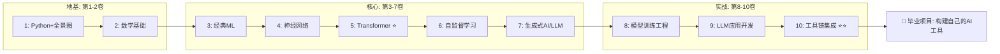

# AI/ML 技术百科全书 — 从零基础到工具链集成的完整学习路径

> 本百科是 **Cache** 项目的一部分，所有内容存储在 `/ai/` 目录下。
> 这是一条从零基础起步，逐步深入到 AI 工具链集成的系统性学习路线。无论你是刚接触 AI 的新人，还是希望夯实基础的开发者，都可以从这里找到属于自己的节奏。

---

## 学习路径总览

下图展示了 10 卷内容的结构与依赖关系。**自底向上**阅读，每一卷都建立在前一卷的基础上。



---

## 卷索引表

| 卷 | 名称 | 章节数 | 难度 | 前置依赖 |
|:---|:---|:---:|:---:|:---|
| 1 | AI全景图+Python | 5 | ⭐ | 无(起点) |
| 2 | 数学基础 | 5 | ⭐⭐ | 卷1 |
| 3 | 经典机器学习 | 6 | ⭐⭐⭐ | 卷2 |
| 4 | 神经网络 | 5 | ⭐⭐⭐ | 卷2+3 |
| 5 | Transformer（/trænsˈfɔːrmər/） | 4 | ⭐⭐⭐⭐ | 卷4 |
| 6 | 自监督学习 | 5 | ⭐⭐⭐⭐ | 卷5 |
| 7 | 生成式AI/LLM | 5 | ⭐⭐⭐⭐⭐ | 卷5+6 |
| 8 | 模型训练工程 | 6 | ⭐⭐⭐⭐ | 卷4+7 |
| 9 | LLM应用开发 | 5 | ⭐⭐⭐ | 卷7 |
| 10 | 工具链集成 | 6 | ⭐⭐⭐⭐ | 卷9 |

---

## 如何使用本百科

### 阅读顺序

路径是**自底向上**的。从卷 1 开始，循序渐进。每一卷都假设你已经掌握了前置依赖中的内容。

### 目录结构

```
ai/
├── 00-README.md          ← 你在这里
├── requirements.txt      ← 全局 Python 依赖
├── 01-overview/          ← 卷1: AI全景图+Python
│   ├── 00-index.md       ← 本卷学习目标
│   ├── chapter-01/
│   ├── ...
│   └── code/             ← 可运行的 Python 脚本
├── 02-mathematics/       ← 卷2: 数学基础
├── 03-classical-ml/      ← 卷3: 经典机器学习
├── 04-neural-networks/   ← 卷4: 神经网络
├── 05-transformer/       ← 卷5: Transformer
├── 06-self-supervised/   ← 卷6: 自监督学习
├── 07-generative-ai/     ← 卷7: 生成式AI/LLM
├── 08-model-training/    ← 卷8: 模型训练工程
├── 09-llm-application/   ← 卷9: LLM应用开发
└── 10-toolchain-integration/  ← 卷10: 工具链集成
```

- 每卷的 `00-index.md` 包含该卷的学习目标、章节概览和前置知识清单。
- 每章的 `code/` 目录包含可独立运行的 Python 脚本，配套该章讲解。
- 运行任何代码前，请先安装依赖：

```bash
pip install -r ai/requirements.txt
```

---

## 编写规范

### 语言

- **中英双语**：正文以中文为主，关键术语首次出现时标注英文。
- 示例：`注意力机制（Attention Mechanism）`、`残差连接（Residual Connection）`、`自监督学习（Self-Supervised Learning）`
- 学界通用的英文术语直接使用原文：`Transformer`、`Attention is All You Need`、`GPT`、`BERT`

### 数学公式

- 使用 LaTeX 语法，行内公式用 `$...$`，独立公式用 `$$...$$`。

### 代码

- 使用 Python 3.11+。
- 每个可运行脚本应在文件头注明依赖的第三方库。
- 代码风格遵循 PEP 8。

### 内容标准

- **教科书风格**：概念讲解清晰，辅以数学推导和代码实现。
- **可验证**：所有代码和结论经过验证（内部流程：Oracle 审核（kernel /ˈkɜːrnl/） + Momus 校验）。
- **适度深度**：对关键算法给出推导过程，不跳过数学细节。

---

## 关于这个项目

**Cache** 是一个个人知识库项目。本 AI/ML 百科是其最新的组成部分，目标是构建一份从零到一的 AI 技术参考。如果你发现了错误或有改进建议，欢迎贡献。

> 千里之行，始于足下。从卷 1 开始吧。
