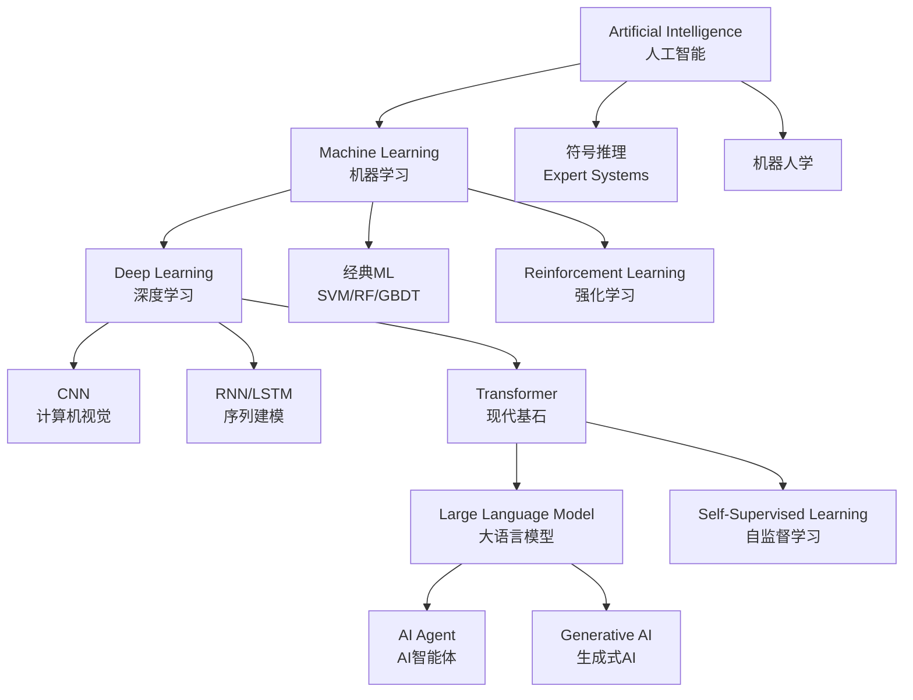
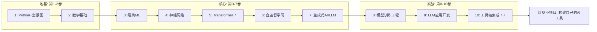

# 第1章：AI 世界全景图

> 欢迎来到 AI 世界。无论你是刚毕业的学生、转行的开发者，还是想补全知识短板的工程师——这一章都属于你。我们不谈复杂公式，只画一张地图，让你知道这片大陆上有什么，它们怎么来的，以及你可以从哪里入手。

---

## 1.1 一张图看懂 AI 世界

先看全貌。所有概念都从这里生长出来：

光看图可能还有点懵，没关系。下面我们一个一个拆开讲。

---

## 1.2 AI / ML / DL / GenAI / Agent 概念辨析

这五个词经常被混用，但它们其实是层层包含的关系。

### 什么是 Artificial Intelligence（人工智能）？

**AI** 是最大的概念，指让机器表现出像人类一样的智能行为。1956 年达特茅斯会议上，这个术语被正式提出。从那以后，AI 经历了两轮寒冬和三轮热潮，到今天才走到我们面前。

AI 的目标很广：下棋（1997 年 DeepBlue 击败国际象棋冠军）、识图（给照片打标签）、开车（特斯拉的 Autopilot）、聊天（ChatGPT），这些都算 AI。

> **一句话**：任何让机器"看起来像人一样聪明"的技术，都可以叫 AI。

### 什么是 Machine Learning（机器学习）？

**Machine Learning** 是 AI 的一个子集。传统编程是你写规则，机器执行。机器学习反过来了——你给机器大量例子，让它自己总结规则。

举个例子：你要识别猫的照片。

- 传统编程：你写"如果图片有尖耳朵、胡须、长尾巴，就是猫"。但现实中猫有各种姿势、光线、遮挡，规则写不完。
- 机器学习：你给它 10 万张标好"猫"或"非猫"的图片，它自己学会猫长什么样。

常见的机器学习方法包括 **支持向量机（Support Vector Machine, SVM）**、**随机（stochastic /stəˈkæstɪk/）森林（Random Forest, RF）**、**梯度（gradient /ˈɡreɪdiənt/）提升树（Gradient Boosting Decision Tree, GBDT）** 等。

### 什么是 Deep Learning（深度学习）？

**Deep Learning** 是机器学习的一个子集。它的核（kernel /ˈkɜːrnl/）心是"神经网络（Neural Network）"——一种模仿大脑神经元连接方式的计算结构。当神经网络的层数很多时（比如几十层甚至上百层），我们就叫它"深度"学习。

深度学习在三个领域掀翻了之前的所有方法：

- **计算机视觉（Computer Vision）**：用 **卷积（convolution /ˌkɒnvəˈluːʃən/）神经网络（Convolutional Neural Network, CNN）** 识别图片
- **序列建模（Sequence Modeling）**：用 **RNN（Recurrent Neural Network）/ LSTM（Long Short-Term Memory）** 处理语音、文本等序列数据
- **现代基石——Transformer（/trænsˈfɔːrmər/）**：2017 年 Google 提出 **Transformer** 架构，它用 **自注意力（attention /əˈtenʃən/）机制（Self-Attention Mechanism）** 彻底取代了 RNN，成为今天几乎所有大模型的基础

### 什么是 Generative AI（生成式 AI）？

**GenAI** 是深度学习发展到一定阶段的产物。以前的 AI 更多是"识别"和"分类（classification /ˌklæsɪfɪˈkeɪʃən/）"——这张图是猫还是狗、这段文字是正面还是负面情绪。而生成式 AI 能创造新内容：

- **文本生成**：ChatGPT、Claude（基于 **大语言模型（Large Language Model, LLM）** + **基于人类反馈的强化（reinforcement /ˌriːɪnˈfɔːrsmənt/）学习（Reinforcement Learning from Human Feedback, RLHF）**）
- **图像生成**：Midjourney、Stable Diffusion（/dɪˈfjuːʒən/）（基于 **扩散模型（Diffusion Model）**）
- **代码生成**：GitHub Copilot、Cursor
- **视频生成**：Sora、Runway Gen-2

GenAI 的核心能力是"理解了分布之后，从中采样"——它学会了真实数据的统计规律，然后能产生符合这些规律的新样本。

### 什么是 AI Agent（AI 智能体）？

**AI Agent（/ˈeɪdʒənt/）** 是 2023 年以后最热门的方向。一个 Agent 不只是"生成文字"，而是一个能**自主行动**的系统：

1. 它有一个 **LLM** 作为"大脑"
2. 它可以**使用工具（Tool Use）**——比如调用搜索引擎、执行 Python 代码、操作数据库
3. 它可以**规划（Planning）**——把一个复杂任务拆成多个步骤
4. 它可以**记忆（Memory）**——记住之前的对话和操作结果

> **对比一下**：ChatGPT 是 GenAI，它回答你的问题。一个 Agent 是"帮你去查天气、订机票、整理行程单"，中间每一步它自己调用工具、自己决定下一步做什么。

### 对比一览

| 概念 | 范围 | 典型例子 | 常用技术 | 什么时候用 |
|:---|:---|:---|:---|:---|
| **AI** | 最广 | 下棋程序、专家系统、自动驾驶 | 各种方法 | 任何需要"智能"的场景 |
| **ML** | AI 的子集 | 垃圾邮件过滤、推荐系统 | SVM、随机森林、线性回归（regression /rɪˈɡreʃən/） | 有大量数据、规则难以手工编写时 |
| **DL** | ML 的子集 | 人脸识别、语音识别 | CNN、RNN、Transformer | 数据量极大、传统 ML 效果不够好时 |
| **GenAI** | DL 的产物 | ChatGPT、Midjourney | 大语言模型、扩散模型 | 需要创造新内容、而非只是分类时 |
| **Agent** | 基于 LLM 的系统 | AutoGPT、Manus | LLM + 工具调用 + 规划 | 需要自动完成多步骤任务时 |

---

## 1.3 这个领域的三个关键转折点

### 转折点一：2012 — CNN 带来视觉革命

2012 年，AlexNet 在 ImageNet 图像识别比赛上将错误率从 26% 直接降到 15%。深度学习从此爆发。**GPU（图形处理器）** 的大规模使用让训练深层网络成为可能。

### 转折点二：2017 — Transformer 改变一切

Google 发表论文 *Attention Is All You Need*，提出 Transformer 架构。它用自注意力机制代替了 RNN，让模型可以并行处理整个序列，而且能捕捉远距离的依赖关系。

今天你听说的 GPT、BERT、LLaMA、Claude，底层全是 Transformer。没有 Transformer，就没有今天的 AI 热潮。

### 转折点三：2022 — ChatGPT 进入大众视野

GPT-3.5 配上 RLHF，让 AI 第一次对普通人来说"真的有用"。两个月用户破亿，成为历史上增长最快的应用。从此，AI 不再是实验室里的玩具，而是人人可用的工具。

---

## 1.4 学习路径总地图

本百科共 10 卷，呈**自底向上**的结构。每一卷都建立在前一卷的基础上。

- **第 1 卷（本卷）**：给你全景图，同时带你掌握 Python 基础。这是起点，不需要任何前置知识。
- **第 2 卷**：数学基础——线性代数、概率统计、微积分。不追求数学专业的深度，但求够用。
- **第 3-7 卷**：核心算法路线——从经典 ML 到神经网络，再到 Transformer、自监督学习，最后到生成式 AI 和 LLM。这是最硬核的部分，也是价值最高的部分。
- **第 8-10 卷**：工程实战——怎么训练模型、怎么开发 LLM 应用、怎么搭建完整的工具链。

读完全部 10 卷，你会具备从零构建一个 AI 工具的能力。

---

## 1.5 不同角色的学习策略

### 如果你是初学者（零基础）

从第 1 卷第 1 章开始，按顺序往下读。别跳。这个路径是精心设计的——每一卷都用前一卷的知识。跳过数学基础直接看 Transformer，你会发现到处都是看不懂的符号。

建议节奏：每周 3-5 章，配合每章的代码练习。第 1 卷的 Python 部分如果已经会了，可以快速掠过。

### 如果你是有经验的开发者

你可以用目录索引跳跃式阅读：

- 已经会 Python？直接从第 2 卷第 2 章（数学速览）开始
- 懂基础 ML？跳到第 4 卷（神经网络）
- 已经在用 LLM API？第 9 卷（LLM 应用开发）和第 10 卷（工具链集成）最贴近你的工作

但建议至少通读第 5 卷（Transformer）和第 6 卷（自监督学习）——这两个是理解现代 AI 的关键。

### 如果你是在职的 AI 从业者

第 8 卷起的工程内容最实用：

- 第 8 卷：模型训练工程——数据准备、分布式训练、评估、部署
- 第 9 卷：LLM 应用开发——Prompt Engineering、RAG（检索增强生成）、Fine-tuning
- 第 10 卷：工具链集成——LangChain、向量数据库、Agent 框架

但如果发现某个下游问题根源于底层原理（比如为什么 Agent 的规划总是出错），别忘了回头翻第 5-7 卷。

---

## 1.6 写在前面的话

AI 领域变化极快。今天的新技术，明天可能就过时了。但这个百科试图教你的是那些**不随时间变化的东西**——数学原理、算法思想、工程方法论。

理解了自注意力机制，不管明天冒出来什么新架构，你都能看懂它跟 Transformer 的异同。理解了 RLHF 的原理，不管后天哪个新模型出来，你都能判断它的对齐方式有没有问题。

> 知其然，更知其所以然。这是我们写这个百科的初衷。

准备好了？从下一章开始，我们动手写 Python。

---

*下一章：[02-python-basics](./02-python-basics/01-intro-to-python.md) —— Python 基础速览*
