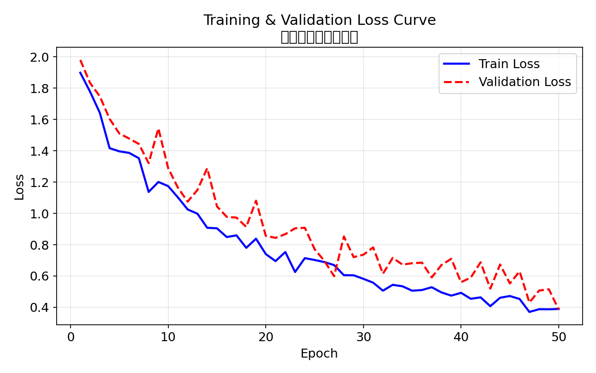
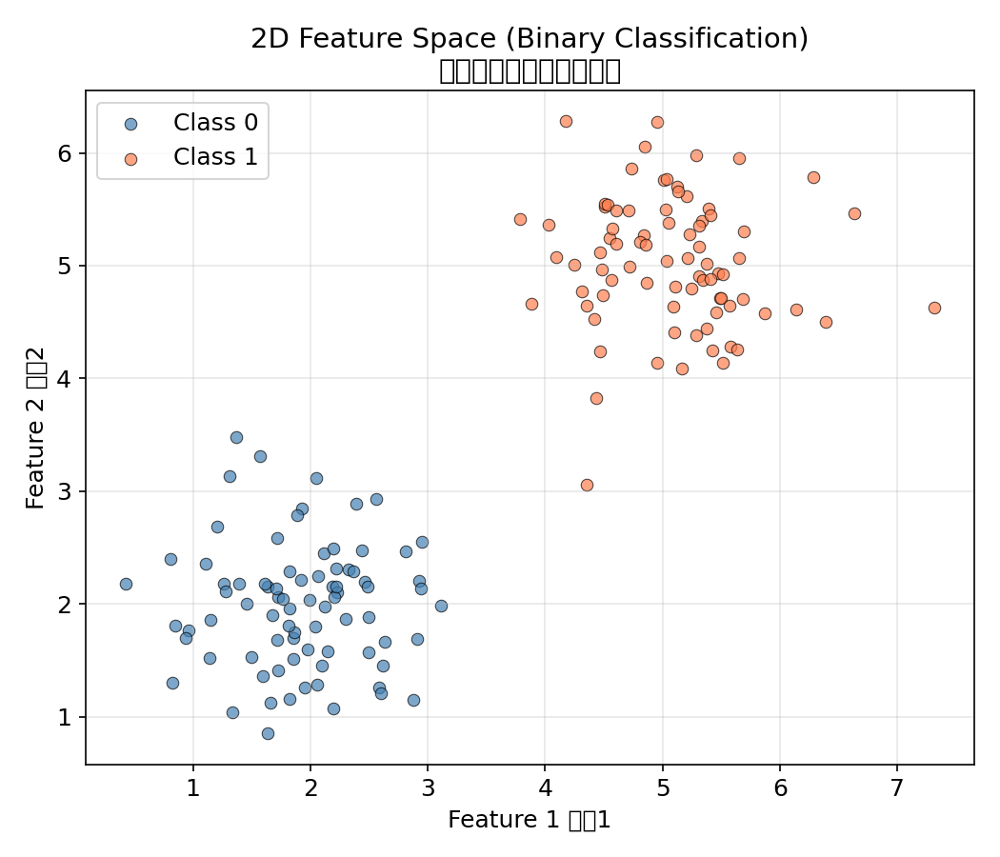
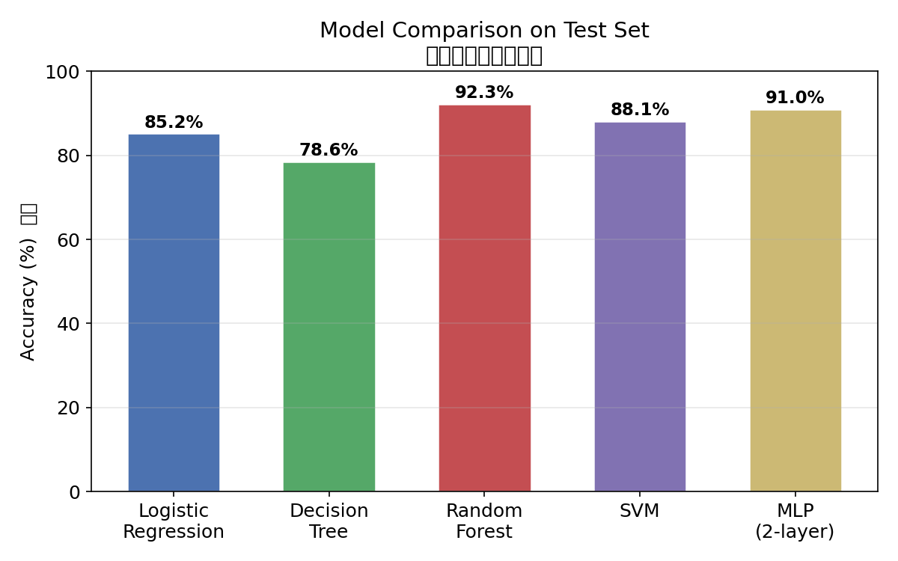
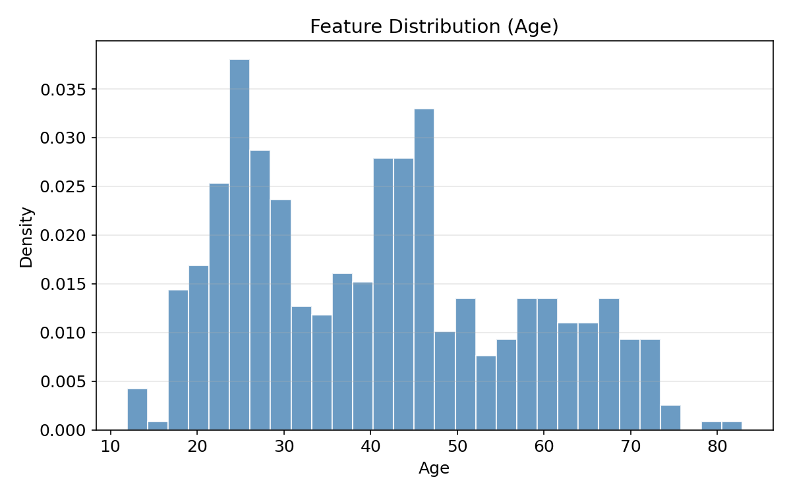
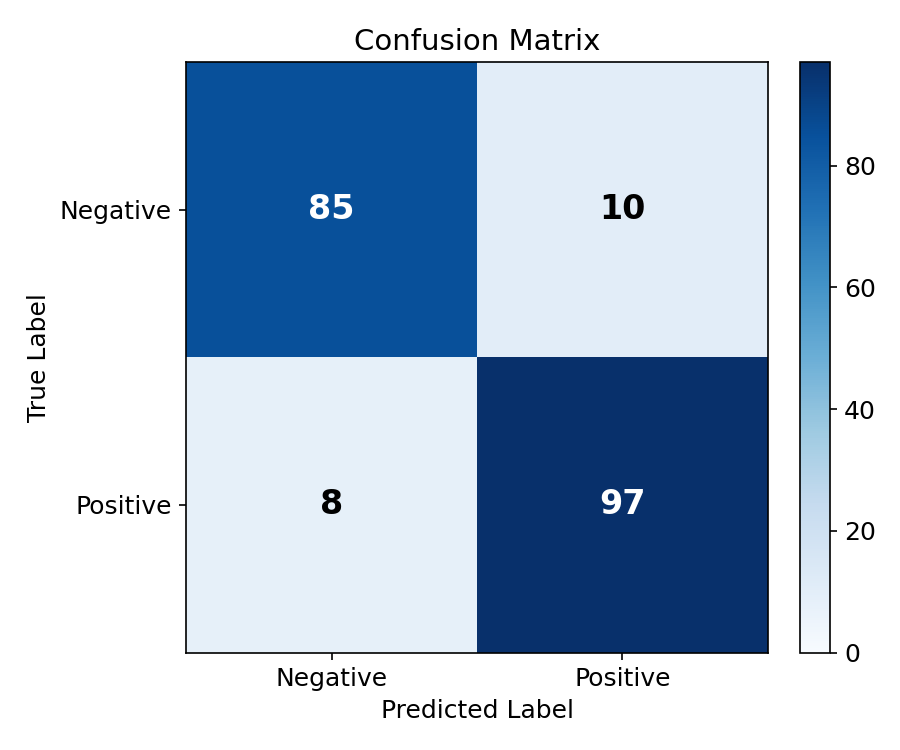
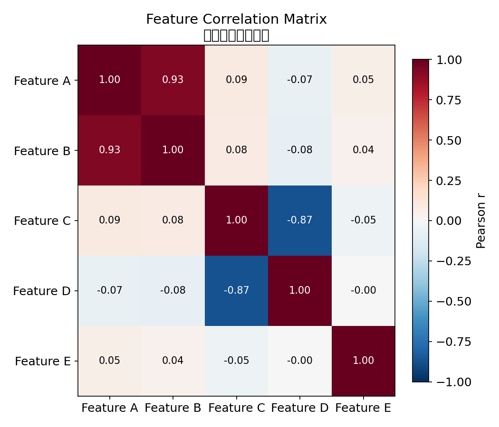
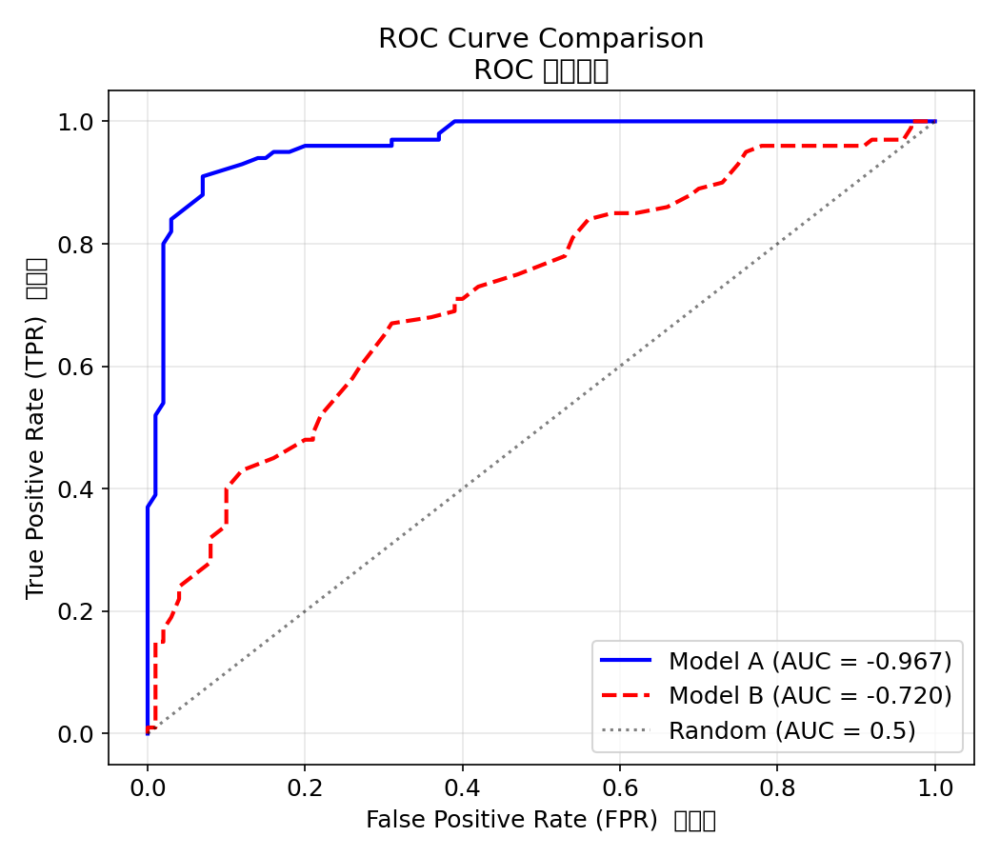
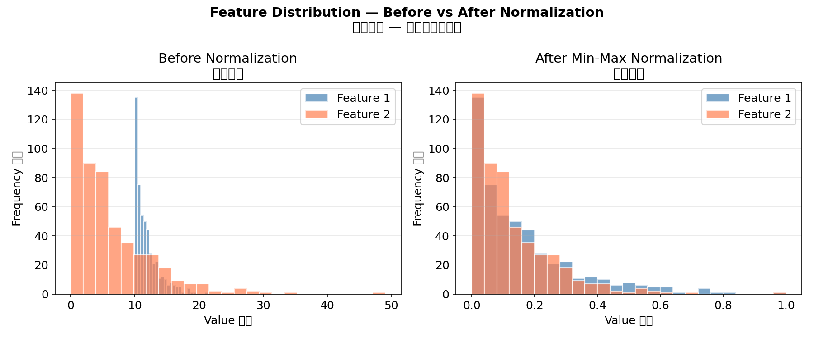

# 04 — 数据可视化基础（Data Visualization for Machine Learning）

> "一图胜千言"——在机器学习中，可视化是理解数据、诊断模型、沟通结果的核（kernel /ˈkɜːrnl/）心技能。本章以 **Matplotlib** 为主线，覆盖 ML 全流程中的高频图表类型和实用技巧。
>
> "A picture is worth a thousand words" — In ML, visualization is essential for understanding data, diagnosing models, and communicating results. This chapter covers Matplotlib's core API and ML-focused chart types.

配套代码（Companion code）：[code/visualization_demo.py](./code/visualization_demo.py)

```bash
# 运行生成所有图表（Run to generate all plots）
python ai/01-overview/code/visualization_demo.py
```

---

## 1. Matplotlib 哲学（Philosophy）

Matplotlib 有两个核心对象：

| 对象 | 含义 | 类比 |
|:---|:---|:---|
| **Figure** | 整个画布（Canvas） | 一张白纸 |
| **Axes** | 画布上的一个子图（Subplot） | 纸上的一块绘图区域 |

```python
import matplotlib.pyplot as plt
import numpy as np

# 核心模式：先创建 Figure + Axes，再在 Axes 上绘制
fig, ax = plt.subplots(figsize=(8, 5))  # 一个 Axes
fig, axes = plt.subplots(2, 3)          # 2×3 网格，axes.shape = (2, 3)
```

> **黄金法则**：所有绘图操作都在 `ax` 上完成（OO-style），而非 `plt`（Pyplot-style）。
> OO-style 更清晰、更灵活，适合复杂布局。

---

## 2. 核心 API（Core API）

### 2.1 Figure 与 Subplots

```python
# 单图
fig, ax = plt.subplots(figsize=(8, 5))

# 多子图
fig, axes = plt.subplots(2, 2, figsize=(10, 8))
ax1, ax2, ax3, ax4 = axes.ravel()  # 展平为 1D 数组

# 共享坐标轴
fig, (ax1, ax2) = plt.subplots(1, 2, sharey=True)
```

`subplots` 返回 `(Figure, Axes)` 元组。`figsize=(width, height)` 单位是英寸。

### 2.2 线形、颜色与标记（Line Styles, Colors & Markers）

```python
ax.plot(x, y,
        color="blue",        # 颜色：'blue', '#1f77b4', (0.1, 0.2, 0.5)
        linestyle="--",      # 线形：'-'(实线), '--'(虚线), ':'(点线), '-.'(点划线)
        linewidth=2,         # 线宽
        marker="o",          # 标记：'o'(圆), 's'(方), '^'(三角), 'x'(叉)
        markersize=6,        # 标记大小
        alpha=0.8,           # 透明度
        label="Train Loss")  # 图例标签
```

快捷方式：`fmt = "[color][marker][line]"`，例如 `"bo--"` = 蓝色圆点虚线。

### 2.3 标签、标题、图例与网格

```python
ax.set_xlabel("Epoch")           # X 轴标签
ax.set_ylabel("Loss")            # Y 轴标签
ax.set_title("Training Curve")   # 标题
ax.legend()                      # 显示图例（需要 plot 时指定 label）
ax.grid(True, alpha=0.3)         # 网格线
ax.set_xlim(0, 100)              # X 轴范围
```

### 2.4 保存图片

```python
fig.savefig("output.png",
            dpi=150,             # 分辨率（dots per inch）
            bbox_inches="tight", # 裁剪空白
            facecolor="white")   # 背景色（默认透明）
```

| 参数（parameter /pəˈræmɪtər/） | 作用 |
|:---|:---|
| `dpi` | 输出分辨率，印刷级 ≥300，屏幕用 150 |
| `bbox_inches="tight"` | 自动裁剪周围空白区域 |
| `transparent=True` | 透明背景（适合嵌入（embedding /ɪmˈbedɪŋ/）演示文稿） |

---

## 3. 常用图表类型（Common Chart Types）

### 3.1 折线图（Line Plot）— 训练曲线

折线图最适合展示**连续变化趋势**。ML 中最经典的场景就是绘制训练/验证损失曲线。

```python
epochs = np.arange(1, 51)
train_loss = 2.0 / (1 + 0.08 * epochs) + 0.05 * np.random.randn(50)
val_loss   = 2.0 / (1 + 0.06 * epochs) + 0.08 * np.random.randn(50)

fig, ax = plt.subplots(figsize=(8, 5))
ax.plot(epochs, train_loss, "b-", linewidth=2, label="Train Loss")
ax.plot(epochs, val_loss, "r--", linewidth=2, label="Validation Loss")
ax.set_xlabel("Epoch"); ax.set_ylabel("Loss")
ax.set_title("Training & Validation Loss Curve")
ax.legend(); ax.grid(True, alpha=0.3)
fig.savefig("line_curve.png", dpi=150, bbox_inches="tight")
```



> **诊断要点**：
> - 两条曲线差距大 → **过拟合（overfitting /ˈoʊvərˈfɪtɪŋ/）**（Overfitting）
> - 验证集不再下降 → **早停**（Early Stopping）
> - 损失震荡剧烈 → **学习率过大**（Learning rate too high）

### 3.2 散点图（Scatter Plot）— 特征分布

散点图展示两个特征之间的关系，常用于分类（classification /ˌklæsɪfɪˈkeɪʃən/）问题的数据探索。

```python
fig, ax = plt.subplots(figsize=(7, 6))
ax.scatter(x0, y0, c="steelblue", label="Class 0", alpha=0.7, edgecolors="k")
ax.scatter(x1, y1, c="coral",     label="Class 1", alpha=0.7, edgecolors="k")
ax.set_xlabel("Feature 1"); ax.set_ylabel("Feature 2")
ax.set_title("2D Feature Space (Binary Classification)")
ax.legend(); ax.grid(True, alpha=0.3)
```



> 散点图可以快速判断：类别是否线性可分？是否存在异常点？特征是否需归一化（normalization /ˌnɔːrmələˈzeɪʃən/）？

### 3.3 条形图（Bar Chart）— 模型对比

条形图适合**离散类别间的数值比较**，如模型精度对比。

```python
models = ["Logistic\nRegression", "Decision\nTree", "Random\nForest", "SVM", "MLP"]
accuracies = [85.2, 78.6, 92.3, 88.1, 91.0]
colors = ["#4C72B0", "#55A868", "#C44E52", "#8172B2", "#CCB974"]

fig, ax = plt.subplots(figsize=(8, 5))
bars = ax.bar(models, accuracies, color=colors, width=0.6)
for bar, acc in zip(bars, accuracies):
    ax.text(bar.get_x() + bar.get_width()/2, bar.get_height() + 0.5,
            f"{acc}%", ha="center", va="bottom", fontweight="bold")
ax.set_ylabel("Accuracy (%)"); ax.set_title("Model Comparison")
ax.set_ylim(0, 100); ax.grid(axis="y", alpha=0.3)
```



### 3.4 直方图（Histogram）— 特征值分布

直方图展示单个特征的数值分布形态。

```python
fig, ax = plt.subplots(figsize=(8, 5))
ax.hist(age, bins=30, color="steelblue", edgecolor="white", alpha=0.8, density=True)
ax.set_xlabel("Age"); ax.set_ylabel("Density")
ax.set_title("Feature Distribution (Age)")
```



> 直方图揭示：数据是否偏斜（Skewed）？是否存在多峰（Multimodal）？是否需对数变换？

### 3.5 热力图（Heatmap）— 混淆矩阵 & 相关矩阵

热力图用颜色编码矩阵数值，ML 中最常用在**混淆矩阵**和**相关系数矩阵**。

```python
# 混淆矩阵
cm = np.array([[85, 10], [8, 97]])
fig, ax = plt.subplots(figsize=(6, 5))
im = ax.imshow(cm, cmap="Blues", aspect="auto")
for i in range(2):
    for j in range(2):
        ax.text(j, i, str(cm[i, j]), ha="center", va="center", fontsize=16)
fig.colorbar(im, ax=ax)
```



```python
# 相关系数矩阵
cov = np.corrcoef(data.T)  # Pearson 相关系数
fig, ax = plt.subplots(figsize=(7, 6))
im = ax.imshow(cov, cmap="RdBu_r", vmin=-1, vmax=1)
for i in range(k):
    for j in range(k):
        ax.text(j, i, f"{cov[i, j]:.2f}", ha="center", va="center")
fig.colorbar(im, ax=ax, label="Pearson r")
```



| 色彩映射（Colormap） | 适用场景 |
|:---|:---|
| `Blues` / `Purples` | 渐变数值（如混淆矩阵计数） |
| `RdBu_r` | 正负对称（如相关系数 -1 ~ +1） |
| `viridis` / `plasma` | 感知均匀，通用首选 |
| `hot` / `coolwarm` | 温差效果，适合强调极端值 |

---

## 4. ML 专用可视化（ML-Specific Visualizations）

### 4.1 ROC 曲线与 AUC

**ROC 曲线**（Receiver Operating Characteristic）从左上到右下绘制**真正率（TPR）** vs **假正率（FPR）**，对角线对应随机（stochastic /stəˈkæstɪk/）猜测（AUC = 0.5）。**AUC**（Area Under the Curve）衡量模型区分正负类的能力。

| AUC 范围 | 含义 |
|:---|:---|
| 0.9 ~ 1.0 | 优秀（Excellent） |
| 0.8 ~ 0.9 | 良好（Good） |
| 0.7 ~ 0.8 | 一般（Fair） |
| 0.5 ~ 0.7 | 较差（Poor） |

```python
fig, ax = plt.subplots(figsize=(7, 6))
ax.plot(fpr1, tpr1, "b-", linewidth=2, label=f"Model A (AUC = {auc1:.3f})")
ax.plot(fpr2, tpr2, "r--", linewidth=2, label=f"Model B (AUC = {auc2:.3f})")
ax.plot([0, 1], [0, 1], "k:", alpha=0.5, label="Random (AUC = 0.5)")
ax.set_xlabel("False Positive Rate (FPR)"); ax.set_ylabel("True Positive Rate (TPR)")
ax.set_title("ROC Curve Comparison"); ax.legend(loc="lower right"); ax.grid(True, alpha=0.3)
```



> **解读**：曲线越贴近左上角，模型性能越好。当 AUC = 1.0 时模型完美，AUC = 0.5 时等于随机猜测。

### 4.2 归一化前后对比

特征归一化（Feature Normalization）是 ML 数据预处理的关键步骤。Min-Max 归一化将数据缩放到 [0, 1] 区间：

```python
raw = np.random.exponential(scale=2, size=(500, 2))
normed = (raw - raw.min(axis=0)) / (raw.max(axis=0) - raw.min(axis=0))

fig, (ax1, ax2) = plt.subplots(1, 2, figsize=(12, 5))
ax1.hist(raw[:, 0], bins=25, alpha=0.7, label="Feature 1")
ax1.hist(raw[:, 1], bins=25, alpha=0.7, label="Feature 2")
ax1.set_title("Before Normalization")
ax2.hist(normed[:, 0], bins=25, alpha=0.7, label="Feature 1")
ax2.hist(normed[:, 1], bins=25, alpha=0.7, label="Feature 2")
ax2.set_title("After Min-Max Normalization")
```



> **归一化必要性**：基于距离的模型（KNN、SVM、K-Means）和梯度（gradient /ˈɡreɪdiənt/）下降方法（神经网络）对特征尺度敏感。决策树和随机森林则不受影响。

### 4.3 学习曲线（Learning Curve）

除损失曲线外，还有**学习曲线**（模型性能 vs 训练样本数），用于诊断**偏差-方差问题**：

| 模式 | 诊断 |
|:---|:---|
| 训练精度低 + 测试精度低 | **高偏差**（欠拟合（underfitting /ˈʌndərˈfɪtɪŋ/））→ 增加模型复杂度 |
| 训练精度高 + 测试精度低 | **高方差**（过拟合）→ 增加数据/正则化（regularization /ˌreɡjələraɪˈzeɪʃən/） |

---

## 5. 颜色与样式最佳实践（Style Best Practices）

### 5.1 推荐配色方案

```python
# 学术论文常用配色
COLORS = ["#4C72B0", "#55A868", "#C44E52", "#8172B2", "#CCB974", "#64B5CD"]

# 灰度兼容（打印友好）
GRAYSCALE = ["#000000", "#666666", "#999999", "#BBBBBB", "#DDDDDD"]
```

### 5.2 易读性检查清单

- [x] 坐标轴标签自带单位或用文字说明
- [x] 图例清晰，不与数据点重叠
- [x] 字体足够大（标题 ≥14pt，标签 ≥12pt）
- [x] 线宽 ≥2，标记 ≥6（确保可见）
- [x] 使用 `grid(alpha=0.3)` 帮助定位数值
- [x] 保存时指定 `dpi=150` 以上

---

## 6. 进阶技巧（Advanced Tips）

### 6.1 双 Y 轴

```python
ax1.plot(epochs, loss, "b-")
ax2 = ax1.twinx()                      # 共享 X 轴
ax2.plot(epochs, lr, "r--")
```

### 6.2 子图布局

```python
# 不均匀布局
gs = fig.add_gridspec(2, 2, height_ratios=[2, 1], width_ratios=[1, 1])
ax1 = fig.add_subplot(gs[0, :])   # 顶部占满两列
ax2 = fig.add_subplot(gs[1, 0])   # 左下
ax3 = fig.add_subplot(gs[1, 1])   # 右下
```

### 6.3 注释与箭头

```python
ax.annotate("Overfitting starts here",
            xy=(20, 0.8), xytext=(30, 1.5),
            arrowprops=dict(arrowstyle="->", color="red"))
```

### 6.4 文本渲染

```python
ax.text(0.02, 0.98, f"AUC = {auc:.3f}", transform=ax.transAxes,
        ha="left", va="top", fontsize=12, bbox=dict(boxstyle="round", fc="wheat", alpha=0.5))
```

`transform=ax.transAxes` 使用**相对坐标**（0~1），随 Axes 缩放。

---

## 参考资源（References）

- [Matplotlib 官方教程](https://matplotlib.org/stable/tutorials/index.html)
- [Matplotlib 颜色示例](https://matplotlib.org/stable/gallery/color/colormap_reference.html)
- [Matplotlib 标记与线型](https://matplotlib.org/stable/api/markers_api.html)
- [scikit-learn 可视化指南](https://scikit-learn.org/stable/visualizations.html)

---

*下一章：[05 — 你的第一个 ML Pipeline](./05-first-ml-pipeline.md)*
