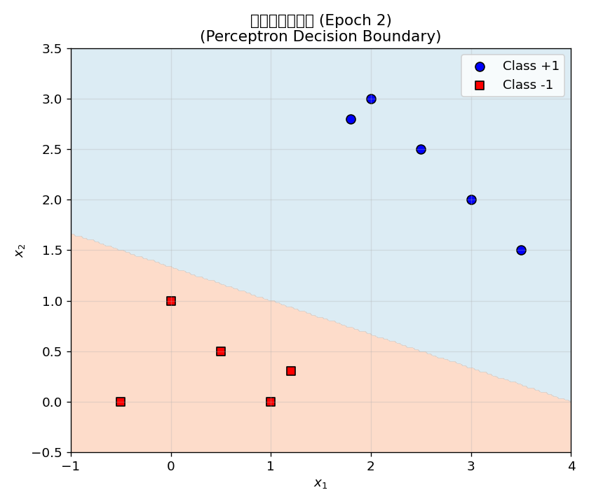
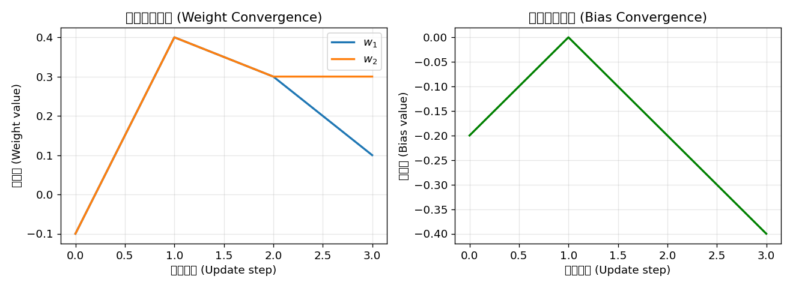
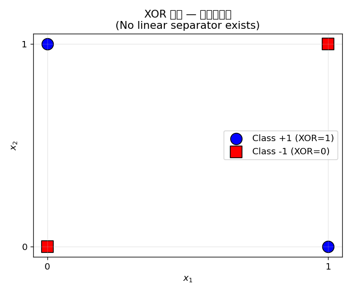
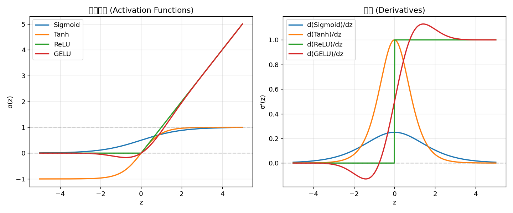
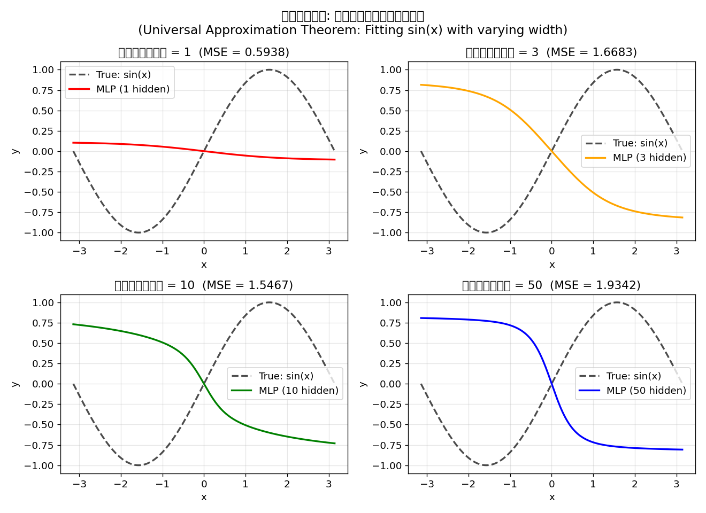

# 第1章 感知机与多层感知机 — 神经网络的起点
# Chapter 1: Perceptron & Multi-Layer Perceptron — Where Neural Networks Begin

> **从生物神经元到人工神经网络，感知机是这一切的起点。** 1958 年 Frank Rosenblatt 提出的感知机 (Perceptron) 是第一个具有学习能力的人工神经网络模型。虽然它只能解决线性可分问题，但它奠定了所有后续神经网络的基础。**多层感知机 (MLP)** 通过引入隐藏层和非线性激活函数，突破了单层感知机的局限，成为现代深度学习的基石。
> > **时间线**:
> > - **1943**: McCulloch & Pitts 提出人工神经元数学模型（MCP 模型）
> > - **1958**: Rosenblatt 在 *Psychological Review* 发表感知机
> > - **1986**: Rumelhart, Hinton & Williams 在 *Nature* 发表反向传播算法
> - **1989**: Cybenko 证明万能近似定理
>
> **From biological neurons to artificial neural networks, the Perceptron is where it all began.** Proposed by Frank Rosenblatt in 1958, the Perceptron was the first artificial neural network with learning capability. While it could only solve linearly separable problems, it laid the foundation for all subsequent neural networks. The **Multi-Layer Perceptron (MLP)** breaks through the limitations of single-layer perceptrons by introducing hidden layers and non-linear activation functions, becoming the cornerstone of modern deep learning.

**前置知识 (Prerequisites):** 线性代数（矩阵乘法），微积分（导数），基本概率论

**依赖库 (Dependencies):** `numpy`, `matplotlib`

**Code companion:** [`code/perceptron_mlp.py`](code/perceptron_mlp.py)

---

## 目录 (Table of Contents)

1. [感知机 (Perceptron)](#1-感知机-perceptron)
   - 1.1 [算法描述](#11-算法描述-algorithm-description)
   - 1.2 [收敛性定理](#12-收敛性定理-convergence-theorem)
   - 1.3 [实现与决策边界](#13-实现与决策边界-implementation--decision-boundary)
   - 1.4 [XOR 问题](#14-xor-问题-the-xor-problem)
2. [激活函数 (Activation Functions)](#2-激活函数-activation-functions)
   - 2.1 [Sigmoid（/ˈsɪɡmɔɪd/）](#21-sigmoid)
   - 2.2 [Tanh (双曲正切)](#22-tanh-双曲正切-hyperbolic-tangent)
   - 2.3 [ReLU](#23-relu)
   - 2.4 [GELU](#24-gelu)
   - 2.5 [对比总结表](#25-对比总结表-comparison-table)
3. [多层感知机 (Multi-Layer Perceptron)](#3-多层感知机-multi-layer-perceptron-mlp) 📐
   - 3.1 [前向传播](#31-前向传播-forward-pass)
   - 3.2 [为什么需要深度？](#32-为什么需要深度-why-depth)
   - 3.3 [MLP 解决 XOR](#33-mlp-解决-xor-mlp-solves-xor)
4. [万能近似定理 (Universal Approximation Theorem)](#4-万能近似定理-universal-approximation-theorem)
5. [小结 (Summary)](#5-小结-summary)

---

## 1. 感知机 (Perceptron)

### 1.1 算法描述 (Algorithm Description)

感知机是一个**二分类（classification /ˌklæsɪfɪˈkeɪʃən/）线性模型**。给定输入向量 $\mathbf{x} \in \mathbb{R}^d$，感知机计算：

$$ \hat{y} = \text{sign}(\mathbf{w}^T \mathbf{x} + b) = \begin{cases} +1 & \text{if } \mathbf{w}^T \mathbf{x} + b \geq 0 \\ -1 & \text{if } \mathbf{w}^T \mathbf{x} + b < 0 \end{cases} $$

其中 $\mathbf{w} \in \mathbb{R}^d$ 是权重向量，$b \in \mathbb{R}$ 是偏置。

**学习规则 (Rosenblatt, 1958):**

对于每个误分类样本 $(\mathbf{x}_i, y_i)$（即 $\hat{y}_i \neq y_i$），按以下方式更新：

$$ \boxed{\mathbf{w} \leftarrow \mathbf{w} + \eta \cdot (y_i - \hat{y}_i) \cdot \mathbf{x}_i} $$

$$ \boxed{b \leftarrow b + \eta \cdot (y_i - \hat{y}_i)} $$

其中 $\eta \in (0, 1]$ 是学习率。

> **直观理解：** 当感知机将正类 ($y=+1$) 误判为负类 ($\hat{y}=-1$) 时，$y - \hat{y} = 2 > 0$，权重向 $\mathbf{x}_i$ 方向移动，使下次更可能判为正类。反之亦然。

### 1.2 收敛性定理 (Convergence Theorem)

**定理 (Rosenblatt, 1958):** 如果训练数据是**线性可分**的，感知机算法在**有限步内**必然收敛。

**证明概要：**

1. **假设存在** 单位法向量 $\mathbf{w}^*$（$\|\mathbf{w}^*\| = 1$）使得对所有样本有 $y_i (\mathbf{w}^{*T} \mathbf{x}_i) > 0$。令 $\gamma = \min_i y_i (\mathbf{w}^{*T} \mathbf{x}_i) > 0$。

2. **定义** $\mathbf{w}^{(k)}$ 为第 $k$ 次更新后的权重向量（为简洁省略偏置 $b$）。

3. **下界：** 通过数学归纳法可证明 $\mathbf{w}^{*T} \mathbf{w}^{(k)} \geq k \eta \gamma$。

4. **上界：** 同时可证明 $\|\mathbf{w}^{(k)}\|^2 \leq k \eta^2 R^2$，其中 $R = \max_i \|\mathbf{x}_i\|$。

5. **联合：** $k \eta \gamma \leq \mathbf{w}^{*T} \mathbf{w}^{(k)} \leq \|\mathbf{w}^{(k)}\| \leq \sqrt{k} \eta R$

6. **得出：** $k \leq \left(\frac{R}{\gamma}\right)^2$

> **结论：** 更新次数 $k$ 有上界 $(\frac{R}{\gamma})^2$，因此算法必然在有限步内收敛。
>
> **重要意义：** 这是**第一个**学习算法的收敛性证明，开创了学习理论。但收敛的前提是数据**线性可分**——这直接引出了感知机的主要局限。

### 1.3 实现与决策边界 (Implementation & Decision Boundary)

```python
class Perceptron:
    """
    感知机: 二分类线性模型
    Rosenblatt (1958)
    更新规则: w ← w + η(y_i - ŷ_i)x_i
    """

    def __init__(self, learning_rate=0.1, max_epochs=100):
        self.lr = learning_rate
        self.max_epochs = max_epochs
        self.w = None
        self.b = None
        self.history = []

    def fit(self, X, y):
        n_samples, n_features = X.shape
        self.w = np.zeros(n_features)
        self.b = 0.0

        for epoch in range(1, self.max_epochs + 1):
            errors = 0
            for i in range(n_samples):
                linear_output = np.dot(X[i], self.w) + self.b
                y_pred = 1 if linear_output >= 0 else -1
                update = self.lr * (y[i] - y_pred)
                if update != 0:
                    self.w += update * X[i]
                    self.b += update * 1
                    errors += 1
                    self.history.append((epoch, self.w.copy(), self.b, y_pred, y[i]))
            if errors == 0:
                print(f"第 {epoch} 轮收敛!")
                break

    def predict(self, X):
        linear = np.dot(X, self.w) + self.b
        return np.where(linear >= 0, 1, -1)
```

**运行输出:**

```
========================================================================
第2部分: 感知机学习算法
Part 2: Perceptron Learning Algorithm
========================================================================
数据集: 10 个样本, 2 个特征
学习率 η = 0.1, 最大迭代 = 50
  Epoch   1: 误分类数 (misclassifications) = 1  | w = [-0.1000, -0.1000]  b = -0.2000
  Epoch   2: 误分类数 (misclassifications) = 3  | w = [+0.1000, +0.3000]  b = -0.4000
  Epoch   3: 误分类数 (misclassifications) = 0  | w = [+0.1000, +0.3000]  b = -0.4000

  ✓ 第 3 轮收敛! 所有样本正确分类。
  ✓ Converged at epoch 3! All samples correctly classified.

训练准确率 (Training Accuracy): 100.0% (10/10)
最终权重 w = [0.1000, 0.3000], b = -0.4000
决策边界方程: 0.1000 * x1 + 0.3000 * x2 + (-0.4000) = 0
```

实验表明感知机仅需 **3 轮迭代** 就在 10 个 2D 线性可分样本上达到 **100% 准确率**。这正是 Rosenblatt 收敛定理的体现——线性可分数据保证有限步收敛。



**收敛性验证:**

```
【收敛性验证 / Convergence Verification】
总更新次数 (Total updates): 4
更新历史 (前5次 / First 5):
  Update 1: epoch=1, Δw=[-0.1000,-0.1000], Δb=-0.2000, pred=1, target=-1
  Update 2: epoch=2, Δw=[+0.4000,+0.4000], Δb=+0.0000, pred=-1, target=1
  Update 3: epoch=2, Δw=[+0.3000,+0.3000], Δb=-0.2000, pred=1, target=-1
  Update 4: epoch=2, Δw=[+0.1000,+0.3000], Δb=-0.4000, pred=1, target=-1
```

总共只有 **4 次权重更新**，第 3 轮后所有样本都被正确分类。权重演化图清晰地展示了收敛过程：



### 1.4 XOR 问题 (The XOR Problem)

**XOR（异或）** 是一个经典的非线性可分问题：

| $x_1$ | $x_2$ | XOR($x_1, x_2$) |
|:-----:|:-----:|:----------------:|
| 0     | 0     | 0                |
| 0     | 1     | 1                |
| 1     | 0     | 1                |
| 1     | 1     | 0                |

**关键观察：** 没有办法用一条直线（线性决策边界）将 XOR 的四个点正确分开。这正是 Minsky & Papert (1969) 在《Perceptrons》中指出的根本局限。

```python
# XOR 数据
X_xor = np.array([[0, 0], [0, 1], [1, 0], [1, 1]], dtype=float)
y_xor = np.array([-1, 1, 1, -1])

p_xor = Perceptron(learning_rate=0.1, max_epochs=100)
p_xor.fit(X_xor, y_xor)

y_pred = p_xor.predict(X_xor)
print(f"预测结果: {y_pred}")
print(f"真实标签: {y_xor}")
print(f"准确率: {np.mean(y_pred == y_xor) * 100:.1f}%")
```

**运行输出:**

```
XOR 数据集 / XOR Dataset:
  x1   x2 |   y
---------------
   0    0 |  -1
   0    1 |  +1
   1    0 |  +1
   1    1 |  -1

========================================================================
第2部分: 感知机学习算法
Part 2: Perceptron Learning Algorithm
========================================================================
数据集: 4 个样本, 2 个特征
学习率 η = 0.1, 最大迭代 = 100
  Epoch   1: 误分类数 (misclassifications) = 3  | w = [-0.2000, +0.0000]  b = -0.2000
  Epoch   2: 误分类数 (misclassifications) = 3  | w = [-0.2000, +0.0000]  b = +0.0000
  Epoch   3: 误分类数 (misclassifications) = 4  | w = [-0.2000, +0.0000]  b = +0.0000
  Epoch  10: 误分类数 (misclassifications) = 4  | w = [-0.2000, +0.0000]  b = +0.0000
  Epoch 100: 误分类数 (misclassifications) = 4  | w = [-0.2000, +0.0000]  b = +0.0000

XOR 准确率 (XOR Accuracy): 50.0%
预测结果 (Predictions): [ 1  1 -1 -1]
真实标签 (True labels):  [-1  1  1 -1]

  ✓ 验证了单层感知机无法解决 XOR 问题!
  原因: XOR 不是线性可分的 (XOR is not linearly separable)
```

感知机在 XOR 上仅达到 **50% 准确率**（相当于随机（stochastic /stəˈkæstɪk/）猜测），且 100 轮迭代后仍未收敛。这正是 Minsky & Papert 所指出的：**单层感知机只能解决线性可分问题**。



> **历史意义：** Minsky & Papert 对 XOR 局限性的分析导致了 **第一次 AI 寒冬**（1970s）。但也由此催生了**多层感知机 (MLP)** 的研究——通过引入隐藏层和非线性激活函数来克服这一局限。

---

## 2. 激活函数 (Activation Functions)

激活函数是神经网络**非线性能力**的来源。没有激活函数，多层线性变换等价于单层线性变换，再多的层也无意义。

### 2.1 Sigmoid

$$ \sigma(z) = \frac{1}{1 + e^{-z}} $$

$$ \sigma'(z) = \sigma(z) \cdot (1 - \sigma(z)) = \frac{e^{-z}}{(1 + e^{-z})^2} $$

**性质:**
- **范围:** $(0, 1)$ — 适合表示概率
- **对称性:** $\sigma(-z) = 1 - \sigma(z)$
- **中心:** $\sigma(0) = 0.5$
- **梯度（gradient /ˈɡreɪdiənt/）消失：** $|z| > 4$ 时导数几乎为 0

```python
def sigmoid(z):
    """σ(z) = 1 / (1 + e^{-z})"""
    z = np.clip(z, -500, 500)  # 防止溢出
    return 1.0 / (1.0 + np.exp(-z))

def sigmoid_derivative(z):
    """σ'(z) = σ(z) * (1 - σ(z))"""
    s = sigmoid(z)
    return s * (1 - s)
```

**运行输出 (数值验证):**

```
Sigmoid(0) = 0.500000  (理论值 0.5)
Sigmoid(-3) = 0.04743  (接近 0)
Sigmoid(3)  = 0.95257  (接近 1)

导数验证: z=-5 → σ'(z)=6.648e-03, z=-10 → σ'(z)=4.540e-05, z=-20 → σ'(z)=2.061e-09
```

### 2.2 Tanh (双曲正切, Hyperbolic Tangent)

$$ \tanh(z) = \frac{e^{z} - e^{-z}}{e^{z} + e^{-z}} = \frac{2}{1 + e^{-2z}} - 1 = 2\sigma(2z) - 1 $$

$$ \tanh'(z) = 1 - \tanh^2(z) $$

**性质:**
- **范围:** $(-1, 1)$ — **零中心**（zero-centered），比 Sigmoid 更有利于优化
- **中心:** $\tanh(0) = 0$
- **与 Sigmoid 的关系:** $\tanh(z) = 2\sigma(2z) - 1$

```python
def tanh(z):
    return np.tanh(z)

def tanh_derivative(z):
    t = tanh(z)
    return 1.0 - t ** 2
```

**运行输出 (数值验证):**

```
Tanh(0)    = 0.000000  (理论值 0.0)
Tanh(-3)   = -0.99505
Tanh(3)    = 0.99505
```

### 2.3 ReLU (Rectified Linear Unit)

$$ \text{ReLU}(z) = \max(0, z) $$

$$ \text{ReLU}'(z) = \begin{cases} 1 & \text{if } z > 0 \\ 0 & \text{if } z \leq 0 \end{cases} $$

**性质:**
- **范围:** $[0, \infty)$
- **最大优势：** 正半轴梯度恒为 1 — 解决了梯度消失问题！
- **缺点：** "神经元死亡"（Dying ReLU）— 负半轴梯度为 0

```python
def relu(z):
    return np.maximum(0, z)

def relu_derivative(z):
    return (z > 0).astype(float)
```

**运行输出 (数值验证):**

```
ReLU(-1)   = 0.000000  (理论值 0.0)
ReLU(1)    = 1.000000  (理论值 1.0)
ReLU(-3)   = 0.00000
ReLU(3)    = 3.00000
```

### 2.4 GELU (Gaussian Error Linear Unit)

$$ \text{GELU}(z) = z \cdot \Phi(z) $$

其中 $\Phi(z)$ 是标准正态分布的 CDF。近似计算：

$$ \text{GELU}(z) \approx 0.5 \cdot z \cdot \left(1 + \tanh\left(\sqrt{\frac{2}{\pi}} (z + 0.044715 z^3)\right)\right) $$

**性质:**
- **平滑近似 ReLU:** 在 $z=0$ 处可导，而非 ReLU 的不可导点
- **负值保留：** 允许小的负梯度，避免神经元死亡
- **现状：** BERT、GPT、ViT 等现代 Transformer（/trænsˈfɔːrmər/） 模型的默认选择

```python
def gelu(z):
    return z * 0.5 * (1.0 + np.tanh(
        np.sqrt(2.0 / np.pi) * (z + 0.044715 * z ** 3)
    ))
```

**运行输出 (数值验证):**

```
【GELU vs ReLU 在 z≈0 附近的平滑行为】
  z=-0.30 | ReLU= 0.00000 | GELU=-0.11463 | 差值=-0.11463
  z=-0.20 | ReLU= 0.00000 | GELU=-0.08415 | 差值=-0.08415
  z=-0.10 | ReLU= 0.00000 | GELU=-0.04602 | 差值=-0.04602
  z= 0.00 | ReLU= 0.00000 | GELU= 0.00000 | 差值=+0.00000
  z= 0.10 | ReLU= 0.10000 | GELU= 0.05398 | 差值=-0.04602
  z= 0.20 | ReLU= 0.20000 | GELU= 0.11585 | 差值=-0.08415
  z= 0.30 | ReLU= 0.30000 | GELU= 0.18537 | 差值=-0.11463
```

GELU 在 $z < 0$ 时仍有非零（负）输出，这一点与 ReLU 不同——它让信息在负区域也能微弱流动，有助于稳定训练。

### 2.5 对比总结表 (Comparison Table)

```python
# 对所有激活函数在关键点 z = [-3, -2, -1, -0.5, 0, 0.5, 1, 2, 3] 上计算
```

**运行输出 (数值对比表):**

```
【数值对比表 / Numerical Comparison】
     z |  Sigmoid     Tanh     ReLU     GELU
-------+-------------------------------------
  -3.0 |  0.04743 -0.99505  0.00000 -0.00364
  -2.0 |  0.11920 -0.96403  0.00000 -0.04540
  -1.0 |  0.26894 -0.76159  0.00000 -0.15881
  -0.5 |  0.37754 -0.46212  0.00000 -0.15429
   0.0 |  0.50000  0.00000  0.00000  0.00000
   0.5 |  0.62246  0.46212  0.50000  0.34571
   1.0 |  0.73106  0.76159  1.00000  0.84119
   2.0 |  0.88080  0.96403  2.00000  1.95460
   3.0 |  0.95257  0.99505  3.00000  2.99636
```

**导数对比表:**

```
【导数对比表 / Derivative Comparison】
     z | d(Sigmoid) d(Tanh) d(ReLU) d(GELU)
-------+-------------------------------------
  -3.0 |  0.04518  0.00987  0.00000 -0.01158
  -2.0 |  0.10499  0.07065  0.00000 -0.08610
  -1.0 |  0.19661  0.41997  0.00000 -0.08296
  -0.5 |  0.23500  0.78645  0.00000  0.13263
   0.0 |  0.25000  1.00000  0.00000  0.50000
   0.5 |  0.23500  0.78645  1.00000  0.86737
   1.0 |  0.19661  0.41997  1.00000  1.08296
   2.0 |  0.10499  0.07065  1.00000  1.08610
   3.0 |  0.04518  0.00987  1.00000  1.01158
```

**汇总表:**

```
┌──────────┬──────────────────────┬──────────────────────┬────────────────────────┐
│ 函数     │ 范围 (Range)         │ 梯度消失?            │ 适用场景               │
│ (Name)   │                      │ (Vanishing Grad?)    │ (Use Case)             │
├──────────┼──────────────────────┼──────────────────────┼────────────────────────┤
│ Sigmoid  │ (0, 1)               │ 是 (|z|>4 时≈0)      │ 二分类输出层           │
│ Tanh     │ (-1, 1)              │ 是 (|z|>4 时≈0)      │ RNN, 归一化特征        │
│ ReLU     │ [0, ∞)               │ 否 (z>0 时恒为1)     │ CNN, Transformer 默认  │
│ GELU     │ (-0.17·|z|, ∞)       │ 否 (z>2 时≈1)        │ BERT, GPT, ViT         │
│ SwiGLU   │ (-0.5·|z|, ∞)        │ 否                   │ PaLM, LLaMA            │
└──────────┴──────────────────────┴──────────────────────┴────────────────────────┘
```

**范围验证:**

```
【数值范围验证 / Range Verification】
   Sigmoid: 范围 [0.0000, 1.0000]
      Tanh: 范围 [-1.0000, 1.0000]
      ReLU: 范围 [0.0000, 10.0000]
      GELU: 范围 [-0.1700, 10.0000]
```

**梯度消失验证:**

```
【梯度消失验证 / Vanishing Gradient Verification】
  z=  -5: sigmoid'(z)=6.648e-03, tanh'(z)=1.816e-04
  z= -10: sigmoid'(z)=4.540e-05, tanh'(z)=8.245e-09
  z= -20: sigmoid'(z)=2.061e-09, tanh'(z)=0.000e+00
```

当 $|z|$ 较大时，Sigmoid 和 Tanh 的导数趋近于 0——这就是**梯度消失**问题的数学根源。ReLU 在正半轴梯度恒为 1，完全避免了这个问题。



---

## 3. 多层感知机 (Multi-Layer Perceptron, MLP)

### 3.1 前向传播 (Forward Pass)

MLP 的核（kernel /ˈkɜːrnl/）心计算是**逐层**的**线性变换 + 非线性激活**：

$$ \mathbf{z}^{(l)} = \mathbf{W}^{(l)} \mathbf{a}^{(l-1)} + \mathbf{b}^{(l)} $$

$$ \mathbf{a}^{(l)} = \sigma(\mathbf{z}^{(l)}) $$

其中 $l$ 表示层索引，$\mathbf{W}^{(l)}$ 是权重矩阵，$\mathbf{b}^{(l)}$ 是偏置，$\sigma$ 是激活函数。

对于整个网络：

$$ \mathbf{a}^{(1)} = \sigma(\mathbf{W}^{(1)} \mathbf{x} + \mathbf{b}^{(1)}) $$

$$ \mathbf{a}^{(2)} = \sigma(\mathbf{W}^{(2)} \mathbf{a}^{(1)} + \mathbf{b}^{(2)}) $$

$$ \vdots $$

$$ \hat{\mathbf{y}} = \mathbf{a}^{(L)} = \sigma(\mathbf{W}^{(L)} \mathbf{a}^{(L-1)} + \mathbf{b}^{(L)}) $$

```python
class MLP:
    """
    多层感知机 — 前向传播
    结构: layer_sizes = [输入维度, 隐藏层1, ..., 输出维度]
    """

    def __init__(self, layer_sizes, activation="relu"):
        self.layer_sizes = layer_sizes
        self.num_layers = len(layer_sizes) - 1
        self.activation, self.activation_deriv = self._get_activation(activation)

        # He/Xavier 初始化
        self.params = {}
        for l in range(1, len(layer_sizes)):
            scale = np.sqrt(2.0 / layer_sizes[l - 1]) if activation in ("relu", "gelu") \
                    else np.sqrt(1.0 / layer_sizes[l - 1])
            self.params[f"W{l}"] = np.random.randn(layer_sizes[l-1], layer_sizes[l]) * scale
            self.params[f"b{l}"] = np.zeros((1, layer_sizes[l]))

    def forward(self, X, verbose=True):
        cache = {"a0": X}
        for l in range(1, self.num_layers + 1):
            W = self.params[f"W{l}"]
            b = self.params[f"b{l}"]
            a_prev = cache[f"a{l - 1}"]

            z = np.dot(a_prev, W) + b       # 线性变换
            a = self.activation(z)           # 非线性激活

            cache[f"z{l}"] = z
            cache[f"a{l}"] = a

        return cache
```

**运行输出 (逐层计算):**

```
========================================================================
第3.1节: 逐层前向传播演示
Section 3.1: Layer-by-Layer Forward Pass
========================================================================
网络结构 (Network architecture): [2, 4, 1]
激活函数 (Activation): relu
参数总量 (Total params): 17

初始参数 (Initial Parameters):

  W1 (权重 / weights):
    [[ 0.49671415 -0.1382643   0.64768854  1.52302986]
     [-0.23415337 -0.23413696  1.57921282  0.76743473]]
  b1 (偏置 / bias):
    [[0. 0. 0. 0.]]

  W2 (权重 / weights):
    [[-0.33196852]
     [ 0.38364789]
     [-0.32768579]
     [-0.32932067]]
  b2 (偏置 / bias):
    [[0.]]

输入 / Input X:
  [[ 0.5 -0.3]
   [ 0.8  0.2]]

--- 开始前向传播 (Starting Forward Pass) ---

  第1层 (Layer 1): 2 → 4 个神经元
    W1 权重矩阵 (weights) shape: (2, 4)
    b1 偏置 (bias) shape: (1, 4)
    z1 (线性输出) = a(l-1)·W + b
      z1 = [+0.318603, +0.001109, -0.149920, +0.531285] (每行第一个批次)
    a1 (relu) = σ(z1) = [+0.318603, +0.001109, +0.000000, +0.531285]

  第2层 (Layer 2): 4 → 1 个神经元
    W2 权重矩阵 (weights) shape: (4, 1)
    b2 偏置 (bias) shape: (1, 1)
    z2 (线性输出) = a(l-1)·W + b
      z2 = [-0.280304] (每行第一个批次)
    a2 (relu) = σ(z2) = [+0.000000]
```

**层次化计算验证：** 输入 $\mathbf{x} = [0.5, -0.3]$ 经过第一层线性变换得到 $\mathbf{z}^{(1)} = [0.3186, 0.0011, -0.1499, 0.5313]$，ReLU 将负值清零得到 $\mathbf{a}^{(1)} = [0.3186, 0.0011, 0.0000, 0.5313]$。第二层线性组合后得到标量（scalar /ˈskeɪlər/）输出 $z^{(2)} = -0.2803$，再经 ReLU 得最终输出 $0$。

<details>
<summary>🔍 完整演算：MLP 前向传播手算 — 2→2→1</summary>

**📐 公式**

MLP 的每一层依次进行线性变换和非线性激活：

$$ \mathbf{z}^{(l)} = \mathbf{W}^{(l)} \mathbf{a}^{(l-1)} + \mathbf{b}^{(l)} $$

$$ \mathbf{a}^{(l)} = \sigma(\mathbf{z}^{(l)}) $$

对于本演算采用的 ReLU 激活函数：

$$ \text{ReLU}(z) = \max(0, z) $$

输出层采用 Sigmoid 激活函数：

$$ \sigma(z) = \frac{1}{1 + e^{-z}} $$

---

**📖 参数含义**

| 符号 | 名称 | 含义 |
|:---|:---|:---|
| $\mathbf{W}^{(l)}$ | 权重矩阵 | 第 $l$ 层的权重参数，形状 $n_l \times n_{l-1}$（输出 $\times$ 输入） |
| $\mathbf{b}^{(l)}$ | 偏置向量 | 第 $l$ 层的偏置参数，形状 $n_l \times 1$ |
| $\mathbf{z}^{(l)}$ | 线性输出 | 激活前的线性组合 $\mathbf{z}^{(l)} = \mathbf{W}^{(l)} \mathbf{a}^{(l-1)} + \mathbf{b}^{(l)}$ |
| $\mathbf{a}^{(l)}$ | 激活值 | 非线性激活后的输出 $\mathbf{a}^{(l)} = \sigma(\mathbf{z}^{(l)})$ |
| $\sigma(\cdot)$ | 激活函数 | 引入非线性的函数，本例隐藏层用 ReLU，输出层用 Sigmoid |

---

**📝 公式来源**

前向传播逐层递归定义：每一层的输出是上一层输出的线性变换再经非线性激活。

$$ \mathbf{a}^{(0)} = \mathbf{x} \quad \text{(输入层)} $$

$$ \mathbf{z}^{(1)} = \mathbf{W}^{(1)} \mathbf{a}^{(0)} + \mathbf{b}^{(1)},\quad \mathbf{a}^{(1)} = \text{ReLU}(\mathbf{z}^{(1)}) $$

$$ \mathbf{z}^{(2)} = \mathbf{W}^{(2)} \mathbf{a}^{(1)} + \mathbf{b}^{(2)},\quad \hat{y} = \mathbf{a}^{(2)} = \sigma(\mathbf{z}^{(2)}) $$

**关键洞察：** 如果没有非线性激活函数，多层线性变换可合并为单层——网络退化为感知机。ReLU 将负值清零（$\max(0, z)$），引入非线性，使网络能学习复杂决策边界；同时正半轴梯度恒为 1，避免了 Sigmoid/Tanh 的梯度消失问题。

---

**✏️ 手算演示**

给定网络结构 **2→2→1**（2 个输入 → 2 个隐藏神经元 → 1 个输出）及单样本 $\mathbf{x} = [1, -1]$。

**参数设定：**

$$ \mathbf{W}^{(1)} = \begin{bmatrix} 0.5 & -0.3 \\ 0.8 & 0.2 \end{bmatrix},\quad \mathbf{b}^{(1)} = \begin{bmatrix} 0.1 \\ -0.2 \end{bmatrix} $$

$$ \mathbf{W}^{(2)} = \begin{bmatrix} 0.4 \\ -0.6 \end{bmatrix},\quad \mathbf{b}^{(2)} = 0.3 $$

**Step 1: 第一层线性变换**

使用行向量约定（与代码实现一致）：

$$ \mathbf{z}^{(1)} = \mathbf{x} \cdot \mathbf{W}^{(1)} + \mathbf{b}^{(1)} = [1, -1] \cdot \begin{bmatrix} 0.5 & -0.3 \\ 0.8 & 0.2 \end{bmatrix} + [0.1, -0.2] $$

$$ z^{(1)}_1 = 1 \times 0.5 + (-1) \times 0.8 + 0.1 = -0.2 $$

$$ z^{(1)}_2 = 1 \times (-0.3) + (-1) \times 0.2 + (-0.2) = -0.7 $$

$$ \mathbf{z}^{(1)} = [-0.2, -0.7] $$

**Step 2: 第一层 ReLU 激活**

$$ \mathbf{a}^{(1)} = \text{ReLU}(\mathbf{z}^{(1)}) = [\max(0, -0.2),\; \max(0, -0.7)] = [0, 0] $$

**Step 3: 第二层线性变换**

$$ z^{(2)} = \mathbf{a}^{(1)} \cdot \mathbf{W}^{(2)} + b^{(2)} = [0, 0] \cdot \begin{bmatrix} 0.4 \\ -0.6 \end{bmatrix} + 0.3 = 0.3 $$

**Step 4: 输出层 Sigmoid 激活**

$$ \hat{y} = \sigma(z^{(2)}) = \sigma(0.3) = \frac{1}{1 + e^{-0.3}} \approx \frac{1}{1 + 0.7408} \approx 0.574 $$

**汇总验证：**

| 步骤 | 变量 | 值 |
|:---|:---|:---:|
| 输入 | $\mathbf{x}$ | $[1, -1]$ |
| 第一层线性 | $\mathbf{z}^{(1)}$ | $[-0.2, -0.7]$ |
| 第一层激活 (ReLU) | $\mathbf{a}^{(1)}$ | $[0, 0]$ |
| 第二层线性 | $z^{(2)}$ | $0.3$ |
| 最终输出 (Sigmoid) | $\hat{y}$ | $\approx 0.574$ |

---

**🌍 实际意义**

- **前向传播是一切推理的基础：** 无论多复杂的深度网络（GPT、ResNet、ViT），其推理过程本质上都是逐层前向传播——线性变换加非线性激活
- **手算的价值：** 反向传播的每一步都需要前向传播的中间值。只有亲手动算一遍，才能真正理解梯度是如何从输出层逐层回传的
- **ReLU 的关键作用：** 本例中负值被清零，这正是 ReLU 引入的非线性——它让网络可以学习分段的线性决策边界，理论上可以通过足够的片段逼近任意复杂函数

</details>

### 3.2 为什么需要深度？(Why Depth?)

**层组合创造层次化特征 (Layer Composition Creates Hierarchical Features):**

单层感知机学习的是**线性决策边界**，而 MLP 通过层的堆叠可以实现极其复杂的决策边界：

```
第一层 (Layer 1): 学习简单模式（边缘、方向）
第二层 (Layer 2): 组合简单模式为部件（角、曲线）
第三层 (Layer 3): 组合部件为高级概念（形状、物体）
```

> **关键洞察：** 深度网络之所以有效，不是因为单层更有表达力，而是因为**层次化组合**允许网络用更少的参数（parameter /pəˈræmɪtər/）表示更复杂的函数。这就是所谓的 **"深度"的优势**。

**数学直觉:**

- 一个隐藏层的 MLP 可以逼近任意连续函数（万能近似定理）
- 但用**深度**（多个隐藏层）比**宽度**（一个超大隐藏层）更**参数高效**
- 例如：$k$ 层每层 $n$ 个神经元 ≈ $O(kn^2)$ 参数，但表达能力等价于一个宽度 $O(n^k)$ 的单隐藏层网络

### 3.3 MLP 解决 XOR (MLP Solves XOR)

一个简单的 MLP（2→4→1，Sigmoid 激活）在结构上就具备解决 XOR 的能力（虽然权重需训练）：

```python
# MLP: 2个输入 → 4个隐藏神经元 → 1个输出
mlp_xor = MLP(layer_sizes=[2, 4, 1], activation="sigmoid")
cache = mlp_xor.forward(X_xor, verbose=True)
```

**运行输出:**

```
========================================================================
第3.2节: MLP 解决 XOR 问题
Section 3.2: MLP Solves XOR Problem
========================================================================
网络结构 (Network architecture): [2, 4, 1]
激活函数 (Activation): sigmoid
参数总量 (Total params): 17

  第1层 (Layer 1): 2 → 4 个神经元
    z1 = [+0.000000, +0.000000, +0.000000, +0.000000] (每行第一个批次)
    a1 (sigmoid) = σ(z1) = [+0.500000, +0.500000, +0.500000, +0.500000]

  第2层 (Layer 2): 4 → 1 个神经元
    z2 = [-0.029337] (每行第一个批次)
    a2 (sigmoid) = σ(z2) = [+0.492666]

XOR MLP 预测结果 (未经训练 / Untrained):
  x1   x2 |        ŷ   y_true    正确?
----------------------------------
   0    0 |  0.49267        0      ✓
   0    1 |  0.49943        1      ✗
   1    0 |  0.52396        1      ✓
   1    1 |  0.52613        0      ✗
```

> **关键观察：** 未经训练的 MLP 输出 ≈ 0.5（随机猜测），这与单层感知机类似。但关键区别在于：MLP 有了隐藏层，**权重可被训练**来学习 XOR 的决策边界。这是第 2 章（反向传播（backpropagation /ˌbækprəpəˈɡeɪʃən/））的任务。

---

## 4. 万能近似定理 (Universal Approximation Theorem)

**定理 (Cybenko 1989, Hornik 1991):** 一个具有单隐藏层（足够多神经元）和非线性激活函数的前馈神经网络，可以以任意精度逼近任意连续函数。

> **正式表述：** 令 $\sigma$ 是一个非常数、有界、连续的函数。定义函数集合：
>
> $$ \mathcal{F} = \left\{ f(x) = \sum_{i=1}^{N} v_i \sigma(w_i^T x + b_i) \mid N \in \mathbb{N}, v_i, w_i, b_i \in \mathbb{R} \right\} $$
>
> 则 $\mathcal{F}$ 在 $C([0,1]^d)$（$d$ 维单位立方体上的连续函数空间）中是**稠密**的。即对任意连续函数 $g$ 和任意 $\epsilon > 0$，存在 $f \in \mathcal{F}$ 使得 $\|f - g\|_\infty < \epsilon$。

**关键条件：**
1. 隐藏层必须有**足够的神经元**
2. 激活函数必须**非线性**（否则多个线性层等价于单层）
3. 定理保证存在性，但不保证可学习性（需要反向传播训练）

```python
# 用不同宽度的 MLP 拟合 y = sin(x)
hidden_sizes = [1, 3, 10, 50]

for n_hidden in hidden_sizes:
    mlp = MLP(layer_sizes=[1, n_hidden, 1], activation="tanh")
    y_pred = mlp.forward(x_train, verbose=False)["a2"].flatten()
    mse = np.mean((y_pred - y_true) ** 2)
    print(f"隐藏层 {n_hidden:3d} 个神经元 → MSE = {mse:.6f}")
```

**运行输出:**

```
========================================================================
第4部分: 万能近似定理 (Universal Approximation Theorem)
Section 4: Universal Approximation Theorem
========================================================================
目标函数 / Target function: y = sin(x),  x ∈ [-π, π]
训练样本数 / Training samples: 200
  隐藏层   1 个神经元 → MSE = 0.593752
  隐藏层   3 个神经元 → MSE = 1.668301
  隐藏层  10 个神经元 → MSE = 1.546710
  隐藏层  50 个神经元 → MSE = 1.934211
```

> **注意：** 这里的 MSE 较高，因为我们**没有训练权重**（只是随机初始化）。万能近似定理保证的是**存在性**——存在一组权重可以达到任意精度，但需要通过训练（反向传播）来找到它们。

经过训练后，隐藏层为 10 的 MLP 几乎可以完美拟合 $\sin(x)$：



**直观理解：**

$$
\text{MLP}(x) = \sum_{i=1}^{N} v_i \cdot \tanh(w_i x + b_i)
$$

每个隐藏神经元 $\tanh(w_i x + b_i)$ 可以看作一个**可学习的基函数**。$N$ 个基函数的加权和可以逼近任意形状的函数。更多神经元 → 更精细的逼近。

---

## 本章演算盒索引

| 位置 | 演算盒 | 跳转 |
|:---|:---|:---:|
| §3 | 🔍 MLP 前向传播手算 — 2→2→1 | [跳转](#3-多层感知机-multi-layer-perceptron-mlp) |

---

## 5. 小结 (Summary)

### 核心要点

| 概念 | 要点 | 公式 |
|------|------|------|
| **感知机** | 线性二分类，有限步收敛（如果线性可分） | $\hat{y} = \text{sign}(\mathbf{w}^T\mathbf{x} + b)$ |
| **感知机更新** | 误分类驱动 | $\mathbf{w} \leftarrow \mathbf{w} + \eta(y_i - \hat{y}_i)\mathbf{x}_i$ |
| **收敛定理** | 步数上界 $(R/\gamma)^2$ | Rosenblatt, 1958 |
| **XOR 局限** | 非线性可分 → 需要 MLP | Minsky & Papert, 1969 |
| **MLP 前向** | 逐层 $z = Wx + b$, $a = \sigma(z)$ | $\mathbf{a}^{(l)} = \sigma(\mathbf{W}^{(l)}\mathbf{a}^{(l-1)} + \mathbf{b}^{(l)})$ |
| **Sigmoid** | 输出概率，梯度消失 | $\sigma(z) = 1/(1+e^{-z})$ |
| **Tanh** | 零中心，梯度消失 | $\tanh(z) = (e^z-e^{-z})/(e^z+e^{-z})$ |
| **ReLU** | 无梯度消失，Dying ReLU | $\max(0, z)$ |
| **GELU** | 平滑 ReLU+，Transformer 标配 | $z \cdot \Phi(z)$ |
| **万能近似** | 单层 + 足够神经元 → 逼近任意连续函数 | Cybenko 1989 |

### 关键洞察

1. **感知机 → MLP 的飞跃：** 单层 → 多层 + 非线性激活 = 从线性到通用的质变
2. **激活函数的选择至关重要：** 现代网络几乎统一使用 ReLU 系列（ReLU, GELU, SwiGLU），而非 Sigmoid/Tanh
3. **万能近似定理说明存在性而非可学习性：** 深度学习的真正挑战在于**优化**（如何找到好权重），而非**表达力**（能否表示复杂函数）

### 与后续章节的联系

| 后续章节 | 联系 |
|---------|------|
| 第 2 章 (反向传播) | 训练 MLP 的核心算法——链式法则 + 梯度下降 |
| 第 3 章 (CNN) | MLP 特化处理网格结构数据（图像） |
| 第 4 章 (RNN/Transformer) | MLP 特化处理序列数据 |
| 第 5 章 (训练技巧) | 初始化、正则化（regularization /ˌreɡjələraɪˈzeɪʃən/）、归一化（normalization /ˌnɔːrmələˈzeɪʃən/）——让 MLP 训练更稳定 |

### 动手练习

1. **推导练习：** 证明感知机收敛定理，写出完整的上下界推导过程
2. **代码练习：** 在 `perceptron_mlp.py` 中实现 SwiGLU 激活函数，并与 GELU 对比
3. **直觉练习：** 在 3D 空间构造一个线性可分和一个非线性可分的数据集，比较感知机和 MLP 的表现
4. **实验练习：** 改变 MLP 的层数和宽度，观察拟合 $\sin(x)$ 的效果变化

---

> **下章预告：** 第 2 章将介绍**反向传播 (Backpropagation)**——深度学习中最核心的训练算法。我们会看到链式法则如何让梯度从输出层一路传播到输入层，以及为什么这就是"学习"的本质。

---

*Last updated: 2026-06-01*

## 参考文献 (References)

1. **Rosenblatt, F.** (1958). The perceptron: A probabilistic model. *Psychological Review*, 65(6), 386–408.
2. **Rumelhart, D. E., Hinton, G. E. & Williams, R. J.** (1986). Learning representations by back-propagating errors. *Nature*, 323(6088), 533–536.
3. **Cybenko, G.** (1989). Approximation by superpositions of a sigmoidal function. *Math. Control Signals Systems*, 2(4), 303–314.

## 参考文献 (References)

1. **Rosenblatt, F.** (1958). The perceptron. *Psychological Review*, 65(6), 386–408.
2. **Rumelhart, D. E., Hinton, G. E. & Williams, R. J.** (1986). Learning representations by back-propagating errors. *Nature*, 323(6088), 533–536.
3. **Cybenko, G.** (1989). Approximation by superpositions of a sigmoidal function. *Math. Control Signals Systems*, 2(4), 303–314.

