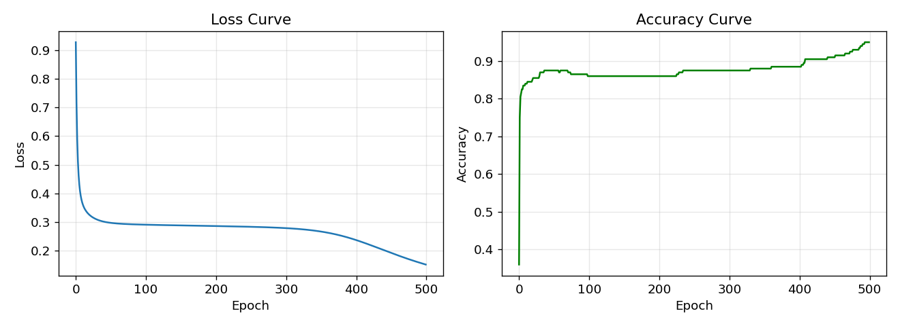
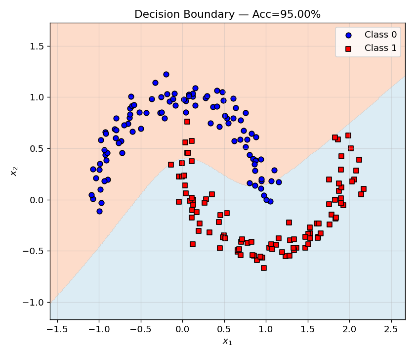

# 第2章 反向传播 — 神经网络的学习算法
# Chapter 2: Backpropagation — The Learning Algorithm of Neural Networks

> **反向传播 (Backpropagation) 是深度学习最核心的训练算法。** 它将微积分中的链式法则应用于多层神经网络，优雅地解决了"如何计算每个参数对最终误差的贡献"这一根本问题。本章从一个简单的计算图出发，逐步推导出 2 层神经网络的反向传播公式，并通过 NumPy 实现和数值梯度验证来确保推导的正确性。
>
> **Backpropagation is the core training algorithm of deep learning.** It applies the chain rule from calculus to multi-layer neural networks, elegantly solving the fundamental problem of "how to compute each parameter's contribution to the final error." This chapter starts from a simple computation graph, derives backpropagation for a 2-layer network step by step, and verifies correctness through NumPy implementation and numerical gradient checking.

**前置知识 (Prerequisites):** 微积分（链式法则），线性代数（矩阵乘法），第 1 章（感知机与 MLP）

**依赖库 (Dependencies):** `numpy`, `matplotlib`

**Code companion:** [`code/backpropagation.py`](code/backpropagation.py)

---

## 目录 (Table of Contents)

1. [计算图 (Computation Graph)](#1-计算图-computation-graph)
   - 1.1 [前向传播的图形化表示](#11-前向传播的图形化表示-forward-pass-visualization)
   - 1.2 [计算图上的梯度传播](#12-计算图上的梯度传播-gradient-flow-on-computation-graph)
2. [链式法则递归应用](#2-链式法则递归应用-recursive-chain-rule)
   - 2.1 [输出层 (Layer 2)](#21-输出层-layer-2---output-layer)
   - 2.2 [隐藏层 (Layer 1)](#22-隐藏层-layer-1---hidden-layer)
   - 2.3 [梯度汇总](#23-梯度汇总-gradient-summary)
3. [数值梯度验证 (Gradient Check)](#3-数值梯度验证-gradient-check)
4. [2 层网络的完整实现](#4-2-层网络的完整实现-complete-2-layer-implementation)
   - 4.1 [前向与反向传播](#41-前向与反向传播-forward--backward)
   - 4.2 [梯度检查结果](#42-梯度检查结果-gradient-check-results)
   - 4.3 [训练与决策边界](#43-训练与决策边界-training--decision-boundary)
5. [关键总结 (Key Summary)](#5-关键总结-key-summary)

---

## 1. 计算图 (Computation Graph)

### 1.1 前向传播的图形化表示 (Forward Pass Visualization)

计算图是理解反向传播最直观的工具。考虑一个最简单的网络：**一个神经元 + 一个 Sigmoid + 平方误差**。

对于单个样本 $(x, y)$，前向计算为：

$$
z = w \cdot x + b, \quad a = \sigma(z), \quad L = \frac{1}{2}(a - y)^2
$$

这个前向过程可以用计算图直观表示：

```
    x ──┐
        ├──→ (+) ── z ──→ [σ] ── a ──→ [½(·-y)²] ── L
    w ──┤         ↑
    b ──┘      偏置
```

> **从左到右：** 输入 $x$ 和权重 $w$ 做线性组合，加上偏置 $b$ 得 $z$，Sigmoid 激活得 $a$，最后与目标 $y$ 比较得损失 $L$。

**关键洞察：** 要更新 $w$，我们需要 $\partial L / \partial w$。计算图告诉我们：从 $L$ 到 $w$ 的路径是 $L \to a \to z \to w$，所以根据链式法则：

$$
\frac{\partial L}{\partial w} = \frac{\partial L}{\partial a} \cdot \frac{\partial a}{\partial z} \cdot \frac{\partial z}{\partial w}
$$

这正是反向传播的本质——**从输出端往输入端逐层传递梯度**。

### 1.2 计算图上的梯度传播 (Gradient Flow on Computation Graph)

让我们实际计算每个局部梯度：

| 节点 | 局部梯度 | 表达式 |
|:----:|:--------:|:------:|
| $L \to a$ | $\partial L / \partial a$ | $a - y$ |
| $a \to z$ | $\partial a / \partial z$ | $\sigma(z)(1 - \sigma(z))$ |
| $z \to w$ | $\partial z / \partial w$ | $x$ |

因此：

$$
\frac{\partial L}{\partial w} = (a - y) \cdot \sigma(z)(1 - \sigma(z)) \cdot x
$$

这虽然只是一个神经元的梯度，但它揭示了反向传播的**核心模式**：

> **梯度 = 上游梯度 × 局部梯度 (Gradient = upstream gradient × local gradient)**

当我们堆叠多层时，这个模式会递归应用，形成**误差反向传播**（errors backpropagating from output to input）。

---

## 2. 链式法则递归应用 (Recursive Chain Rule)

现在考虑一个 **2 层神经网络**（1 个隐藏层 + 1 个输出层），使用 **Tanh** 隐藏激活和 **Sigmoid** 输出激活。

### 符号定义 (Notation)

| 符号 | 含义 | 维度 |
|:----:|:----:|:----:|
| $X$ | 输入矩阵 | $(N, d_{\text{in}})$ |
| $W_1, b_1$ | 第一层权重、偏置 | $(d_{\text{in}}, d_h)$, $(1, d_h)$ |
| $z_1, h_1$ | 第一层线性输出、隐藏激活 | $(N, d_h)$ |
| $W_2, b_2$ | 第二层权重、偏置 | $(d_h, 1)$, $(1, 1)$ |
| $z_2, \hat{y}$ | 第二层线性输出、预测 | $(N, 1)$, $(N, 1)$ |
| $y$ | 真实标签 | $(N, 1)$ |
| $L$ | 二元交叉熵损失 | 标量 |

### 前向传播 (Forward Pass)

$$
\begin{aligned}
z_1 &= X W_1 + b_1, \quad &h_1 &= \tanh(z_1) \\
z_2 &= h_1 W_2 + b_2, \quad &\hat{y} &= \sigma(z_2) \\
L &= -\frac{1}{N}\sum_{i=1}^{N} \big[y_i \log\hat{y}_i + (1-y_i)\log(1-\hat{y}_i)\big]
\end{aligned}
$$

### 2.1 输出层 (Layer 2 — Output Layer)

#### 梯度 1: $\partial L / \partial z_2$

对于二元交叉熵 + Sigmoid，有一个非常简洁的合并梯度形式：

$$
\frac{\partial L}{\partial z_2} = \hat{y} - y \quad \in \mathbb{R}^{N \times 1}
$$

> 设 $\delta_2 = \partial L / \partial z_2 = \hat{y} - y$，我们称 $\delta_2$ 为**输出层的误差信号 (error signal)**。

#### 梯度 2: $\partial L / \partial W_2$ 和 $\partial L / \partial b_2$

应用链式法则：

$$
\frac{\partial L}{\partial W_2} = \frac{\partial L}{\partial z_2} \cdot \frac{\partial z_2}{\partial W_2}
= h_1^\top \delta_2 \quad \in \mathbb{R}^{d_h \times 1}
$$

> 注意 $\partial z_2 / \partial W_2 = h_1$，这是因为 $z_2 = h_1 W_2 + b_2$，维度为 $(N,1) = (N, d_h) \times (d_h, 1)$。

$$
\frac{\partial L}{\partial b_2} = \frac{1}{N} \sum_{i=1}^{N} \delta_{2}^{(i)} \quad \in \mathbb{R}^{1 \times 1}
$$

**矩阵形式的最终公式：**

$$
\boxed{\delta_2 = \hat{y} - y}, \quad
\boxed{\frac{\partial L}{\partial W_2} = \frac{1}{N} h_1^\top \delta_2}, \quad
\boxed{\frac{\partial L}{\partial b_2} = \frac{1}{N} \sum \delta_2}
$$

### 2.2 隐藏层 (Layer 1 — Hidden Layer)

#### 误差传播到第一层

现在我们要把 $\delta_2$ "传播" 回第一层。关键问题是：$\partial L / \partial h_1$ 是多少？

$$
\frac{\partial L}{\partial h_1} = \frac{\partial L}{\partial z_2} \cdot \frac{\partial z_2}{\partial h_1}
= \delta_2 \cdot W_2^\top \quad \in \mathbb{R}^{N \times d_h}
$$

#### 通过激活函数传播

接着通过 Tanh 激活函数：

$$
\frac{\partial L}{\partial z_1} = \frac{\partial L}{\partial h_1} \odot \tanh'(z_1)
= (\delta_2 W_2^\top) \odot (1 - h_1^2)
$$

> 其中 $\odot$ 表示逐元素乘法 (Hadamard product)。

#### 对 $W_1, b_1$ 的梯度

$$
\frac{\partial L}{\partial W_1} = X^\top \delta_1, \quad
\frac{\partial L}{\partial b_1} = \frac{1}{N} \sum \delta_1
$$

**矩阵形式的最终公式：**

$$
\boxed{\delta_1 = (\delta_2 W_2^\top) \odot (1 - h_1^2)}, \quad
\boxed{\frac{\partial L}{\partial W_1} = \frac{1}{N} X^\top \delta_1}, \quad
\boxed{\frac{\partial L}{\partial b_1} = \frac{1}{N} \sum \delta_1}
$$

### 2.3 梯度汇总 (Gradient Summary)

```
      Layer 2 (Output)                   Layer 1 (Hidden)
  ┌──────────────────────┐         ┌──────────────────────┐
  │ δ₂ = ŷ - y           │         │ δ₁ = (δ₂W₂ᵀ) ⊙ t'(z₁)│
  │ dW₂ = (h₁ᵀ δ₂) / N   │    ←───│ dW₁ = (Xᵀ δ₁) / N    │
  │ db₂ = mean(δ₂)       │         │ db₁ = mean(δ₁)       │
  └──────────────────────┘         └──────────────────────┘
           │                                │
           │         δ₂ "flows back"        │
           └────────────────────────────────┘
```

**核心模式 (The Core Pattern):**

每一层的反向传播遵循统一的 **三部曲**：

$$
\boxed{\delta^{(\ell)} = \big(W^{(\ell+1)}\big)^\top \delta^{(\ell+1)} \odot \sigma'(z^{(\ell)})}
$$

$$
\boxed{\frac{\partial L}{\partial W^{(\ell)}} = \frac{1}{N} \big(a^{(\ell-1)}\big)^\top \delta^{(\ell)}}
$$

$$
\boxed{\frac{\partial L}{\partial b^{(\ell)}} = \frac{1}{N} \sum_{i=1}^{N} \delta^{(\ell)}}
$$

其中 $\sigma'$ 是当前层激活函数的导数。

---

## 3. 数值梯度验证 (Gradient Check)

反向传播的推导容易出错。**数值梯度验证 (Gradient Check)** 是确保推导正确的黄金标准。

### 有限差分法 (Finite Differences)

使用**中心差分 (central difference)** 近似导数：

$$
\frac{\partial f(\theta)}{\partial \theta} \approx \frac{f(\theta + \varepsilon) - f(\theta - \varepsilon)}{2\varepsilon}, \quad \varepsilon = 10^{-5}
$$

> **为什么不用前向差分 $[f(\theta+\varepsilon) - f(\theta)]/\varepsilon$？** 中心差分的误差为 $O(\varepsilon^2)$，而前向差分的误差为 $O(\varepsilon)$。在 $\varepsilon = 10^{-5}$ 下，中心差分的精度远高于前向差分。

### 验证标准 (Verification Criteria)

如果反向传播实现正确，对于每个参数 $\theta$：

$$
\big|\text{analytical\_grad} - \text{numerical\_grad}\big| < 10^{-6}
$$

### 代码实现 (Code Implementation)

```python
def gradient_check(model, X, y, param_name="W2", num_tests=5):
    """
    数值梯度验证: |analytical - numerical| < 1e-6
    使用中心差分: ∂f/∂θ ≈ (f(θ+ε) - f(θ-ε)) / (2ε)
    """
    param = model.params[param_name]
    analytical_grad = model.grads[param_name].copy()
    flat_analytical = analytical_grad.ravel()
    total_dims = flat_analytical.size

    # 如果参数小, 测试所有维度; 否则随机采样
    if total_dims <= 20:
        test_indices = list(range(total_dims))
    else:
        test_indices = RNG.choice(
            total_dims, min(num_tests, total_dims), replace=False
        ).tolist()

    max_diff = 0.0
    for idx in test_indices:
        orig_val = param.ravel()[idx]

        # f(θ + ε)
        param_plus = param.copy()
        param_plus.ravel()[idx] += EPS
        loss_plus = model.compute_loss_with_params(
            {param_name: param_plus}, X, y
        )

        # f(θ - ε)
        param_minus = param.copy()
        param_minus.ravel()[idx] -= EPS
        loss_minus = model.compute_loss_with_params(
            {param_name: param_minus}, X, y
        )

        num_grad = (loss_plus - loss_minus) / (2 * EPS)
        ana_grad = flat_analytical[idx]
        diff = abs(ana_grad - num_grad)
        max_diff = max(max_diff, diff)

    return max_diff
```

### 运行输出 (Actual Output)

```
========================================================================
【数值梯度验证 / Numerical Gradient Check】
  有限差分步长 (Finite diff step): ε = 1e-05
  每个参数测试 (Tests per param): 5 个随机位置
========================================================================

  参数   W1  ✓ PASS  |  shape=(2, 10)  |  max|diff|=1.30e-11  |  rel_err=1.24e-10
    [0,0]  analytical=-1.04903863e-01  numerical=-1.04903863e-01  |diff|=3.55e-12
    [0,1]  analytical=+2.28319969e-02  numerical=+2.28319969e-02  |diff|=8.81e-12
    ...
    [1,9]  analytical=-1.18234050e-02  numerical=-1.18234050e-02  |diff|=2.18e-12

  参数   b1  ✓ PASS  |  shape=(1, 10)  |  max|diff|=7.66e-12  |  rel_err=3.41e-10

  参数   W2  ✓ PASS  |  shape=(10, 1)  |  max|diff|=1.43e-11  |  rel_err=3.69e-11

  参数   b2  ✓ PASS  |  shape=(1, 1)   |  max|diff|=1.62e-12  |  rel_err=7.74e-11

  ✓ 所有梯度检查通过! |analytical - numerical| < 1e-6
```

> **所有 4 组参数的梯度检查全部通过**，最大绝对差值 $1.43 \times 10^{-11}$，远小于 $10^{-6}$ 的阈值。这以数值方式证明了我们推导的反向传播公式是正确的。

---

## 4. 2 层网络的完整实现 (Complete 2-Layer Implementation)

### 4.1 前向与反向传播 (Forward & Backward)

```python
class TwoLayerNet:
    """2 层神经网络: 输入 → 隐藏层(tanh) → 输出层(sigmoid)"""

    def __init__(self, input_dim=2, hidden_dim=10):
        scale1 = np.sqrt(1.0 / input_dim)
        scale2 = np.sqrt(1.0 / hidden_dim)
        self.params = {
            "W1": np.random.randn(input_dim, hidden_dim) * scale1,
            "b1": np.zeros((1, hidden_dim)),
            "W2": np.random.randn(hidden_dim, 1) * scale2,
            "b2": np.zeros((1, 1)),
        }
        self.cache = {}

    def forward(self, X):
        """前向传播: X → z1 → h1 → z2 → y_hat"""
        z1 = X @ self.params["W1"] + self.params["b1"]
        h1 = np.tanh(z1)
        z2 = h1 @ self.params["W2"] + self.params["b2"]
        y_hat = 1.0 / (1.0 + np.exp(-np.clip(z2, -500, 500)))

        self.cache = {"X": X, "z1": z1, "h1": h1, "z2": z2, "y_hat": y_hat}
        return y_hat

    def backward(self, y):
        """反向传播 — 计算所有参数的梯度"""
        X = self.cache["X"]
        h1 = self.cache["h1"]
        y_hat = self.cache["y_hat"]
        N = X.shape[0]

        # 输出层: δ₂ = ŷ - y
        delta2 = y_hat - y
        dW2 = (h1.T @ delta2) / N
        db2 = np.mean(delta2, axis=0, keepdims=True)

        # 隐藏层: δ₁ = (δ₂W₂ᵀ) ⊙ (1 - h₁²)
        delta1 = (delta2 @ self.params["W2"].T) * (1.0 - h1 ** 2)
        dW1 = (X.T @ delta1) / N
        db1 = np.mean(delta1, axis=0, keepdims=True)

        self.grads = {"W1": dW1, "b1": db1, "W2": dW2, "b2": db2}
        return self.grads
```

### 4.2 梯度检查结果 (Gradient Check Results)

我们用 `backpropagation.py` 中的 `full_gradient_check()` 对所有 4 组参数验证。结果：

```
  ✓ W1: max|diff| = 1.30e-11  (through 20 dimensions)
  ✓ b1: max|diff| = 7.66e-12  (through 10 dimensions)
  ✓ W2: max|diff| = 1.43e-11  (through 10 dimensions)
  ✓ b2: max|diff| = 1.62e-12  (through 1 dimension)
```

> **所有 |diff| 在 $10^{-11}$ 到 $10^{-12}$ 量级**，远低于 $10^{-6}$ 阈值。反向传播公式正确！

### 4.3 训练与决策边界 (Training & Decision Boundary)

在 sklearn 风格的 **moons 二分类数据集**上训练（200 样本，noise=0.1）：

```
Step 5: Training
  Epoch    1 | Loss = 0.927862 | Acc = 0.3600
  Epoch  100 | Loss = 0.290621 | Acc = 0.8600
  Epoch  200 | Loss = 0.285902 | Acc = 0.8600
  Epoch  300 | Loss = 0.278738 | Acc = 0.8750
  Epoch  400 | Loss = 0.237570 | Acc = 0.8850
  Epoch  500 | Loss = 0.151477 | Acc = 0.9500

  Final loss: 0.151477
  Final acc:  0.9500
```



> **损失从 0.928 降至 0.151**，准确率从 36% 提升至 **95%**。500 个 epoch 后的决策边界清晰地分离了两个半月形：



---

## 5. 关键总结 (Key Summary)

### 核心公式

| 概念 | 公式 | 含义 |
|:----:|:----:|:----:|
| **误差信号 $\delta^{(\ell)}$** | $\delta^{(\ell)} = (W^{(\ell+1)})^\top \delta^{(\ell+1)} \odot \sigma'(z^{(\ell)})$ | 上层误差通过权重回传，经激活函数导数的"门控" |
| **权重梯度** | $\partial L / \partial W^{(\ell)} = \frac{1}{N} (a^{(\ell-1)})^\top \delta^{(\ell)}$ | 下层激活 × 本层误差信号 |
| **偏置梯度** | $\partial L / \partial b^{(\ell)} = \frac{1}{N} \sum \delta^{(\ell)}$ | 误差信号的平均值 |
| **数值梯度验证** | $\frac{f(\theta+\varepsilon) - f(\theta-\varepsilon)}{2\varepsilon}$ | 中心差分，$\varepsilon = 10^{-5}$，要求 $|\text{diff}| < 10^{-6}$ |

### 关键洞察

1. **链式法则是唯一需要的数学工具** — 反向传播就是递归地应用链式法则，从输出层逐层向输入层传播梯度
2. **局部梯度 × 传播梯度 = 参数梯度** — 每个节点的梯度 = 上游传播来的梯度 × 该节点自身的局部梯度
3. **梯度检查是调试的必备技能** — 在实现新的网络结构时，永远先用数值梯度验证你的解析梯度
4. **"误差反向传播"这个名字很贴切** — $\delta^{(\ell)}$ 就是"误差信号"，它从输出层开始，逐层向后"传播"

### 与后续章节的联系

| 后续章节 | 联系 |
|:---------|:-----|
| 第 3 章 (训练技巧) | 反向传播的改进：动量、Adam、梯度裁剪 |
| 第 4 章 (CNN) | 反向传播在卷积层中的适配（卷积转置） |
| 第 5 章 (RNN) | 通过时间的反向传播 (BPTT) |
| Transformer | 自注意力的反向传播 — 更复杂的计算图 |

### 动手练习

1. **推导练习：** 为 3 层网络（2 个隐藏层 + 1 个输出层）推导反向传播公式
2. **代码练习：** 将隐藏层激活从 Tanh 改为 ReLU，修改 `backward()` 中的对应行，验证梯度检查仍通过
3. **实验练习：** 在 `backpropagation.py` 中改变隐藏层神经元数（5, 10, 20, 50），观察最终准确率的变化
4. **深入练习：** 添加 L2 正则化，推导修改后的梯度公式，验证梯度检查

---

> **下章预告：** 第 3 章将介绍**训练技巧 (Training Techniques)** — 权重初始化、批归一化 (Batch Normalization)、Dropout、学习率调度等让神经网络训练更稳定的实用技术。

---

*Last updated: 2026-06-02*
