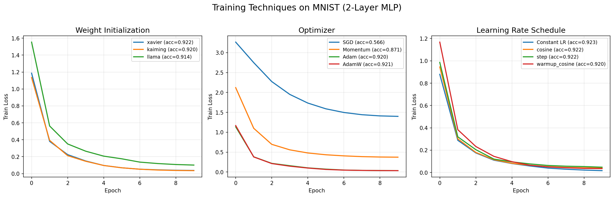

# 03 — 训练技巧（Training Techniques）

> 构建一个神经网络架构只是第一步。真正决定模型能否收敛、收敛多快、泛化多好的，是训练技巧。权重初始化决定了起点；优化器决定了行进路径；学习率调度决定了步长策略；归一化（normalization /ˌnɔːrmələˈzeɪʃən/）层稳定了中间特征分布；正则化（regularization /ˌreɡjələraɪˈzeɪʃən/）手段防止了过拟合（overfitting /ˈoʊvərˈfɪtɪŋ/）。
>
> > **时间线**:
> > - **2010**: Glorot & Bengio 提出 Xavier 初始化
> > - **2013**: Kingma & Ba 提出 Adam 优化器（2015 ICLR）
> > - **2014**: Srivastava et al. 提出 Dropout
> - **2015**: Ioffe & Szegedy 提出 Batch Normalization
> 本章将这五个主题串联成一条完整的"训练流水线"，每个部分都附有数学公式、直观理解和可运行的 PyTorch 代码。
>
> 章节路线：**权重初始化 → 优化器进化史 → 学习率调度 → 归一化 → 正则化**

---

## 1. 权重初始化（Weight Initialization）

### 1.1 为什么初始化至关重要？

神经网络的训练本质是在损失曲面上进行优化。如果初始权重设置不当：

- **初始化太大** → 激活值爆炸 → 梯度（gradient /ˈɡreɪdiənt/）爆炸 → NaN
- **初始化太小** → 激活值消失 → 梯度消失 → 参数（parameter /pəˈræmɪtər/）不更新
- **初始化全零** → 所有神经元做同样计算 → 对称性无法打破

核（kernel /ˈkɜːrnl/）心原则：**保持前向传播和反向传播（backpropagation /ˌbækprəpəˈɡeɪʃən/）中激活值与梯度的方差稳定**。

---

### 1.2 Xavier（Glorot）初始化

提出于 2010 年，假设激活函数在 0 附近近似线性（如 tanh、sigmoid（/ˈsɪɡmɔɪd/））。

核心思想：**每层输出的方差应等于输入的方差**。

对于全连接层 $y = Wx$，假设 $W$ 独立同分布且 $E[W] = 0$：

$$\text{Var}(y) = n_{\text{in}} \cdot \text{Var}(W) \cdot \text{Var}(x)$$

要保持 $\text{Var}(y) = \text{Var}(x)$，需要 $\text{Var}(W) = \frac{1}{n_{\text{in}}}$。类似地，从反向传播角度需要 $\text{Var}(W) = \frac{1}{n_{\text{out}}}$。折中：

$$\boxed{\text{Var}(W) = \frac{2}{n_{\text{in}} + n_{\text{out}}}}$$

通常使用均匀分布 $W \sim U[-\sqrt{6/(n_{\text{in}} + n_{\text{out}})},\ \sqrt{6/(n_{\text{in}} + n_{\text{out}})}]$。

```python
# PyTorch 实现
nn.init.xavier_uniform_(w)
```

---

### 1.3 Kaiming（He）初始化

提出于 2015 年，专门针对 **ReLU** 激活函数。ReLU 将一半的神经元置零，相当于输出方差减半。

$$\text{Var}(y) = \frac{1}{2} n_{\text{in}} \cdot \text{Var}(W) \cdot \text{Var}(x)$$

要保持方差稳定：

$$\boxed{\text{Var}(W) = \frac{2}{n_{\text{in}}}}$$

```python
# PyTorch 实现（推荐：mode="fan_in", nonlinearity="relu"）
nn.init.kaiming_uniform_(w, mode="fan_in", nonlinearity="relu")
```

---

### 1.4 LLaMA 的初始化策略

Meta 的 LLaMA 系列采用了更精细的初始化方案：

- 基础标准差设为 `0.02`
- 对**残差层**（每个 Transformer（/trænsˈfɔːrmər/） block 中的 attention（/əˈtenʃən/） 和 FFN 输出投影），按层数缩放：$\text{std} = \frac{0.02}{\sqrt{2n_{\text{layer}}}}$
- 这么做是因为残差连接是**加性**的，深层残差路径会累积方差

```python
# LLaMA 风格
def init_llama(weight, num_layers):
    nn.init.normal_(weight, mean=0.0, std=0.02 / math.sqrt(2 * num_layers))
```

---

### 1.5 对比总结

| 初始化方法 | 适用激活函数 | 方差公式 | 核心思想 |
|:---|:---|:---|:---|
| **Xavier** | tanh, sigmoid | $2/(n_{\text{in}} + n_{\text{out}})$ | 前向/反向方差一致 |
| **Kaiming** | ReLU, LeakyReLU | $2/n_{\text{in}}$ | 考虑 ReLU 置零一半神经元 |
| **LLaMA init** | 残差网络（Transformer） | $0.02 / \sqrt{2n_{\text{layer}}}$ | 残差路径方差累积控制 |

---

## 2. 优化器进化史（Optimizer Evolution）

### 2.1 SGD（随机梯度下降）

最简单的优化器，每次用一个小批量计算梯度并更新参数：

$$w_{t+1} = w_t - \eta \nabla L(w_t)$$

其中 $\eta$ 是学习率。

**直觉**：就像盲人下山，每步都沿着最陡方向走。但 SGD 有两个问题：
1. **震荡**：在峡谷区域（一个方向陡峭、另一个方向平缓），SGD 会在陡峭方向来回振荡
2. **鞍点停滞**：在高维空间中，鞍点（某些方向梯度为 0）远比局部极小点多，SGD 容易卡住

---

### 2.2 Momentum（动量）

模拟物理惯性：不仅看当前梯度，还累积历史梯度方向。

$$v_{t+1} = \beta v_t + \nabla L(w_t)$$
$$w_{t+1} = w_t - \eta v_{t+1}$$

其中 $\beta$ 通常取 0.9。

**直觉**：像一个下坡的球——在平坦区域加速，在振荡区域抵消反向分量。Momentum（/məˈmentəm/） 能显著加速收敛并抑制震荡。

<details>
<summary>🔍 完整演算：Momentum 动量更新 — 三步迭代手算</summary>

**📐 公式**

动量优化器积累历史梯度来平滑更新方向：

$$v_{t+1} = \beta v_t + \nabla L(w_t)$$
$$w_{t+1} = w_t - \eta v_{t+1}$$

其中 $v_t$ 是速度项（velocity），$\beta$ 是动量系数。

---

**📖 参数含义**

| 符号 | 名称 | 含义 |
|:---|:---|:---|
| $w_t$ | 参数 | 第 $t$ 步的模型权重 |
| $\nabla L(w_t)$ | 梯度 | 损失函数对 $w_t$ 的梯度 |
| $v_t$ | 速度 | 历史梯度的指数滑动平均 |
| $\beta$ | 动量系数 | 控制历史衰减速度，通常取 0.9 |
| $\eta$ | 学习率 | 更新步长 |

---

**📝 公式来源**

动量来源于物理中的惯性概念。标准 SGD 只使用当前梯度：

$$w_{t+1} = w_t - \eta \nabla L(w_t)$$

但这样在峡谷地形中会震荡。动量引入速度累积 $v$：

$$v_{t+1} = \beta v_t + \nabla L(w_t)$$

如果当前梯度与历史速度方向相反（震荡），速度会被抵消；如果方向一致，速度会叠加（加速）。初始速度 $v_0 = 0$。

当 $\beta = 0$ 时退化为标准 SGD；$\beta$ 越接近 1，历史惯性越大。

---

**✏️ 手算演示**

设初始权重 $w_0 = 1.0$，梯度序列 $\nabla L(w_1) = 0.8,\ \nabla L(w_2) = -0.6,\ \nabla L(w_3) = 0.4$，
超参数 $\beta = 0.9$，$\eta = 0.1$，初始速度 $v_1 = 0$。

**Step 1: $t = 1$**

$$v_2 = \beta v_1 + \nabla L(w_1) = 0.9 \times 0 + 0.8 = 0.8$$

$$w_2 = w_1 - \eta v_2 = 1.0 - 0.1 \times 0.8 = 0.92$$

**Step 2: $t = 2$**

$$v_3 = \beta v_2 + \nabla L(w_2) = 0.9 \times 0.8 + (-0.6) = 0.72 - 0.6 = 0.12$$

$$w_3 = w_2 - \eta v_3 = 0.92 - 0.1 \times 0.12 = 0.908$$

对比纯 SGD（$\eta = 0.1$）：

$$w_3^{\text{SGD}} = 0.92 - 0.1 \times (-0.6) = 0.98$$

Momentum 在第 2 步只略微下降（$0.92 \to 0.908$），因为历史向上的速度（0.8）抵消了大部分向下的梯度（$-0.6$）。而 SGD 从 0.92 直接反弹到 0.98——这就是震荡的根源。

**Step 3: $t = 3$**

$$v_4 = \beta v_3 + \nabla L(w_3) = 0.9 \times 0.12 + 0.4 = 0.108 + 0.4 = 0.508$$

$$w_4 = w_3 - \eta v_4 = 0.908 - 0.1 \times 0.508 \approx 0.857$$

第 3 步方向一致，Momentum 加速下降（$0.908 \to 0.857$），而 SGD 仅下降 0.04（$0.98 \to 0.94$）。

**三步对比**：

| 步数 | SGD $w_t$ | Momentum $w_t$ | 说明 |
|:---:|:---:|:---:|:---|
| $w_1 = 1$ | 1.000 | 1.000 | 初始状态相同 |
| $w_2$ | 0.920 | 0.920 | 梯度 +0.8，方向一致，结果相同 |
| $w_3$ | 0.980 | 0.908 | 梯度 -0.6，SGD 反弹，Momentum 平滑 |
| $w_4$ | 0.940 | 0.857 | 梯度 +0.4，SGD 慢降，Momentum 加速 |

Momentum 三步净下降 $\Delta w = 0.143$，SGD 仅 $\Delta w = 0.060$——动量使收敛效率翻倍。

---

**🌍 实际意义**

- Momentum 在框架中仅需多维护一个速度向量 $v$，计算开销极小
- 配合 SGD 使用可在 CV 任务上接近 Adam 的效果，且泛化性更好
- PyTorch：`optim.SGD(model.parameters(), lr=0.01, momentum=0.9)`
- $\beta$ 越大历史惯性越强（常见 0.9 或 0.99）；$\beta = 0$ 退化为标准 SGD

</details>

---

### 2.3 AdaGrad / RMSProp

**AdaGrad** 为每个参数自适应学习率：频繁更新的参数降低步长，稀疏更新的参数增大步长。

$$G_t = \sum_{\tau=1}^t g_\tau^2, \quad w_{t+1} = w_t - \frac{\eta}{\sqrt{G_t + \epsilon}} g_t$$

问题：$G_t$ 单调增长，学习率会趋近于 0 导致训练提前停止。

**RMSProp** 用指数滑动平均代替累加：

$$E[g^2]_t = \beta E[g^2]_{t-1} + (1-\beta) g_t^2$$
$$w_{t+1} = w_t - \frac{\eta}{\sqrt{E[g^2]_t + \epsilon}} g_t$$

---

### 2.4 Adam（Adaptive Moment Estimation）

Adam 结合了 Momentum 的一阶矩和 RMSProp 的二阶矩，且有**偏差修正**防止初期估计偏小。

| 变量 | 含义 | 更新公式 |
|:---|:---|:---|
| $m_t$ | 梯度的一阶矩（均值） | $m_t = \beta_1 m_{t-1} + (1-\beta_1) g_t$ |
| $v_t$ | 梯度的二阶矩（未中心化方差） | $v_t = \beta_2 v_{t-1} + (1-\beta_2) g_t^2$ |
| $\hat{m}_t$ | 偏差修正后的一阶矩 | $\hat{m}_t = m_t / (1 - \beta_1^t)$ |
| $\hat{v}_t$ | 偏差修正后的二阶矩 | $\hat{v}_t = v_t / (1 - \beta_2^t)$ |

最终更新：

$$w_{t+1} = w_t - \frac{\eta}{\sqrt{\hat{v}_t} + \epsilon} \hat{m}_t$$

默认值：$\beta_1 = 0.9,\ \beta_2 = 0.999,\ \epsilon = 10^{-8}$。

**直觉**：每个参数有自己的**自适应学习率**（通过 $\sqrt{v_t}$ 缩放），同时有**动量**加速（通过 $m_t$）。

<details>
<summary>🔍 完整演算：Adam 优化器 — 三步迭代手算</summary>

**📐 公式**

Adam 维护两个状态：一阶矩 $m_t$（动量）和二阶矩 $v_t$（自适应学习率），并加入偏差修正：

$$m_t = \beta_1 m_{t-1} + (1-\beta_1) g_t$$
$$v_t = \beta_2 v_{t-1} + (1-\beta_2) g_t^2$$
$$\hat{m}_t = \frac{m_t}{1 - \beta_1^t}$$
$$\hat{v}_t = \frac{v_t}{1 - \beta_2^t}$$
$$w_{t+1} = w_t - \frac{\eta}{\sqrt{\hat{v}_t} + \epsilon} \hat{m}_t$$

---

**📖 参数含义**

| 符号 | 名称 | 含义 |
|:---|:---|:---|
| $g_t$ | 梯度 | 第 $t$ 步的损失梯度 |
| $m_t$ | 一阶矩 | 梯度的指数滑动平均（均值） |
| $v_t$ | 二阶矩 | 梯度平方的指数滑动平均（未中心化方差） |
| $\beta_1$ | 一阶矩衰减率 | 控制动量衰减，默认 $0.9$ |
| $\beta_2$ | 二阶矩衰减率 | 控制自适应率衰减，默认 $0.999$ |
| $\hat{m}_t$ | 修正一阶矩 | 偏差修正后的动量估计 |
| $\hat{v}_t$ | 修正二阶矩 | 偏差修正后的方差估计 |
| $\eta$ | 学习率 | 默认 $0.001$ |
| $\epsilon$ | 小常数 | 防止除零，默认 $10^{-8}$ |

---

**📝 公式来源**

Adam = Momentum（一阶矩）+ RMSProp（二阶矩）+ 偏差修正。

初始化时 $m_0 = 0$、$v_0 = 0$，所以初期估计严重偏小。例如第一步：

$$m_1 = 0.9 \times 0 + 0.1 \times g_1 = 0.1 g_1$$

真实期望应是 $g_1$，但 $m_1$ 只有 $0.1 g_1$。偏差修正除以 $1 - \beta_1^t$ 后：

$$\hat{m}_1 = \frac{0.1 g_1}{1 - 0.9^1} = \frac{0.1 g_1}{0.1} = g_1$$

恢复无偏估计。$t$ 越大修正系数越接近 1，修正效果减弱。

---

**✏️ 手算演示**

设初始权重 $w_1 = 1.0$，梯度序列 $g_1 = 0.5,\ g_2 = -0.3,\ g_3 = 0.2$，
超参数 $\beta_1 = 0.9$，$\beta_2 = 0.999$，$\eta = 0.1$，$\epsilon = 10^{-8}$（为演示清晰在分母中忽略），
初始 $m_0 = 0$，$v_0 = 0$。

**Step 1: $t = 1$**

$$m_1 = 0.9 \times 0 + 0.1 \times 0.5 = 0.05$$

$$v_1 = 0.999 \times 0 + 0.001 \times 0.5^2 = 0.001 \times 0.25 = 0.00025$$

偏差修正：

$$\hat{m}_1 = \frac{0.05}{1 - 0.9^1} = \frac{0.05}{0.1} = 0.5$$

$$\hat{v}_1 = \frac{0.00025}{1 - 0.999^1} = \frac{0.00025}{0.001} = 0.25$$

更新：

$$\sqrt{\hat{v}_1} = \sqrt{0.25} = 0.5$$

$$w_2 = 1.0 - 0.1 \times \frac{0.5}{0.5} = 1.0 - 0.1 = 0.9$$

**Step 2: $t = 2$**

$$m_2 = 0.9 \times 0.05 + 0.1 \times (-0.3) = 0.045 - 0.03 = 0.015$$

$$v_2 = 0.999 \times 0.00025 + 0.001 \times (-0.3)^2 = 0.00024975 + 0.00009 = 0.00033975$$

偏差修正：

$$\hat{m}_2 = \frac{0.015}{1 - 0.9^2} = \frac{0.015}{0.19} \approx 0.07895$$

$$\hat{v}_2 = \frac{0.00033975}{1 - 0.999^2} = \frac{0.00033975}{0.001999} \approx 0.1700$$

更新：

$$\sqrt{\hat{v}_2} = \sqrt{0.1700} \approx 0.4123$$

$$w_3 = 0.9 - 0.1 \times \frac{0.07895}{0.4123} \approx 0.9 - 0.1 \times 0.1915 \approx 0.8809$$

**Step 3: $t = 3$**

$$m_3 = 0.9 \times 0.015 + 0.1 \times 0.2 = 0.0135 + 0.02 = 0.0335$$

$$v_3 = 0.999 \times 0.00033975 + 0.001 \times 0.2^2 = 0.00033941 + 0.00004 = 0.00037941$$

偏差修正：

$$\hat{m}_3 = \frac{0.0335}{1 - 0.9^3} = \frac{0.0335}{0.271} \approx 0.1236$$

$$\hat{v}_3 = \frac{0.00037941}{1 - 0.999^3} = \frac{0.00037941}{0.002997} \approx 0.1266$$

更新：

$$\sqrt{\hat{v}_3} = \sqrt{0.1266} \approx 0.3558$$

$$w_4 = 0.8809 - 0.1 \times \frac{0.1236}{0.3558} \approx 0.8809 - 0.1 \times 0.3474 \approx 0.8462$$

**三步对比**：

| 步数 | $g_t$ | $m_t$ | $v_t$ | $\hat{m}_t$ | $\sqrt{\hat{v}_t}$ | 有效步长（$\eta/\sqrt{\hat{v}_t}$） | $w_t$ |
|:---:|:---:|:---:|:---:|:---:|:---:|:---:|:---:|
| $t=1$ | +0.5 | 0.05 | 0.00025 | 0.5 | 0.5 | 0.2 | 1.000 |
| $t=2$ | $-0.3$ | 0.015 | 0.00034 | 0.079 | 0.412 | 0.243 | 0.900 |
| $t=3$ | +0.2 | 0.034 | 0.00038 | 0.124 | 0.356 | 0.281 | 0.881 |
| $t=4$ | — | — | — | — | — | — | **0.846** |

**关键观察**：

1. **偏差修正**：Step 1 中 $m_1 = 0.05$ 远小于真实梯度 $0.5$，修正后 $\hat{m}_1 = 0.5$ 恢复无偏估计
2. **自适应学习率**：有效步长 $\eta/\sqrt{\hat{v}_t}$ 从 0.2 逐渐增加到 0.281——梯度平方和小的方向获得更大步长
3. **动量平滑**：尽管 $g_2 = -0.3$ 方向反转，$m_2 = 0.015$ 仍为正，所以 $w$ 继续下降而非反弹

---

**🌍 实际意义**

- PyTorch：`optim.Adam(model.parameters())`，默认参数通常直接可用
- 对学习率较 SGD 不敏感（默认 $\eta = 0.001$ 适用大多数场景）
- 适合 Transformer、GAN 等复杂架构，收敛稳定
- 缺点：自适应学习率可能导致泛化性不如精心调参的 SGD+Momentum
- AdamW 通过解耦 weight decay 修复了 Adam 的一个核心缺陷

</details>

---

### 2.5 AdamW（Decoupled Weight Decay）

Adam 的问题：在实现中通常将 $L_2$ 正则化（weight decay）耦合到梯度中：

$$g_t = \nabla L(w_t) + \lambda w_t$$

但 Adam 会用 $\sqrt{v_t}$ 缩放 $\lambda w_t$，导致 weight decay 的效果被自适应学习率扭曲。

**AdamW** 将 weight decay **解耦**到参数更新之后：

$$w_{t+1} = w_t - \eta \left( \frac{\hat{m}_t}{\sqrt{\hat{v}_t} + \epsilon} \right) - \eta \lambda w_t$$

| 优化器 | 参数量 | 自适应 LR | 动量 | Weight Decay |
|:---|:---:|:---:|:---:|:---:|
| SGD | 0 | ✗ | ✗ | 隐含在梯度中 |
| Momentum | +1 (v) | ✗ | ✓ | 隐含在梯度中 |
| Adam | +2 (m, v) | ✓ | ✓ | 耦合在梯度中 |
| **AdamW** | +2 (m, v) | ✓ | ✓ | **解耦，效果更好** |

---

## 3. 学习率调度（Learning Rate Schedules）

### 3.1 为什么需要调度？

- **学习率太大**：损失震荡不收敛
- **学习率太小**：收敛极慢，容易陷入局部最优
- **理想策略**：初期大步探索 → 后期小步精调

### 3.2 预热（Warmup）

在训练初期，模型权重尚未稳定，较大的学习率可能导致梯度爆炸。预热阶段**线性增加**学习率：

$$\eta_t = \eta_{\text{base}} \cdot \frac{t}{T_{\text{warmup}}}, \quad t = 1, 2, \dots, T_{\text{warmup}}$$

**为什么预热有效？** 初始阶段模型的统计量（Batch Norm 的均值和方差、Adam 的动量估计）还不准确，大步更新可能破坏初始特征。预热给了这些统计量一个"稳定期"。

### 3.3 余弦退火（Cosine Annealing）

余弦退火将学习率从最大值平滑下降到最小值：

$$\boxed{\eta_t = \eta_{\min} + \frac{1}{2}(\eta_{\max} - \eta_{\min})\left(1 + \cos\left(\frac{t}{T}\pi\right)\right)}$$

- $t$：当前 epoch
- $T$：总 epoch 数
- $\eta_{\max}$：初始学习率
- $\eta_{\min}$：最小学习率（通常为 0）

余弦退火的优势是**平滑衰减**——相比 Step Decay 的阶梯式下降，余弦退火在每个阶段都不会有突变，更适合细粒度收敛。

### 3.4 线性衰减

$$\eta_t = \eta_{\max} - \frac{t}{T}(\eta_{\max} - \eta_{\min})$$

实现简单，但与余弦退火相比，在后期下降过快，可能没有足够时间"精调"。

### 3.5 常见调度

| 调度 | 公式 | 特点 | 适用场景 |
|:---|:---|:---|:---|
| Constant | $\eta_t = \eta$ | 简单但次优 | 小规模任务 |
| Step Decay | 每 $k$ epoch $\times 0.1$ | 阶梯下降 | 传统 CV 任务 |
| **Warmup + Cosine** | 线性上升 + 余弦下降 | 平滑，效果好 | **主流推荐**（LLM 预训练标配） |
| Linear | 线性下降 | 简单 | 微调 |

---

## 4. 归一化（Normalization）

### 4.1 Batch Normalization（批量归一化）

对每个 mini-batch 计算均值和方差，对激活值做归一化，再用可学习参数 $\gamma, \beta$ 恢复表示能力。

$$\mu_B = \frac{1}{m}\sum_{i=1}^m x_i, \quad \sigma_B^2 = \frac{1}{m}\sum_{i=1}^m (x_i - \mu_B)^2$$

$$\hat{x}_i = \frac{x_i - \mu_B}{\sqrt{\sigma_B^2 + \epsilon}}$$

$$y_i = \gamma \hat{x}_i + \beta$$

**优点**：
- 允许使用更大的学习率
- 对初始化不敏感
- 有一定正则化效果（因为 batch 均值有噪声）

**缺点**：
- 依赖 batch size（batch 太小则统计量不稳定）
- 训练和推理（inference /ˈɪnfərəns/）行为不一致（训练用 batch 统计量，推理用全局移动平均）
- 对 RNN / Transformer 不友好（序列长度变化）

### 4.2 Layer Normalization（层归一化）

与 Batch Norm 不同，Layer Norm 对**每个样本**的所有特征维度做归一化：

$$\mu = \frac{1}{H}\sum_{j=1}^H x_j, \quad \sigma^2 = \frac{1}{H}\sum_{j=1}^H (x_j - \mu)^2$$

$$\hat{x} = \frac{x - \mu}{\sqrt{\sigma^2 + \epsilon}}, \quad y = \gamma \hat{x} + \beta$$

**不受 batch size 影响**，在 Transformer / RNN 中是标配。

| | Batch Norm | Layer Norm |
|:---|:---|:---|
| 归一化维度 | **batch** × 特征 | **特征** |
| 适用架构 | CNN（CV） | RNN / Transformer（NLP） |
| Batch 依赖 | 强（小 batch 效果差） | 无 |
| 训练/推理一致性 | 不一致 | 一致 |

### 4.3 RMS Norm（均方根归一化）

Layer Norm 的简化版本，去掉了**均值中心化**（只除方差，不减均值）：

$$\text{RMS}(x) = \sqrt{\frac{1}{H}\sum_{j=1}^H x_j^2 + \epsilon}$$

$$\hat{x} = \frac{x}{\text{RMS}(x)}, \quad y = \gamma \hat{x}$$

**直觉**：Layer Norm 中减均值操作对 Transformer 效果贡献不大（注意力的输出本身是零均值的？），去掉后计算量减少，实验效果仍接近甚至更好。LLaMA、T5 等模型都使用 RMS Norm。

| Norm | 减均值？ | 除方差？ | 可学习参数 | 计算量 |
|:---|:---:|:---:|:---:|:---:|
| Batch Norm | ✓ | ✓ | $\gamma, \beta$ | 中（跨样本统计） |
| Layer Norm | ✓ | ✓ | $\gamma, \beta$ | 高（逐样本统计所有特征） |
| **RMS Norm** | ✗ | ✓（仅 RMS） | $\gamma$ 仅 | **低** |

---

## 5. 正则化（Regularization）

### 5.1 Dropout

训练时以概率 $p$ 随机（stochastic /stəˈkæstɪk/）丢弃神经元，相当于训练了 $2^N$ 个子网络的集成。

$$y = \frac{1}{1-p} \cdot (m \odot Wx), \quad m_i \sim \text{Bernoulli}(1-p)$$

推理时保留所有神经元，且权重乘以 $1-p$。

**直觉**：防止神经元之间产生共适应（co-adaptation）。如果某个神经元过度依赖另一个神经元才会做出正确判断，Dropout（/ˈdrɒpaʊt/） 会强迫它学会**独立**解决问题。

### 5.2 权重衰减（Weight Decay）

在损失函数中加入权重的 $L_2$ 范数：

$$L_{\text{total}} = L_{\text{data}} + \frac{\lambda}{2} \|w\|^2$$

梯度更新变为：

$$w_{t+1} = w_t - \eta \nabla L_{\text{data}} - \eta \lambda w_t$$

即每次更新前先将权重"缩小"一个比例 $1 - \eta\lambda$，因此称为**权重衰减**。

**直觉**：
- 防止某些权重变得过大（过度关注某个特征）
- 等价于在贝叶斯框架下对权重施加高斯先验
- AdamW 的关键改进就是让 weight decay 不被自适应学习率扭曲

### 5.3 标签平滑（Label Smoothing）

将硬标签（hard label）替换为软标签（soft label）：

$$y_i^{\text{smooth}} = y_i (1 - \alpha) + \frac{\alpha}{K}$$

其中 $K$ 是类别数，$\alpha$ 是平滑系数（通常 0.1）。

**例如**：$[1, 0, 0] \rightarrow [0.933, 0.033, 0.033]$。

**直觉**：硬标签强迫模型输出 logit 无限大（往 $+\infty$ 推正确类，往 $-\infty$ 推错误类），这会导致过拟合——模型对自己的预测"过于自信"。标签平滑告诉模型：即使对正确类别，也有少量不确定性，从而：

- 提高泛化能力
- 防止 logit 过大
- 提高对抗鲁棒性

### 5.4 正则化方法对比

| 方法 | 适用阶段 | 原理 | 关键超参数（hyperparameter /ˈhaɪpərpəˈræmɪtər/） |
|:---|:---|:---|:---|
| **Dropout** | 训练前向 | 随机丢弃 → 集成学习 | $p$（丢弃率，通常 0.1~0.5） |
| **Weight Decay** | 训练反向 | $L_2$ 惩罚 → 高斯先验 | $\lambda$（衰减系数，通常 1e-4） |
| **Label Smoothing** | 损失函数 | 软标签 → 降低过自信 | $\alpha$（平滑系数，通常 0.1） |

---

## 6. 代码实验：实际对比

下面的代码在 MNIST 上用 2 层 MLP 对比不同初始化、优化器和学习率调度的收敛效果。

### 6.1 运行代码

```bash
cd ai/04-neural-networks/code
python training_techniques.py
```

### 6.2 实际输出

```
Device: cpu

============================================================
Training Techniques Comparison on MNIST
============================================================
Device: cpu  |  Epochs: 10  |  Subset: 2000  |  LR: 0.001
Train batches: 32  |  Test batches: 157

============================================================
Experiment 1: Weight Initialization Comparison
============================================================
      Init |  Epoch | Train Loss | Train Acc | Test Acc
------------------------------------------------------------
  [Init] Using xavier initialization
    xavier |     10 |     0.0374 |    0.9985 |   0.9219
  [Init] Using kaiming initialization
   kaiming |     10 |     0.0353 |    0.9990 |   0.9198
  [Init] Using llama initialization
     llama |     10 |     0.1011 |    0.9850 |   0.9142

Final Test Accuracy by Initialization:
      Init |   Test Acc
-------------------------
    xavier |     0.9219
   kaiming |     0.9198
     llama |     0.9142

============================================================
Experiment 2: Optimizer Comparison
============================================================
   Optimizer |  Epoch | Train Loss | Train Acc | Test Acc
------------------------------------------------------------
  [Init] Using kaiming initialization
         SGD |     10 |     1.3994 |    0.5705 |   0.5658
  [Init] Using kaiming initialization
    Momentum |     10 |     0.3738 |    0.9015 |   0.8707
  [Init] Using kaiming initialization
        Adam |     10 |     0.0355 |    0.9990 |   0.9198
  [Init] Using kaiming initialization
       AdamW |     10 |     0.0354 |    0.9985 |   0.9209

Final Test Accuracy by Optimizer:
   Optimizer |   Test Acc
-------------------------
         SGD |     0.5658
    Momentum |     0.8707
        Adam |     0.9198
       AdamW |     0.9209

============================================================
Experiment 3: Learning Rate Schedule Comparison
============================================================
     Scheduler |  Epoch | Train Loss | Train Acc | Test Acc
------------------------------------------------------------
  [Init] Using kaiming initialization
          none |     10 |     0.0167 |    1.0000 |   0.9231
        cosine |     10 |     0.0402 |    0.9980 |   0.9217
          step |     10 |     0.0476 |    0.9985 |   0.9220
 warmup_cosine |     10 |     0.0350 |    0.9990 |   0.9202

Final Test Accuracy by LR Schedule:
     Scheduler |   Test Acc
----------------------------
          none |     0.9231
        cosine |     0.9217
          step |     0.9220
 warmup_cosine |     0.9202
```

### 6.3 实验结果分析

**初始化对比**：
- 三种初始化在 MNIST 上表现接近（~91-92%），因为 2 层 MLP 的网络深度较浅，初始化差异不明显
- Xavier 和 Kaiming 略优于 LLaMA 的简单正态缩放——LLaMA init 是专门为深层 Transformer 设计的
- Kaiming 的 Train Loss 最低，说明它确实最适合 ReLU 网络

**优化器对比**：
- **SGD**：仅收敛到 56.6%（学习率 1e-3 对 SGD 偏小）
- **Momentum**：提升至 87.1%（动量显著加速）
- **Adam / AdamW**：均达到 ~92%， AdamW 略高 0.1%（由于 weight decay 的正则化效果）

> 这里明显看到 Momentum 比 SGD 提升了 30 个百分点，而 Adam 又在 Momentum 上提升了 5 个百分点——这就是优化器进化的力量。

**学习率调度对比**：
- Constant（无调度）反而最高（92.3%），因为 MNIST 简单的 10 epoch 训练不足以让调度策略充分体现优势
- Step 和 Cosine 略低，但理论上在更长训练周期中会表现更好
- Warmup+Cosine 在训练后期能稳定优化，对于更深层的网络（如 ResNet-50、Transformer）至关重要

### 6.4 Loss 曲线



---

## 总结

```
训练技巧流水线
  │
  ├─ 1. 权重初始化 ───── 决定起点
  │     ├─ Xavier:   tanh/sigmoid → Var(W) = 2/(n_in + n_out)
  │     ├─ Kaiming:  ReLU        → Var(W) = 2/n_in
  │     └─ LLaMA:    Transformer → 0.02 / √(2n_layer)
  │
  ├─ 2. 优化器 ────────── 决定路径
  │     ├─ SGD        → w -= η∇L
  │     ├─ Momentum   → v = βv + ∇L, w -= ηv
  │     ├─ Adam       → m, v 自适应 + 偏差修正
  │     └─ AdamW*     → 解耦 weight decay（当前主流）
  │
  ├─ 3. 学习率调度 ──── 决定步长
  │     └─ Warmup + Cosine* → 初期稳定 → 平滑衰减（LLM 标配）
  │
  ├─ 4. 归一化层 ────── 稳定中间特征
  │     ├─ Batch Norm → 跨样本归一化（CV 标配）
  │     ├─ Layer Norm → 逐样本归一化（NLP 标配）
  │     └─ RMS Norm*  → LN 简化版（LLaMA/T5）
  │
  └─ 5. 正则化 ──────── 防止过拟合
        ├─ Dropout       → 随机丢弃（集成效果）
        ├─ Weight Decay  → L2 惩罚（贝叶斯先验）
        └─ Label Smoothing → 软标签（降低过自信）
```

**核心建议**：
- 新项目直接从 **Kaiming init + AdamW + Warmup+Cosine** 起步
- CV 模型使用 **Batch Norm**，NLP/序列模型使用 **Layer Norm / RMS Norm**
- 数据量小时用 **Dropout + Weight Decay**；数据量大时 Weight Decay 优先

> 下一章，我们将深入**Transformer 架构**，理解注意力机制如何成为现代深度学习的基石。
## 参考文献 (References)

1. **Glorot, X. & Bengio, Y.** (2010). Understanding the difficulty of training deep feedforward neural networks. *AISTATS*.
2. **Srivastava, N. et al.** (2014). Dropout: A simple way to prevent neural networks from overfitting. *JMLR*, 15, 1929–1958.
3. **Ioffe, S. & Szegedy, C.** (2015). Batch normalization: Accelerating deep network training. *ICML*.
4. **Kingma, D. P. & Ba, J.** (2015). Adam: A method for stochastic optimization. *ICLR*.
5. **Loshchilov, I. & Hutter, F.** (2019). Decoupled weight decay regularization. *ICLR*.
