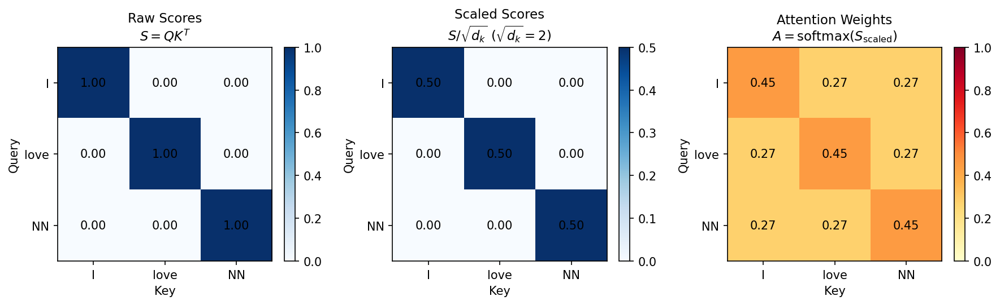

# 第1章：注意力机制 — 从直觉到数学
# Chapter 1: Attention Mechanism — From Intuition to Mathematics

> **注意力（attention /əˈtenʃən/）机制（Attention Mechanism）是 Transformer（/trænsˈfɔːrmər/） 架构的基石。它让模型在每一步都能"聚焦"到输入序列中最相关的部分，而不是依赖一个固定维度的上下文向量。** 本章从直觉类比出发，完整推导缩放点积注意力（Scaled Dot-Product Attention）的数学公式，并通过小规模矩阵计算展示其每一步的运作过程。
> > **时间线**:
> > - **2014**: Bahdanau, Cho & Bengio 将注意力机制引入神经机器翻译
> - **2017**: Vaswani et al. 提出 Attention Is All You Need
>
> **The Attention mechanism is the cornerstone of the Transformer architecture. It allows the model to "focus" on the most relevant parts of the input sequence at each step, rather than relying on a fixed-dimensional context vector.** This chapter starts from an intuitive analogy, fully derives the mathematics of Scaled Dot-Product Attention, and walks through every step with small matrix computations.

**前置知识 (Prerequisites):** 向量点积、softmax（/sɒftˈmæks/） 函数、线性代数基础（第2卷）
**Code companion:** [`code/attention_mechanism.py`](code/attention_mechanism.py)

---

## 1. QKV 直觉：搜索引擎类比
## QKV Intuition: The Search Engine Analogy

注意力机制的核（kernel /ˈkɜːrnl/）心操作围绕三个角色展开：**Query（查询）**、**Key（键）**、**Value（值）**。理解它们最简单的方式是搜索引擎类比：

| 角色 | 符号 | 类比：搜索 | 数学含义 |
|:---|:---:|:---|:---|
| **Query（查询）** | $Q$ | 你在搜索框输入的关键词 | "我正在找什么？" |
| **Key（键）** | $K$ | 网页的索引标签 | "我包含什么内容？" |
| **Value（值）** | $V$ | 网页的正文内容 | "我将返回什么信息？" |

**工作流程：**

1. 你的 **Query**（如"深度学习入门"）与每个网页的 **Key**（如"机器学习教程"、"烹饪食谱"）做**匹配**。
2. 匹配分数越高的 Key，对应的 Value 在最终结果中占据**更大的权重**。
3. 最终输出是**所有 Value 的加权平均**，权重来自 Query 和 Key 的匹配程度。

> **为什么需要区分 Key 和 Value？**
>
> Key 负责"被匹配"——它决定了哪些信息值得被关注。Value 负责"被返回"——它包含了实际需要的信息内容。这种分离让模型可以独立地学习"什么值得被注意"（Key）和"被注意后输出什么"（Value），增加了表达能力。

**在 Transformer 中：**

$$ \text{Attention}(Q, K, V) = \text{softmax}\left(\frac{QK^T}{\sqrt{d_k}}\right) V $$

这个公式就是"可微分的搜索系统"。

---

## 2. 缩放点积注意力（Scaled Dot-Product Attention）的完整推导
## Full Derivation of Scaled Dot-Product Attention

### 2.1 问题设定

假设我们有一个包含 $n$ 个 token 的输入序列，每个 token 的嵌入（embedding /ɪmˈbedɪŋ/）维度为 $d_k$。通过线性投影得到：

$$ Q \in \mathbb{R}^{n \times d_k}, \quad K \in \mathbb{R}^{n \times d_k}, \quad V \in \mathbb{R}^{n \times d_v} $$

注意：$d_k$ 是 Query 和 Key 的维度，$d_v$ 是 Value 的维度。在实践中通常 $d_k = d_v$，但概念上它们是独立的。

### 2.2 第一步：相似度矩阵 — $QK^T$

$$ S = QK^T \in \mathbb{R}^{n \times n} $$

$S_{ij} = Q_i \cdot K_j$ 是第 $i$ 个 Query 和第 $j$ 个 Key 的点积（dot product），衡量它们的相似度。

**点积的含义**：两个向量 $a, b \in \mathbb{R}^{d_k}$ 的点积 $a \cdot b = \sum_{l=1}^{d_k} a_l b_l$ 在高维空间中近似衡量它们的方向一致性。方向越一致，点积越大。

### 2.3 第二步：缩放 — $\frac{S}{\sqrt{d_k}}$

$$ S_{\text{scaled}} = \frac{QK^T}{\sqrt{d_k}} $$

**为什么需要缩放？**

假设 $q$ 和 $k$ 的分量是独立同分布的标准正态分布 $\mathcal{N}(0, 1)$。那么点积 $q \cdot k = \sum_{i=1}^{d_k} q_i k_i$ 的均值为 0，方差为 $d_k$：

$$ \mathbb{E}[q \cdot k] = 0, \quad \text{Var}(q \cdot k) = d_k $$

当 $d_k$ 很大时，点积的规模会很大，导致 softmax 进入**梯度（gradient /ˈɡreɪdiənt/）极小的饱和区域**：


当输入值很大时，最大的 $x_i$ 对应的 softmax 输出接近 1，其余接近 0，梯度趋近于 0。

**除以 $\sqrt{d_k}$** 将方差重新缩回到 1，使 softmax 的输入落在梯度良好的区域。

$$ \text{Var}\left(\frac{q \cdot k}{\sqrt{d_k}}\right) = \frac{d_k}{(\sqrt{d_k})^2} = 1 $$

### 2.4 第三步：Softmax — 归一化权重

$$ A = \text{softmax}(S_{\text{scaled}}, \text{axis}=-1) \in \mathbb{R}^{n \times n} $$

沿最后一个维度（即对每个 Query 在所有 Key 上）做 softmax，使得每一行的注意力权重之和为 1：

$$ A_{ij} = \frac{\exp(S_{\text{scaled}, ij})}{\sum_{k=1}^{n} \exp(S_{\text{scaled}, ik})} $$

$$
\sum_{j=1}^{n} A_{ij} = 1, \quad \forall i \in \{1, \dots, n\}
$$

**数值稳定性**：实际计算时先减去行最大值再指数：

$$ \text{softmax}(x_i) = \frac{\exp(x_i - \max_k x_k)}{\sum_j \exp(x_j - \max_k x_k)} $$

### 2.5 第四步：加权求和 — $AV$

$$ Z = AV \in \mathbb{R}^{n \times d_v} $$

$$ Z_i = \sum_{j=1}^{n} A_{ij} V_j $$

即第 $i$ 个 token 的输出是所有 Value 的加权平均，权重由第 $i$ 个 Query 与所有 Key 的相似度决定。

### 2.6 完整公式

$$ \boxed{\text{Attention}(Q, K, V) = \text{softmax}\left(\frac{QK^T}{\sqrt{d_k}}\right) V} $$

### 2.7 小规模样例 (3 tokens, $d_k=4$)

以 [`attention_mechanism.py`](code/attention_mechanism.py) 中的例子，我们逐步追踪计算：

**输入嵌入：**

```
Token 0 ("I"):     [1.0, 0.0, 0.0, 0.0]
Token 1 ("love"):  [0.0, 1.0, 0.0, 0.0]
Token 2 ("NN"):    [0.0, 0.0, 1.0, 0.0]
```

为简化，设 $W_Q = W_K = W_V = I$（单位矩阵），因此 $Q = K = V = X$。

**步骤 1：相似度矩阵 $QK^T$**

$$
QK^T = \begin{pmatrix}
1.0 & 0.0 & 0.0 \\
0.0 & 1.0 & 0.0 \\
0.0 & 0.0 & 1.0
\end{pmatrix}
$$

每个 token 与自身完美匹配（点积 = 1），与其他 token 不匹配（点积 = 0）。

**步骤 2：缩放 $/\sqrt{d_k} = 2$**

$$
S_{\text{scaled}} = \begin{pmatrix}
0.50 & 0.00 & 0.00 \\
0.00 & 0.50 & 0.00 \\
0.00 & 0.00 & 0.50
\end{pmatrix}
$$

**步骤 3：Softmax 得到注意力权重**

$$
A = \text{softmax}(S_{\text{scaled}}) = \begin{pmatrix}
0.39 & 0.30 & 0.30 \\
0.30 & 0.39 & 0.30 \\
0.30 & 0.30 & 0.39
\end{pmatrix}
$$

虽然对角线的值最大，但 softmax 并不会使其接近 1，因为值之间的差距很小（0.50 vs 0.00）。

> **注意**：每个 $A$ 的行和为 1.0。这是验证注意力机制实现正确的重要检查点。

**步骤 4：输出 $Z = AV$**

$$
Z = \begin{pmatrix}
0.39 & 0.30 & 0.30 & 0.00 \\
0.30 & 0.39 & 0.30 & 0.00 \\
0.30 & 0.30 & 0.39 & 0.00
\end{pmatrix}
$$

每个 token 的输出向量主要来自自身（约 39%），同时混合了其他 token 的信息（各约 30%）。

实际运行代码 `python code/attention_mechanism.py` 可以看到完整的逐步骤输出：

```text
=================================================================
STEP 0: Input embeddings (3 tokens, d_model=4)
=================================================================
X shape: (3, 4)
  Token 0: [1. 0. 0. 0.]
  Token 1: [0. 1. 0. 0.]
  Token 2: [0. 0. 1. 0.]

=================================================================
STEP 1: Linear projections Q, K, V
=================================================================
Q shape: (3, 4)
K shape: (3, 4)
V shape: (3, 4)

Q (Query) matrix:
[[1. 0. 0. 0.]
 [0. 1. 0. 0.]
 [0. 0. 1. 0.]]

...

=================================================================
STEP 4: Attention weights  A = softmax(S_scaled, axis=-1)
=================================================================
Attention weight matrix (row = query, col = key):
[[0.4519 0.2741 0.2741]
 [0.2741 0.4519 0.2741]
 [0.2741 0.2741 0.4519]]

Row sums (should all be 1.0):
[1. 1. 1.]
  ✓ All rows sum to 1 — each query distributes 100% attention across keys.

=================================================================
DETAILED TRACE: Query 0 ('I')
=================================================================
  Attention weights for Query 0:
    → Key 0 (I): weight = 0.4519 (45.2%)
    → Key 1 (love): weight = 0.2741 (27.4%)
    → Key 2 (NN): weight = 0.2741 (27.4%)

  Context vector Z[0] = Σ_j A[0,j] * V[j]:
    = 0.4519 × [1. 0. 0. 0.] +
      0.2741 × [0. 1. 0. 0.] +
      0.2741 × [0. 0. 1. 0.]
    = [0.4519 0.2741 0.2741 0.    ]
```

---

## 3. 注意力权重可视化
## Attention Weight Visualization

下图展示了上述 3-token 例子的注意力权重（由代码生成的 `attention_heatmap.png`）：



**解读：**

| 图 | 含义 |
|:---|:---|
| 左：Raw Scores $QK^T$ | 每个 Query-Key 对的原始点积。对角线最高（token 与自身匹配） |
| 中：Scaled Scores $/\sqrt{d_k}$ | 除以 $\sqrt{4}=2$ 后，数值范围缩小，softmax 输入更温和 |
| 右：Attention Weights | 经过 softmax 后的概率分布，每行和为 1。对角线略高，其他位置非零 |

**关键观察**：即使在这个极端简化的例子中（三个 token 完全不相关），注意力机制仍然为每个 token 分配了非零权重给其他 token。这展示了注意力的"全局视野"——每个位置都能看到所有其他位置。

### 注意力模式类型

在实际的 Transformer 中，注意力权重可以呈现多种模式：

| 模式 | 描述 | 示例场景 |
|:---|:---|:---|
| **对角线主导** | token 主要关注自身 | 浅层语义编码 |
| **局部关注** | token 关注附近邻居 | 语法依赖（形容词→名词） |
| **长程依赖** | 远距离 token 之间有高权重 | 代词指代（"it"→"France"） |
| **多头分工** | 不同 head 学习不同模式 | 一个 head 关注语法，另一个关注语义 |

---

## 4. 从 RNN+Attention 到纯注意力
## From RNN+Attention to Pure Attention

注意力机制并非 Transformer 原创。它的演进经历了三个阶段：

### 4.1 Bahdanau Attention (2014) — 注意力作为 RNN 的附加组件

Bahdanau et al. 在机器翻译中首次将注意力引入神经网络。

**动机**：传统的 Encoder（/ɪnˈkoʊdər/）-Decoder（/diːˈkoʊdər/）（Cho 2014, Sutskever 2014）将所有输入信息压缩到一个固定维度的上下文向量 $c$ 中——对于长句这是严重的信息瓶颈。

**核心思想**：在解码的每一步，不再只依赖单一的 $c$，而是**动态计算**一个上下文向量 $c_t$：

$$ c_t = \sum_{j=1}^{T_x} \alpha_{tj} h_j $$

其中 $h_j$ 是编码器的所有隐藏状态，$\alpha_{tj}$ 是解码器当前状态 $s_{t-1}$ 与编码器状态 $h_j$ 之间的匹配分数。

**对齐分数（Bahdanau 的加性注意力）：**

$$ e_{tj} = v_a^T \tanh(W_a s_{t-1} + U_a h_j) $$

$$ \alpha_{tj} = \frac{\exp(e_{tj})}{\sum_{k=1}^{T_x} \exp(e_{tk})} $$

**局限**：仍使用 RNN，不能并行。

### 4.2 Luong Attention (2015) — 简化与分类

Luong et al. 提出了更简洁的点积注意力，并分类（classification /ˌklæsɪfɪˈkeɪʃən/）了 attention 的变体：

| 变体 | 分数计算 | 备注 |
|:---|:---|:---|
| **Dot** | $s_t^T h_j$ | 最简单，但需要相同维度 |
| **General** | $s_t^T W_a h_j$ | 中间加权重矩阵 |
| **Concat** (Bahdanau) | $v_a^T \tanh(W_a[s_t; h_j])$ | 加性注意力，最复杂 |

Luong 还区分了 **Global Attention**（关注所有源位置）和 **Local Attention**（只关注一个窗口），后者是后来滑动窗口注意力的先驱。

### 4.3 Vaswani et al. (2017) — "Attention Is All You Need"

**突破性洞察**：既然注意力已经承担了所有"信息路由"的职责，为什么还需要 RNN？

Transformer 的贡献不是发明了注意力，而是**证明了去掉 RNN、只用注意力就足以达到甚至超越 SOTA**。

| 特性 | RNN + Attention | 纯 Attention (Transformer) |
|:---|:---|:---|
| 序列处理 | 串行（$O(n)$ 步） | 并行（$O(1)$ 步） |
| 任意两个位置的路径长度 | $O(n)$（经过 RNN 隐藏状态链） | $O(1)$（直接注意力连接） |
| 信息瓶颈 | 有（固定维度的上下文向量） | 无（全连接注意力） |
| 梯度传播 | 困难（BPTT 连乘） | 容易（一步到位） |

**Transformer 中的关键创新**：

1. **缩放点积注意力（Scaled Dot-Product Attention）**：比加性注意力更快、更省空间（可用优化的矩阵乘法实现）
2. **多头注意力（Multi-Head Attention）**：多个注意力头并行，每个头学习不同的关系模式
3. **自注意力（Self-Attention）**：$Q, K, V$ 都来自同一个序列，让每个位置关注序列内部的所有位置

> **历史里程碑**：
>
> 2014: Bahdanau — 注意力首次用于神经机器翻译（加性注意力，RNN 框架内）
>
> 2015: Luong — 点积注意力简化，Global/Local 分类
>
> 2017: Vaswani — "Attention Is All You Need"，完全抛弃 RNN

---

## 5. 小结 (Summary)

1. **QKV 类比**：Query 是"我要找什么"，Key 是"我有什么"，Value 是"我给你什么"。注意力可微的"搜索-返回"系统。

2. **缩放点积注意力**：
   $$ \text{Attention}(Q, K, V) = \text{softmax}\left(\frac{QK^T}{\sqrt{d_k}}\right) V $$
   - $QK^T$：相似度矩阵
   - $/\sqrt{d_k}$：防止 softmax 饱和
   - softmax：归一化（normalization /ˌnɔːrmələˈzeɪʃən/）为概率
   - $ \times V$：加权平均

3. **注意力权重每行和为 1**，形成概率分布。权重图可直观显示每个 token 关注哪些位置。

4. **历史演进**：Bahdanau（RNN+注意力）→ Luong（简化点积）→ Vaswani（纯注意力）。每一步都在减少 RNN 的依赖，直到最终完全消除它。

> **下一章预告**：有了注意力机制，我们将构建完整的 Transformer 架构——嵌入层、位置编码、多头注意力、前馈网络、残差连接与层归一化。

---

## References

- Bahdanau, Cho & Bengio (2014). "Neural Machine Translation by Jointly Learning to Align and Translate." — **Bahdanau Attention** 原始论文
- Luong, Pham & Manning (2015). "Effective Approaches to Attention-based Neural Machine Translation." — **Luong Attention** 分类与简化
- Vaswani et al. (2017). "Attention Is All You Need." — **Transformer** 原始论文，提出缩放点积注意力和纯注意力架构

## 参考文献 (References)

1. **Bahdanau, D., Cho, K. & Bengio, Y.** (2015). Neural machine translation by jointly learning to align and translate. *ICLR*.
2. **Vaswani, A. et al.** (2017). Attention Is All You Need. *NeurIPS*.
