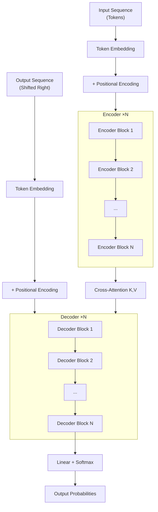

# 第2章：完整的 Transformer 架构
# Chapter 2: The Complete Transformer Architecture

> **Transformer（/trænsˈfɔːrmər/） 不再是"Seq2Seq with Attention（/əˈtenʃən/）"——它用纯注意力机制构建了一个全新的架构范式。** Encoder（/ɪnˈkoʊdər/） 用双向自注意力理解输入，Decoder（/diːˈkoʊdər/） 用因果掩码 + 交叉注意力逐步生成输出。本章拆解每个组件：从多头注意力到位置编码，从残差连接到 FFN。
> > **时间线**:
> > - **2017**: Vaswani et al. 在 *NeurIPS* 提出 Transformer 架构
> - **2022**: Dao et al. 提出 FlashAttention
>
> **The Transformer is no longer "Seq2Seq with Attention" — it uses pure attention to build a completely new architectural paradigm.** The Encoder uses bidirectional self-attention to understand the input; the Decoder uses causal masking + cross-attention to generate output step by step. This chapter dissects every component: from Multi-Head Attention to Positional Encoding, from Residual Connections to FFN.

**前置知识 (Prerequisites):** 缩放点积注意力（第1章）、线性代数与概率基础（第2卷）
**Code companion:** [`code/transformer_block.py`](code/transformer_block.py)

---

## 1. 架构总览
## Architecture Overview

原始 Transformer（Vaswani et al., 2017）是 **Encoder-Decoder** 结构：



### Encoder-Decoder 数据流

| 阶段 | 输入 | 输出 | 关键操作 |
|:-----|:-----|:-----|:---------|
| **Encoder** | $X \in \mathbb{R}^{n \times d}$ | $Z \in \mathbb{R}^{n \times d}$ | Self-Attention → Add&Norm → FFN → Add&Norm |
| **Decoder** | $Y_{<t}$ (已生成的部分) | $P(y_t \mid Y_{<t}, X)$ | Masked Self-Attention → Cross-Attention → FFN |
| **输出** | Decoder 最终隐藏状态 | 词汇表上的概率分布 | Linear + Softmax（/sɒftˈmæks/） |

**核（kernel /ˈkɜːrnl/）心洞察：**

- Encoder 的 Self-Attention 是**双向的**（每个位置可以看到所有位置）——适合"理解"。
- Decoder 的第一个 Self-Attention 是**因果的**（每个位置只能看到自己和之前的位置）——适合"生成"。
- Decoder 的 Cross-Attention 是**编码器-解码器的桥梁**——Decoder 通过它从 Encoder 读取信息。

$$ \boxed{\text{Transformer} = \text{Encoder}(\text{Bidirectional}) + \text{Decoder}(\text{Causal} + \text{Cross-Attention})} $$

---

## 2. Multi-Head Attention
## Multi-Head Attention

### 2.1 为什么需要多头？

单头注意力的问题：所有注意力模式被**压缩到一个分布**中。但一个句子中，一个词可能需要关注多种不同类型的关系：

- "**它**昨天在**公园**看到了**一条狗**，**它**很喜欢。"
  - 代词"它"需要关注"公园"（位置）、"狗"（对象）、甚至整个事件。

单头注意力被迫在这些模式之间"折中"。多头注意力（Multi-Head Attention, MHA）让模型**并行学习多个不同的注意力分布**，每个头可以专注于不同类型的关系。

### 2.2 多头注意力的数学

给定 $h$ 个头，每个头的维度为 $d_k = d_{\text{model}} / h$：

$$ \text{MultiHead}(Q, K, V) = \text{Concat}(\text{head}_1, \dots, \text{head}_h) W_O $$

$$ \text{head}_i = \text{Attention}(Q W_Q^i, K W_K^i, V W_V^i) $$

其中 $W_Q^i \in \mathbb{R}^{d_{\text{model}} \times d_k}$, $W_K^i \in \mathbb{R}^{d_{\text{model}} \times d_k}$, $W_V^i \in \mathbb{R}^{d_{\text{model}} \times d_v}$, $W_O \in \mathbb{R}^{h d_v \times d_{\text{model}}}$.

**实际操作中**，将所有头的 Q, K, V 投影合并为一个大矩阵，一次性完成所有头的计算：

$$
\begin{aligned}
Q_{\text{all}} &= X W_Q \in \mathbb{R}^{n \times (h d_k)} \\
K_{\text{all}} &= X W_K \in \mathbb{R}^{n \times (h d_k)} \\
V_{\text{all}} &= X W_V \in \mathbb{R}^{n \times (h d_v)} \\
\end{aligned}
$$

然后 reshape 为 $(h, n, d_k)$，对每个头独立计算注意力。

为什么这样做更好？

| 单头注意力 | 多头注意力 |
|:-----------|:-----------|
| 一个注意力分布 | $h$ 个独立的注意力分布 |
| 所有关系耦合在一起 | 每个头可以专注不同的关系（语法、语义、位置等） |
| 梯度（gradient /ˈɡreɪdiənt/）更新是"平均"的 | 每个头的梯度相对独立，学习不同的特征 |
| 总计算量 $O(n^2 d)$ | 总计算量相同 $O(h \cdot n^2 \cdot d_k) = O(n^2 d)$ |

> **关键**：多头注意力不增加总计算量（$h \times d_k = d_{\text{model}}$ 保持不变），但显著提升了表达能力。这是"免费午餐"——并行化带来的质变。

### 2.3 为什么缩放 $\sqrt{d_k}$ 防止 softmax 饱和？

回忆第1章：$q$ 和 $k$ 的分量独立同分布 $\mathcal{N}(0, 1)$ 时，点积 $q \cdot k$ 的方差为 $d_k$：

$$ \text{Var}(q \cdot k) = d_k $$

当 $d_k$ 较大时，点积的绝对值分布更分散，softmax 会趋向于 one-hot：

$$ \text{softmax}(x_i) = \frac{e^{x_i}}{\sum_j e^{x_j}} $$

如果某些 $x_i$ 远大于其他值，$e^{x_i}$ 会主导分母 → 梯度趋近于 0 → 模型停止学习。

**除以 $\sqrt{d_k}$ 控制方差为 1**，确保 softmax 的输入落在梯度良好的区域：

$$ \text{Var}\left(\frac{q \cdot k}{\sqrt{d_k}}\right) = \frac{d_k}{(\sqrt{d_k})^2} = 1 $$

---

## 3. 残差连接 & Layer Normalization
## Residual Connections & Layer Normalization

### 3.1 残差连接 (Residual Connection / Skip Connection)

每个子层（Self-Attention 或 FFN）的输出都加上它的输入：

$$ \text{Output} = x + \text{Sublayer}(x) $$

**为什么残差连接如此重要？**

1. **梯度高速公路**：梯度可以直接通过恒等映射回传到浅层，避免了深层网络中的梯度消失问题。
2. **不需要"记忆"变换**：子层只需要学习"残差"（即 $x$ 和期望输出之间的差异），而不是完整的输出。如果恒等映射已经很好，子层可以简单地输出接近零的值。

$$ \text{如果 Sublayer}(x) \approx 0 \text{，则 Output} \approx x $$

> **直觉**：想象你要画一幅完美的肖像。与其每次从空白画布开始，不如在现有草稿上添加细节。残差连接就是那个"现有草稿"。

### 3.2 Layer Normalization (Layer Norm)

$$ \text{LayerNorm}(x_i) = \gamma \odot \frac{x_i - \mu_i}{\sigma_i + \epsilon} + \beta $$

其中 $\mu_i$ 和 $\sigma_i$ 是对**第 $i$ 个 token** 的所有特征维度计算的：

$$ \mu_i = \frac{1}{d} \sum_{j=1}^{d} x_{ij}, \quad \sigma_i^2 = \frac{1}{d} \sum_{j=1}^{d} (x_{ij} - \mu_i)^2 $$

**Layer Norm vs Batch Norm：**

| 特性 | Layer Norm | Batch Norm |
|:-----|:-----------|:-----------|
| 归一化（normalization /ˌnɔːrmələˈzeɪʃən/）维度 | 每个 token 的特征维 | 每个特征维的 batch 维 |
| 计算方式 | 对**每个样本**单独计算 | 对**每个特征**跨 batch 计算 |
| 依赖 batch size | 否 | 是（小 batch 不稳定） |
| 序列长度变化 | 自然支持 | 需要特殊处理 |
| 训练/推理（inference /ˈɪnfərəns/）一致 | 是 | 不同（训练用 batch 统计，推理用全局统计） |

**Layer Norm 是 Transformer 的首选**，因为它：
- 不受 batch 大小影响
- 对变长序列自然友好
- 训练和推理行为一致

**现代 Transformer（如 LLaMA）使用 Pre-Norm**（将 Layer Norm 放在子层之前）：

$$ \text{Output} = x + \text{Sublayer}(\text{LayerNorm}(x)) $$

**Pre-Norm vs Post-Norm（原始 Transformer）：**

| 变体 | 公式 | 梯度流 | 训练稳定性 |
|:-----|:-----|:-------|:-----------|
| **Post-Norm** | $x + \text{LayerNorm}(\text{Sublayer}(x))$ | 梯度需经过 Layer Norm | 不稳定，需 warmup |
| **Pre-Norm** | $x + \text{Sublayer}(\text{LayerNorm}(x))$ | 梯度可直接通过恒等映射 | 稳定，无需 warmup |

> **为什么 Post-Norm 不稳定？** 在 Post-Norm 中，Layer Norm 在残差相加之后。如果多个残差连接相加的值很大，Layer Norm 需要"压缩"这些大值，导致梯度变小。Pre-Norm 在子层之前做归一化，残差连接直接传递未缩放的信息，梯度更干净。
>
> 现代 LLM（GPT-2/3, LLaMA, PaLM）全部使用 Pre-Norm。

---

## 4. 前馈网络 (FFN)
## Feed-Forward Network

### 4.1 标准 FFN

每个 token 在经过自注意力后，通过一个两层的全连接网络（position-wise，即每个位置独立共享参数（parameter /pəˈræmɪtər/））：

$$ \text{FFN}(x) = W_2 \cdot \text{ReLU}(W_1 x + b_1) + b_2 $$

其中 $W_1 \in \mathbb{R}^{d_{\text{ff}} \times d_{\text{model}}}$，$W_2 \in \mathbb{R}^{d_{\text{model}} \times d_{\text{ff}}}$。

通常 $d_{\text{ff}} = 4 \times d_{\text{model}}$（例如 $d_{\text{model}}=512$ 时 $d_{\text{ff}}=2048$）。

**为什么 FFN 是必要的？**

| 层 | 操作 | 效果 |
|:---|:-----|:-----|
| Self-Attention | Token 间的信息混合 | 每个 token 获取上下文信息 |
| FFN | 每个 token 的独立变换 | 对混合后的信息进行非线性投影 |
| 整体 | 先交流（Attention）→ 再思考（FFN） | 类似人的"讨论后独立决策" |

> **直觉**：自注意力是"小组讨论"（互相交换信息），FFN 是"个人思考"（基于讨论结果做自己的判断）。两者交替进行。

### 4.2 现代变体：SwiGLU

现代 LLM（LLaMA, PaLM）使用更复杂的门控激活函数替代 ReLU：

$$ \text{SwiGLU}(x) = (\text{SwiGLU}_1(x) \odot \text{SwiGLU}_2(x)) \cdot W_3 $$

常用形式：

$$ \text{FFN}_{\text{SwiGLU}}(x) = (\text{SiLU}(x W_1) \odot (x W_2)) W_3 $$

其中 SiLU（Sigmoid（/ˈsɪɡmɔɪd/） Linear Unit）是 Swish 的变体：

$$ \text{SiLU}(x) = x \cdot \sigma(x) $$

| 激活函数 | 公式 | 特点 |
|:---------|:-----|:-----|
| **ReLU** | $\max(0, x)$ | 简单、稀疏，但死神经元问题 |
| **GELU** | $x \cdot \Phi(x)$ | 平滑近似 ReLU，GPT/BERT 使用 |
| **SwiGLU** | $\text{SiLU}(x W_1) \odot (x W_2)$ | 门控机制，LLaMA/PaLM 使用，效果好但参数多 1/3 |

---

## 5. 位置编码
## Positional Encoding

自注意力本身是**排列不变**（permutation invariant）的——打乱 token 顺序，输出不变。因此需要显式注入位置信息。

### 5.1 Sinusoidal Positional Encoding (原始 Transformer)

$$ \begin{aligned}
\text{PE}_{(pos, 2i)} &= \sin\left(\frac{pos}{10000^{2i / d_{\text{model}}}}\right) \\
\text{PE}_{(pos, 2i+1)} &= \cos\left(\frac{pos}{10000^{2i / d_{\text{model}}}}\right)
\end{aligned} $$

其中 $pos$ 是位置索引，$i$ 是维度索引，$d_{\text{model}}$ 是模型维度。

**为什么用正弦/余弦？**

1. **值域固定**：$\text{PE} \in [-1, 1]$，不会随序列长度发散。
2. **相对位置可表达**：$\text{PE}_{pos+k}$ 可以表示为 $\text{PE}_{pos}$ 的线性变换——理论上模型可以从绝对位置编码中学习相对位置关系。
3. **不需要学习**：固定编码，可泛化到训练时未见过的序列长度。

### 5.2 RoPE (Rotary Position Embedding)

RoPE 是目前最流行的位置编码，被 LLaMA、Mistral、Falcon 等主流模型采用。

**核心思想**：在注意力计算中，通过对 Query 和 Key 的向量进行**旋转**来编码位置信息。

$$ \text{RoPE}(q, pos) = R(pos) \cdot q, \quad \text{RoPE}(k, pos) = R(pos) \cdot k $$

其中 $R(pos)$ 是一个分块旋转矩阵：

$$
R(pos) = \begin{pmatrix}
\cos(pos\theta_1) & -\sin(pos\theta_1) & 0 & 0 & \cdots \\
\sin(pos\theta_1) & \cos(pos\theta_1) & 0 & 0 & \cdots \\
0 & 0 & \cos(pos\theta_2) & -\sin(pos\theta_2) & \cdots \\
0 & 0 & \sin(pos\theta_2) & \cos(pos\theta_2) & \cdots \\
\vdots & \vdots & \vdots & \vdots & \ddots
\end{pmatrix}
$$

**为什么 RoPE 这么好？**

- **天然关注相对位置**：旋转后的点积 $q_m \cdot k_n$ 只依赖于相对距离 $m - n$，而非绝对位置。
- **位置信息的衰减**：距离越远的 token，旋转角度差异越大，点积贡献自然衰减——符合直觉。
- **兼容线性注意力**：旋转操作可以与线性注意力结合。

> **一句话总结 Sinusoidal vs RoPE：**
> Sinusoidal 把位置信息"加到"嵌入（embedding /ɪmˈbedɪŋ/）上，RoPE 把位置信息"旋到"注意力中。

### 5.3 ALiBi (Attention with Linear Biases)

ALiBi 进一步简化：**不做任何位置编码加法或旋转**，直接在注意力分数上减去一个与距离成正比的偏置。

$$ \text{Attention}(Q, K, V) = \text{softmax}\left(\frac{QK^T}{\sqrt{d_k}} - m \cdot D\right) V $$

其中 $D_{ij} = |i - j|$ 是距离矩阵，$m$ 是头相关的斜率（head-specific slope）。

**为什么 ALiBi 有效？**

- **外推能力强**：在短序列上训练，可以直接推广到更长的序列（比 Sinusoidal 和 RoPE 都好）。
- **零额外参数**：无需学习位置编码。
- **计算无损**：只在 softmax 之前加一个减法。

**三种位置编码对比：**

| 方法 | 注入方式 | 外推能力 | 参数开销 | 主流使用 |
|:-----|:---------|:---------|:---------|:---------|
| **Sinusoidal** | 加到嵌入上 | 中等 | 0 | 原始 Transformer |
| **RoPE** | 旋转 Q/K | 较好 | 0 | LLaMA, Mistral, Gemma |
| **ALiBi** | 偏置注意力分数 | 最好 | 0 | BLOOM, MPT |

---

## 6. Masked Self-Attention（因果掩码）
## Masked Self-Attention (Causal Masking)

Decoder 中的 Self-Attention 必须是**因果的**（causal）——每个 token 不能看到它之后的 token。这是通过一个**上三角掩码矩阵**实现的：

$$ \text{MaskedAttention}(Q, K, V) = \text{softmax}\left(\frac{QK^T}{\sqrt{d_k}} + M\right) V $$

其中 $M \in \mathbb{R}^{n \times n}$ 是一个掩码矩阵：

$$
M_{ij} = \begin{cases}
0, & i \geq j \quad \text{(可见：当前位置及之前)} \\
-\infty, & i < j \quad \text{(不可见：未来位置)}
\end{cases}
$$

**计算效果：** 由于 $e^{-\infty} = 0$，被掩码的位置的注意力权重强制为 0。

```
注意力分数矩阵 (缩放后)：
[[0.50, 0.20, 0.10],     [[0.50,  -inf,  -inf],
 [0.15, 0.60, 0.30],  +   [0.15,  0.60,  -inf],  
 [0.05, 0.10, 0.80]]      [0.05,  0.10,  0.80]]

→ Masked Scores:
[[0.50, -inf, -inf],
 [0.15, 0.60, -inf],
 [0.05, 0.10, 0.80]]

→ Softmax 后:
[[1.00, 0.00, 0.00],    ← Token 0 只看自己
 [0.39, 0.61, 0.00],    ← Token 1 看 Token 0 & 1
 [0.20, 0.22, 0.58]]    ← Token 2 看所有已生成 token
```

**在训练阶段**，Masked Self-Attention 实现了**并行 teacher-forcing**：模型一次看到所有（掩码后的）位置，同时计算所有位置的预测损失。

> **直觉**：Masked Self-Attention 就像"逐词填空"——你只能看到已经写出来的词，不能偷看未来的答案。这就是为什么 Decoder 被称为自回归（regression /rɪˈɡreʃən/）（auto-regressive）的。

---

## 7. Cross-Attention（交叉注意力）
## Cross-Attention

Cross-Attention 是 Decoder 中独有的子层，它是 Encoder 和 Decoder 之间的**信息桥梁**：

$$ \text{CrossAttention}(Q_{\text{dec}}, K_{\text{enc}}, V_{\text{enc}}) = \text{softmax}\left(\frac{Q_{\text{dec}} K_{\text{enc}}^T}{\sqrt{d_k}}\right) V_{\text{enc}} $$

**关键区别：**

| 角色 | 来源 | 含义 |
|:-----|:-----|:-----|
| **Query ($Q$)** | Decoder 上一层的输出 | "我（Decoder）现在想生成什么？" |
| **Key ($K$)** | Encoder 的最终输出 | "输入序列中哪些部分和我现在想生成的有关？" |
| **Value ($V$)** | Encoder 的最终输出 | "那些相关部分的具体内容是什么？" |

**Cross-Attention 没有掩码**！Decoder 在生成每个 token 时，都可以访问整个输入序列的全部信息。这与 Decoder 内部的 Masked Self-Attention 形成鲜明对比。

**完整的 Decoder Block 数据流：**

```
Decoder Input
    ↓
[Masked Self-Attention]
    Q, K, V 都来自上一层的 Decoder 输出
    掩码确保因果性
    ↓
[Add & Norm] ← 残差连接
    ↓
[Cross-Attention]
    Q ← 上一层的输出 (Decoder)
    K, V ← Encoder 的输出
    无掩码 — 所有输入位置可见
    ↓
[Add & Norm] ← 残差连接
    ↓
[FFN]
    ↓
[Add & Norm] ← 残差连接
    ↓
Decoder Output
```

---

## 8. 小结 (Summary)

1. **Transformer = Encoder (理解) + Decoder (生成)**。Encoder 用双向自注意力读取输入，Decoder 用因果掩码+交叉注意力逐步生成。

2. **Multi-Head Attention** 在不增加总计算量的前提下，让模型并行学习 $h$ 个不同的注意力模式。缩放 $\sqrt{d_k}$ 防止 softmax 饱和。

3. **残差连接 + Layer Norm** 让训练深度 Transformer 成为可能。现代模型几乎全部使用 **Pre-Norm**。

4. **FFN** 为每个 token 提供独立的非线性变换。$\text{ReLU} \to \text{GELU} \to \text{SwiGLU}$ 是现代 LLM 的进化路径。

5. **位置编码** 打破注意力的排列不变性。Sinusoidal → RoPE → ALiBi 是演进路线，RoPE 是目前的事实标准。

6. **Masked Self-Attention** 用上三角掩码 $-\infty$ 实现因果性，使 Decoder 可以并行训练（teacher-forcing）。

7. **Cross-Attention** 让 Decoder "查询" Encoder 的输出，是实现 Encoder-Decoder 翻译/摘要等任务的关键桥梁。

> **下一章预告**：Transformer 不是终点。从 GPT 到 LLaMA，从 BERT 到 T5，Transformer 长成了一棵繁茂的家族树。下一章我们用一张图看清所有变体的关系。

---

## References

- Vaswani et al. (2017). "Attention Is All You Need." — **Transformer** 原始论文
- Ba et al. (2016). "Layer Normalization." — **Layer Norm** 首次提出
- Su et al. (2021). "RoFormer: Enhanced Transformer with Rotary Position Embedding." — **RoPE** 论文
- Press et al. (2021). "Train Short, Test Long: Attention with Linear Biases Enables Input Length Extrapolation." — **ALiBi** 论文
- Shazeer (2020). "GLU Variants Improve Transformer." — **SwiGLU** 的提出
- Xiong et al. (2020). "On Layer Normalization in the Transformer Architecture." — **Pre-Norm vs Post-Norm** 的深入分析

## 参考文献 (References)

1. **Vaswani, A. et al.** (2017). Attention Is All You Need. *NeurIPS*.
2. **Su, J. et al.** (2021). RoFormer: Enhanced transformer with rotary position embedding. *arXiv:2104.09864*.
