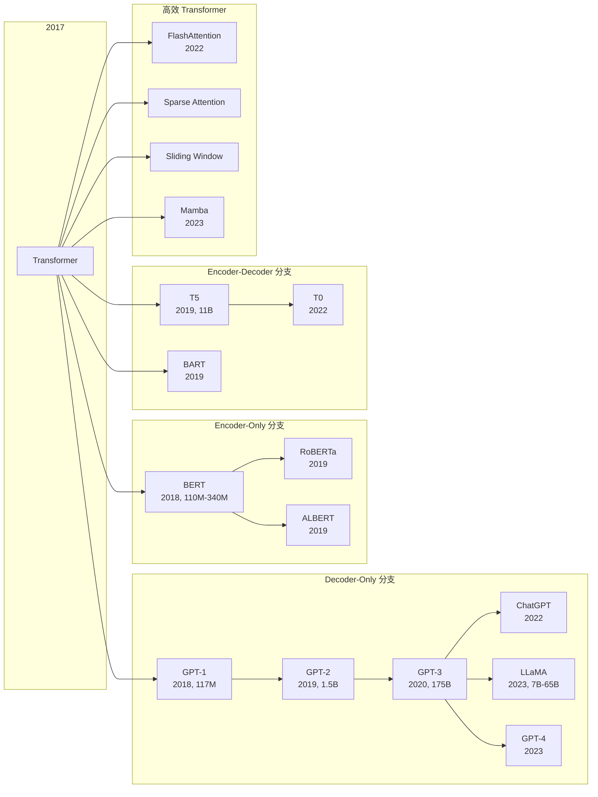

# 第3章：Transformer 家族树 — 变体与演进

> 2017 年 Transformer 架构诞生后，就像一棵树开始分叉。不同的分支擅长不同的事情：有的专攻文本生成，有的精于理解，有的则试图改写底层计算规则。
>
> 这一章我们不看数学，不写代码，只画一张**家族树**，理清主干和分支的关系。

---

## 3.1 为什么需要变体？

原始 Transformer 是一个 Encoder-Decoder 架构，但很多任务只用其中一半就够了：

- **文本生成**（GPT、LLaMA）只需要 Decoder，因为生成是单向的。
- **文本理解**（BERT）只需要 Encoder，因为理解需要双向上下文。
- **翻译/摘要**（T5、BART）仍然需要 Encoder-Decoder，因为需要"读完再写"。

此外，原始 Transformer 的 **自注意力机制（Self-Attention）** 有 $O(n^2)$ 的计算和内存复杂度，当序列变长时成本急剧上升。于是有了各种高效变体。

下面这张图概括了整个家族树：

---

## 3.2 Decoder-Only 分支：生成之路

这条分支的核心思想很简单：**只用 Decoder，做自回归生成（Autoregressive Generation）**。每次预测下一个 token，把结果拼回去继续预测。

### GPT-1 (2018)

OpenAI 的第一枪。12 层 Transformer Decoder，117M 参数。在 BooksCorpus 上做无监督预训练，然后针对下游任务微调。效果不错，但还没引起轰动。

关键创新：**生成式预训练（Generative Pre-Training）**。以前做 NLP 任务需要从零开始训练，GPT 证明了先在大规模语料上预训练、再微调的方式有效。

### GPT-2 (2019)

参数飙升到 1.5B。OpenAI 一开始甚至不敢完整发布，怕被滥用生成假新闻。核心改进是 **Zero-Shot 能力**：在未见过的任务上直接生成，不需要微调。

这时候大家开始意识到：**模型大了，能力会涌现（Emergent Abilities）**。

### GPT-3 (2020)

175B 参数，训练成本估计在千万美元级别。核心能力是 **In-Context Learning（上下文学习）**：你给几个例子（Few-Shot），它就能照着做，不需要更新参数。

GPT-3 还催生了 **Prompt Engineering（提示工程）** 这个新领域。

### ChatGPT (2022)

GPT-3.5 + **RLHF（Reinforcement Learning from Human Feedback，基于人类反馈的强化学习）**。关键不在架构创新，而在训练方法的变革：

1. **SFT（Supervised Fine-Tuning）**：用人工写好的对话数据微调。
2. **Reward Modeling**：训练一个奖励模型，判断哪个回答更好。
3. **PPO 强化学习**：用奖励模型指导 GPT 优化策略。

ChatGPT 成为史上增长最快的应用，两个月月活破亿。

### LLaMA (2023, Meta)

Meta 开源的大语言模型系列。架构上没什么惊天动地的创新，但有一个关键洞察：**在更多的数据上训练更小的模型**。

| 模型 | 参数量 | 训练数据量 |
|:---|:---:|:---:|
| LLaMA-7B | 7B | 1T tokens |
| LLaMA-13B | 13B | 1T tokens |
| LLaMA-33B | 33B | 1.4T tokens |
| LLaMA-65B | 65B | 1.4T tokens |

相比 GPT-3 的 175B 参数在 300B tokens 上训练，LLaMA-13B 在 1T tokens 上训练后，性能可以匹敌 GPT-3。这证明了**数据质量 and 数量比单纯的参数规模更重要**。

### Decoder-Only 总结

> **Decoder 擅长生成（Generation）**，因为自回归方式天然适合逐 token 预测。这条分支的核心演进路线是：更大的模型 + 更多的数据 + 更好的训练方法（RLHF）。

---

## 3.3 Encoder-Only 分支：理解之路

这条分支的核心思想：**用 Encoder 做双向上下文理解**。

### BERT (2018, Google)

BERT 的架构和 Transformer Encoder 完全一样，但训练任务不同：

1. **Masked Language Model（MLM，掩码语言模型）**：随机遮掉 15% 的 token，让模型预测被遮掉的是什么。这迫使模型学到双向上下文。
2. **Next Sentence Prediction（NSP，下一句预测）**：给两句话，判断是否连续。这个任务后来被证明作用有限。

BERT 有两个版本：
- BERT-Base: 12 层, 768 hidden, 110M 参数
- BERT-Large: 24 层, 1024 hidden, 340M 参数

BERT 在 11 个 NLP 基准测试上刷新了记录，成为 2018 年 NLP 领域最重磅的突破。

### RoBERTa (2019)

Facebook 的改进版 BERT。核心发现：**BERT 原来训练得不够充分**。RoBERTa 做了几个改动：
- 用更多数据训练（160GB vs 16GB）
- 去掉 NSP 任务
- 动态 Mask 策略
- 更大的 batch size

结果：RoBERTa 在几乎所有任务上都超过了 BERT。

### ALBERT (2019)

Google 的轻量版 BERT。通过 **参数共享（Parameter Sharing）** 和 **分解嵌入（Factorized Embedding）** 大幅减少参数量。ALBERT-xxlarge 只有 BERT-large 的 1/18 参数量，但性能相当。

### Encoder-Only 总结

> **Encoder 擅长理解（Understanding）**：分类、问答、命名实体识别（NER）、情感分析等任务。Encoder 能看到完整的上下文，所以对语义理解更准确。但由于不能做自回归生成，它不适合文本生成任务。

---

## 3.4 Encoder-Decoder 分支：翻译与摘要之路

这条分支保留了完整的 Encoder-Decoder 结构。

### T5 (2019, Google)

**Text-to-Text Transfer Transformer**。T5 的核心思想非常优雅：**把所有 NLP 任务都统一成 Text-to-Text 格式**。

| 任务 | 输入格式 | 输出格式 |
|:---|:---|:---|
| 翻译 | `translate English to German: That is good.` | `Das ist gut.` |
| 分类 | `cola sentence: It is good.` | `acceptable` |
| 摘要 | `summarize: ...(长文本)...` | `摘要内容` |
| 问答 | `question: ... context: ...` | `答案` |

T5 用 **C4 数据集（Colossal Clean Crawled Corpus）** 训练，约 750GB 清洗后的网页文本。最大版本 T5-11B（11B 参数）。

T5 的贡献在于提出了一种**统一的框架**，让 NLP 不再需要为每个任务设计不同的输出头（classification head、QA head 等）。

### BART (2019, Facebook)

**Denoising Autoencoder**。结合了 BERT 的双向 Encoder 和 GPT 的自回归 Decoder。

训练方式：对原文加噪声（如 token 遮罩、删除、句子打乱等），Encoder 读完被破坏的文本，Decoder 生成原始的干净文本。这比单纯的 MLM 更适合生成任务。

BART 在摘要、翻译等任务上表现优异。

### T0 (2022, Hugging Face / BigScience)

T5 的进化版，用 **Prompt 方式**微调，把几十个任务统一成自然语言指令格式。展示了**多任务指令微调（Multi-Task Instruction Tuning）** 的潜力。

### Encoder-Decoder 总结

> **Encoder-Decoder 擅长翻译和摘要**，因为 Encoder 充分理解输入后，Decoder 再逐 token 生成输出。缺点是模型较大，推理速度较慢。

---

## 3.5 高效 Transformer

原始 Self-Attention 的 $O(n^2)$ 复杂度是大规模应用的瓶颈。于是出现了各种高效变体。

### FlashAttention (2022)

IO 感知的精确注意力算法。核心洞察：**GPU 的算力远快于内存带宽**，之前 Self-Attention 的瓶颈不是计算而是显存读写。

FlashAttention 通过分块（Tiling）和重计算（Recomputation）技术，把注意力计算放在 SRAM 中完成，减少 HBM（高带宽显存）的读写次数。效果：
- 训练速度提升约 2x
- 内存占用从 $O(n^2)$ 降到 $O(n)$
- 没有任何精度损失（精确注意力）

FlashAttention-2 (2023) 进一步优化了并行性和线程束利用率，达到更快的速度。

### Sparse Attention（稀疏注意力）

不是对所有 token pair 计算注意力，而是只计算一个子集。常见模式：
- **全局 + 局部**：某些 token 看全局，其他只看局部
- **分块模式**：只在固定大小的块内做注意力
- **学习模式**：用网络学习哪些位置需要交互

代表工作：Longformer、BigBird、Reformer。

### Sliding Window（滑动窗口）

每个 token 只关注前后 $w$ 个 token，注意力范围固定为窗口大小 $w$。复杂度降到 $O(n \times w)$。Mistral 7B 就用了这个策略。

### Mamba (2023)

**State Space Model（SSM，状态空间模型）** 的变体。完全抛弃了注意力机制，改用线性时间复杂度的 SSM 做序列建模。在长序列任务上表现惊艳，推理速度远超同等规模的 Transformer。

Mamba 的出现提出了一个问题：**注意力机制真的是序列建模的最优解吗？** 目前看，在超长序列（如基因组、音频）场景下，Mamba 很有优势，但在语言建模的 Scaling Law 上还不及 Transformer。

### 高效 Transformer 总结

| 方法 | 复杂度 | 精度损失 | 代表作 |
|:---|:---:|:---:|:---|
| 原始 Attention | $O(n^2)$ | 无 | Transformer |
| FlashAttention | $O(n^2)$ 但更快 | 无 | FlashAttention |
| Sparse Attention | $O(n \log n)$ | 有 | Longformer, BigBird |
| Sliding Window | $O(n \times w)$ | 有 | Mistral |
| Mamba (SSM) | $O(n)$ | 有 | Mamba |

---

## 3.6 对比总结

| 特性 | GPT-3 | BERT | T5 | LLaMA |
|:---|:---:|:---:|:---:|:---:|
| 架构 | Decoder-Only | Encoder-Only | Encoder-Decoder | Decoder-Only |
| 参数量 | 175B | 110M-340M | 11B | 7B-65B |
| 预训练任务 | 语言建模 | MLM+NSP | 文本到文本去噪 | 语言建模 |
| 训练数据 | ~300B tokens | 16GB | 750GB (C4) | 1T-1.4T tokens |
| 擅长 | 生成、Few-Shot | 理解、分类、NER | 翻译、摘要 | 生成、开源可商用 |
| 是否开源 | 否 (API) | 是 | 是 | 是 |
| 核心贡献 | Scaling Law | 双向预训练 | 统一Text-to-Text | 小模型+大数据 |

---

## 3.7 本章小结

Transformer 家族的三条主干各有定位：

1. **Decoder-Only（GPT、LLaMA）**：生成为王。一路 Scaling 催生了 ChatGPT 和整个 LLM 时代。
2. **Encoder-Only（BERT、RoBERTa）**：理解专家。在分类、NER、QA 等任务上至今仍是主力。
3. **Encoder-Decoder（T5、BART）**：翻译和摘要的首选。统一框架的提出者有深远影响。

而高效 Transformer（FlashAttention、Mamba）正在改写底层规则，让长序列建模变得可行。

> **一句话总结**：架构不重要，重要的是架构让你能做什么。生成选 Decoder，理解选 Encoder，翻译选 Encoder-Decoder。
>
> **下一章预告**：我们将深入自监督学习（Self-Supervised Learning），看看 BERT 和 GPT 的预训练方法如何成为现代 AI 的基石。

---

## References

- Vaswani et al. (2017). Attention Is All You Need.
- Radford et al. (2018). Improving Language Understanding by Generative Pre-Training. (GPT-1)
- Radford et al. (2019). Language Models are Unsupervised Multitask Learners. (GPT-2)
- Brown et al. (2020). Language Models are Few-Shot Learners. (GPT-3)
- Devlin et al. (2019). BERT: Pre-training of Deep Bidirectional Transformers.
- Liu et al. (2019). RoBERTa: A Robustly Optimized BERT Pretraining Approach.
- Raffel et al. (2020). Exploring the Limits of Transfer Learning with a Unified Text-to-Text Transformer. (T5)
- Lewis et al. (2020). BART: Denoising Sequence-to-Sequence Pre-training.
- Touvron et al. (2023). LLaMA: Open and Efficient Foundation Language Models.
- Dao et al. (2022). FlashAttention: Fast and Memory-Efficient Exact Attention with IO-Awareness.
- Gu & Dao (2023). Mamba: Linear-Time Sequence Modeling with Selective State Spaces.
