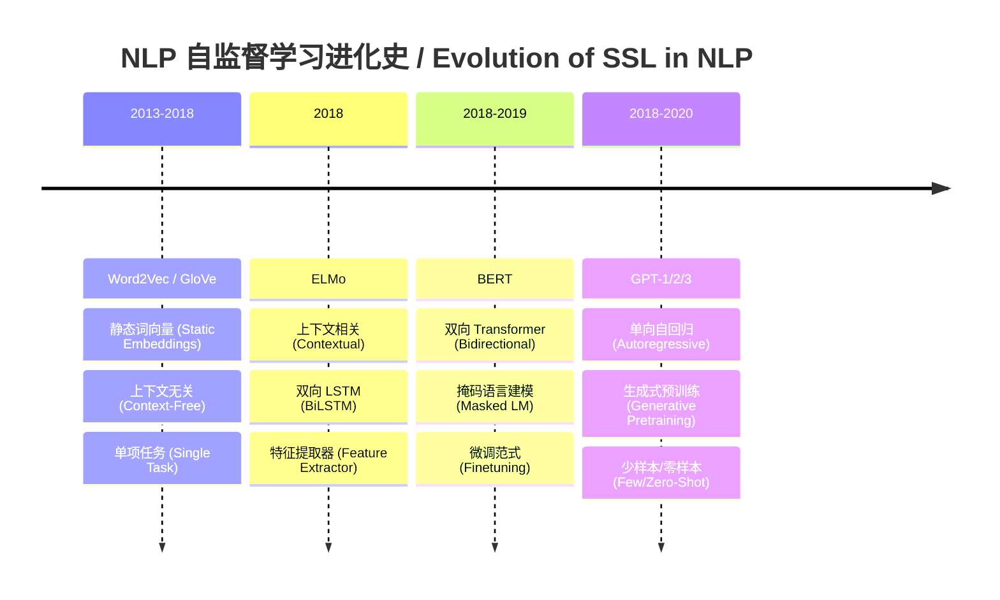

# 第1章：预训练范式 — 自监督学习的基石
# Chapter 1: The Pretraining Paradigm — Foundation of Self-Supervised Learning

> **为什么互联网上数十亿的文本和图像不需要人工标注就能教会模型理解世界？答案藏在预训练（Pretraining）与微调（Finetuning）的两阶段范式中。** 本章深入剖析自监督学习的核（kernel /ˈkɜːrnl/）心思想：如何从无标注数据中构造监督信号，以及为什么"先预训练、再微调"的策略如此有效。
> > **时间线**:
> > - **2013**: Mikolov et al. 提出 Word2Vec
> > - **2018**: Devlin et al. 提出 BERT（MLM 预训练）
> > - **2020**: Chen et al. 提出 SimCLR; He et al. 提出 MoCo
> - **2021**: Radford et al. 提出 CLIP（多模态对比学习）
>
> **Why can billions of text and images on the internet teach models to understand the world without human annotations? The answer lies in the two-stage paradigm of pretraining and finetuning.** This chapter dissects the core idea of self-supervised learning: how to construct supervisory signals from unlabeled data, and why the "pretrain then finetune" strategy works so well.

**前置知识 (Prerequisites):** 基础机器学习概念（第3卷）、神经网络基础（第4卷）、Transformer（/trænsˈfɔːrmər/） 基础（第5卷）

---

## 1. 标注瓶颈：从人工标注到自监督
## The Labeling Bottleneck: From Manual Annotation to Self-Supervision

### 1.1 标注的成本困境

传统监督学习依赖大量人工标注数据。标注每张 ImageNet 图片平均需要 0.5 秒的专家时间，100 万张图片就是 140 人时。在医学影像领域，标注一张 CT 扫描可能需要放射科医生 30 分钟。这种成本使大规模监督学习在经济上不可持续。

Traditional supervised learning relies heavily on manually labeled data. Labeling each ImageNet image takes an average of 0.5 seconds of expert time, and 1 million images means 140 person-hours. In medical imaging, labeling a single CT scan can take a radiologist 30 minutes. This cost makes large-scale supervised learning economically unsustainable.

与此同时，互联网每秒钟产生约 100 TB 的新数据——文本、图像、视频、语音。这些数据天然可用，却缺少标签。

Meanwhile, the internet generates approximately 100 TB of new data every second: text, images, video, and speech. This data is freely available, yet lacks labels.

### 1.2 自监督的核心洞察

自监督学习（Self-Supervised Learning, SSL）的核心洞察是：**从数据本身构造监督信号**。如果我们设计一个任务，让模型预测数据的某个部分（或某种变换），那么数据本身就提供了标签。

The core insight of Self-Supervised Learning (SSL) is: **construct supervisory signals from the data itself**. If we design a task where the model must predict one part of the data (or a transformation of it), then the data itself provides the labels.

常见的自监督信号构造方式：

| 模态 | 任务示例 | 预测目标 | 标签来源 |
|:---|:---|:---|:---|
| 文本 | 掩码语言建模 (Masked LM) | 被遮住的词 | 原文中的词 |
| 图像 | 旋转预测 (Rotation Prediction) | 旋转角度 | 已知的旋转角度 |
| 图像 | 对比学习 (Contrastive Learning) | 正样本对 > 负样本对 | 数据增强后的同一张图 |
| 视频 | 帧序预测 (Frame Order) | 帧的正确顺序 | 原始视频的时间轴 |
| 语音 | 对比预测编码 (CPC) | 未来的声学特征 | 音频信号自身 |

自监督的本质是：**用数据的结构作为老师**。

The essence of self-supervision is: **use the structure of data as the teacher**.

---

## 2. 四象限对比：四种学习范式
## Four-Quadrant Comparison: Four Learning Paradigms

要理解自监督学习的定位，最好的方式是把它和另外三种学习范式放在一起对比。

The best way to understand self-supervised learning is to place it alongside the other three learning paradigms.

```mermaid
quadrantChart
    title 学习范式四象限 / Four Learning Paradigms
    x-axis 无标注数据 (Unlabeled Data) --> 有标注数据 (Labeled Data)
    y-axis 直接监督 (Direct Supervision) --> 无监督 (No Supervision)
    quadrant-1 监督学习 (Supervised)
    quadrant-2 半监督学习 (Semi-Supervised)
    quadrant-3 自监督学习 (Self-Supervised)
    quadrant-4 无监督学习 (Unsupervised)
    "ImageNet Classification": [0.9, 0.9]
    "MixMatch": [0.6, 0.7]
    "BERT Pretrain": [0.2, 0.3]
    "K-Means": [0.1, 0.9]
```

| 范式 | Paradigm | 标注需求 | 核心思想 | 代表方法 |
|:---|:---|:---|:---|:---|
| **监督学习** | Supervised | 全标注 | 输入→标签的直接映射 | CNN分类（classification /ˌklæsɪfɪˈkeɪʃən/）、物体检测 |
| **无监督学习** | Unsupervised | 无标注 | 发现数据内在结构 | K-Means、PCA、GMM |
| **自监督学习** | Self-Supervised | 无标注 | 从数据构造伪标签 | BERT、SimCLR、MAE |
| **半监督学习** | Semi-Supervised | 少量标注+大量未标注 | 利用未标注数据辅助 | 一致性正则化（regularization /ˌreɡjələraɪˈzeɪʃən/）、伪标签 |

### 关键区别 (Key Distinction)

- **自监督 vs 无监督**：无监督学习只发现已有结构（如聚类），而自监督学习主动构造预测任务来学习可迁移的表征。两者目标不同——无监督重在发现，自监督重在表征学习。
- **自监督 vs 半监督**：半监督假设少量标注数据存在并用它们引导学习；自监督完全不依赖任何标注，只从数据自身学习。
- **自监督 vs 监督**：监督需要人工标注，自监督不需要——但在下游任务上，好的自监督预训练可以接近甚至超越监督学习的表现。

- **Self-Supervised vs Unsupervised**: Unsupervised learning only discovers existing structure (e.g., clustering), while self-supervised learning actively constructs prediction tasks to learn transferable representations. Their goals differ: unsupervised is about discovery, self-supervised is about representation learning.
- **Self-Supervised vs Semi-Supervised**: Semi-supervised assumes a small amount of labeled data exists and uses it to guide learning; self-supervised does not depend on any labels at all.
- **Self-Supervised vs Supervised**: Supervised requires human annotations, self-supervised does not. But on downstream tasks, good self-supervised pretraining can approach or even surpass supervised performance.

---

## 3. 预训练-微调范式
## The Pretraining-Finetuning Paradigm

### 3.1 两阶段流程 (Two-Stage Pipeline)

```
Stage 1: 预训练 (Pretraining)
┌─────────────────────────────────────────────────┐
│  大规模无标注数据 (Large Unlabeled Data)          │
│         │                                         │
│         ▼                                         │
│  自监督任务 (e.g., Masked LM, Contrastive)        │
│         │                                         │
│         ▼                                         │
│  预训练模型 (Pretrained Model)                    │
└─────────────────────────────────────────────────┘
                        │
                        ▼
Stage 2: 微调 (Finetuning)
┌─────────────────────────────────────────────────┐
│  小规模标注数据 (Small Labeled Data)              │
│         │                                         │
│         ▼                                         │
│  初始化权重 = 预训练参数                           │
│         │                                         │
│         ▼                                         │
│  在特定任务上继续训练 (Few epochs)                │
│         │                                         │
│         ▼                                         │
│  任务模型 (Task-Specific Model)                   │
└─────────────────────────────────────────────────┘
```

**预训练阶段**：在大量无标注数据上训练一个自监督任务，模型学会通用的语言/视觉/语音表征。**微调阶段**：用预训练的参数（parameter /pəˈræmɪtər/）初始化模型，然后在少量标注数据上针对特定任务继续训练。

**Pretraining phase**: Train a self-supervised task on large amounts of unlabeled data. The model learns general-purpose representations of language, vision, or speech. **Finetuning phase**: Initialize the model with pretrained parameters, then continue training on a small labeled dataset for a specific task.

### 3.2 为什么两阶段？(Why Two Stages?)

单一阶段训练（直接在目标任务上训练）受限于标注数据量，模型容易过拟合（overfitting /ˈoʊvərˈfɪtɪŋ/）。两阶段设计解决了这个问题：

- **预训练阶段**：数据充足，模型学习通用模式，不会过拟合。
- **微调阶段**：标注需求骤降，100-1000 条标注即可在预训练模型上取得不错的效果。

Single-stage training (directly training on the target task) is limited by the amount of labeled data, making the model prone to overfitting. The two-stage design solves this:

- **Pretraining**: Abundant data allows the model to learn general patterns without overfitting.
- **Finetuning**: Labeling requirements drop dramatically. 100-1000 labeled examples can yield strong results on top of a pretrained model.

这种范式在 NLP 领域最为成功：BERT 在 33 亿词上预训练，只需在数千条标注数据上微调，即可在各 NLP 任务上达到 SOTA。

This paradigm has been most successful in NLP: BERT pretrained on 3.3 billion words can be finetuned on just a few thousand labeled examples to achieve state-of-the-art results across NLP tasks.

---

## 4. 为什么预训练有效？
## Why Pretraining Works?

预训练的惊人效果并非偶然。研究者提出了三种互补的解释。

The remarkable effectiveness of pretraining is no accident. Researchers have proposed three complementary explanations.

### 4.1 好的初始化 (Good Initialization)

深度神经网络的训练高度依赖初始点。随机（stochastic /stəˈkæstɪk/）初始化落在损失景观（Loss Landscape）的"坏区域"，而预训练提供了接近最优解的起点。微调只需在局部范围内调整，而不是从头探索整个参数空间。

Deep neural network training is highly dependent on the starting point. Random initialization often lands in "bad regions" of the loss landscape, while pretraining provides a starting point near a good solution. Finetuning only needs to adjust locally, rather than exploring the entire parameter space from scratch.

数学上，这相当于一个**隐式的先验**：预训练参数 $θ_0$ 是"好参数应该在什么附近"的先验知识。微调在贝叶斯意义下等价于：先验 $p(θ)$ 集中在 $θ_0$ 附近，用少量标注数据更新后验。

Mathematically, this is equivalent to an **implicit prior**: the pretrained parameters $θ_0$ encode prior knowledge about "where good parameters should be." Finetuning is, in a Bayesian sense, equivalent to: the prior $p(θ)$ is concentrated near $θ_0$, and we update the posterior with a small amount of labeled data.

### 4.2 特征复用 (Feature Reuse)

预训练过程中，模型各层逐渐学习到通用的、可复用的特征：

- **浅层**：学习低级特征（边缘、纹理、词性）
- **中层**：学习中级模式（物体部件、语法结构、短语）
- **深层**：学习高级语义（物体概念、句子语义、跨句关系）

Pretraining layers gradually learn generic, reusable features:

- **Lower layers**: Low-level features (edges, textures, parts of speech)
- **Middle layers**: Mid-level patterns (object parts, syntactic structures, phrases)
- **Higher layers**: High-level semantics (object concepts, sentence meaning, cross-sentence relations)

这些特征在不同任务间是共享的。微调时，模型只需在新任务的数据分布上微调高层特征，底层和中层特征基本保留。这被称为**表征迁移**（Representation Transfer）。

These features are shared across tasks. During finetuning, the model only needs to adjust high-level features on the new task distribution, while low and middle-level features are largely preserved. This is known as **Representation Transfer**.

### 4.3 正则化效应 (Regularization Effect)

预训练隐式地起到了正则化作用。预训练后的参数 $θ_0$ 编码了数据中的通用模式，这些模式限制了下游任务的可行参数空间。相比于随机初始化，预训练约束了模型的假设空间大小，降低了有效模型容量，从而在小数据场景下减少了过拟合风险。

Pretraining implicitly acts as a regularizer. The pretrained parameters $θ_0$ encode general patterns in the data, which constrain the feasible parameter space for the downstream task. Compared to random initialization, pretraining reduces the size of the effective hypothesis space, thereby lowering the risk of overfitting in low-data scenarios.

经验证据：在 GLUE 基准上，BERT 的微调实验显示，即使只有 500 条训练样本，预训练模型仍然能取得 80%+ 的性能（相对于全量数据的 85%），而随机初始化的 Transformer 在同一设置下仅能达到 40-50%。

Empirical evidence: BERT finetuning experiments on GLUE benchmarks show that even with only 500 training examples, the pretrained model still achieves 80%+ performance (compared to 85% on full data), while a randomly initialized Transformer reaches only 40-50% in the same setting.

---

## 5. 历史脉络：Word2Vec → BERT → GPT
## Historical Evolution: Word2Vec → BERT → GPT

自监督学习在 NLP 领域经历了三次范式跃迁。

Self-supervised learning in NLP has gone through three paradigm shifts.



### 5.1 静态词向量时代 (Static Embeddings)

**Word2Vec (Mikolov et al., 2013)** 是自监督学习在 NLP 的第一次成功。它设计了两个自监督任务：

- **CBOW (Continuous Bag of Words)**：根据上下文词预测中心词。
- **Skip-gram**：根据中心词预测上下文词。

Word2Vec 的每个词对应一个固定的向量。但它的局限是**上下文无关**——"bank"（银行/河岸）在任何上下文中都得到同一个向量。

Word2Vec assigns a fixed vector to each word. But its limitation is **context-free**: "bank" (financial institution / river bank) gets the same vector regardless of context.

### 5.2 上下文嵌入时代 (Contextual Embeddings)

**ELMo (Peters et al., 2018)** 使用双向 LSTM 通过语言模型目标进行预训练。关键突破：同一个词在不同上下文中得到不同的向量，因为它编码了整个句子的信息。

**ELMo (Peters et al., 2018)** uses a bidirectional LSTM pretrained on a language modeling objective. Key breakthrough: the same word gets different vectors in different contexts, because it encodes the entire sentence.

然而 ELMo 仍是一个特征提取器（Feature Extractor），而非端到端的微调模型。它生成上下文相关的词向量，但这些向量在下游模型中只是输入特征。

### 5.3 双向 Transformer 预训练 (Bidirectional Pretraining)

**BERT (Devlin et al., 2019)** 带来了两个核心创新：

1. **双向 Transformer**：掩码语言建模（Masked Language Modeling, MLM）让模型同时看到左右两边的上下文，这对理解语义至关重要。
2. **微调范式**：预训练 + 微调成为 NLP 的标准流程。

BERT (Base) 在 3.3B 词上预训练，微调后在 11 个 NLP 基准上取得 SOTA。它证明了：**大规模自监督预训练 + 小规模微调 = 通用语言理解**。

BERT (Base) pretrained on 3.3B words and achieved SOTA on 11 NLP benchmarks after finetuning. It proved that: **large-scale self-supervised pretraining + small-scale finetuning = universal language understanding**.

### 5.4 生成式预训练 (Generative Pretraining)

**GPT 系列 (Radford et al., 2018, 2019; Brown et al., 2020)** 走了另一条路：使用**自回归（regression /rɪˈɡreʃən/）语言建模**（Autoregressive Language Modeling）——给定前文预测下一个词。

**GPT 的关键洞察**：如果模型参数量足够大、训练数据足够多，自回归预训练不仅能让模型学会语言，还能让模型**隐式地学会执行各种任务**，而无需显式的微调。

**GPT's key insight**: With sufficient model scale and training data, autoregressive pretraining not only teaches the model language, but also enables it to **implicitly perform various tasks** without explicit finetuning.

从 GPT-1（117M 参数）到 GPT-3（175B 参数），规模扩大了 1500 倍。GPT-3 展示了令人惊讶的**少样本学习**（Few-Shot Learning）和**零样本泛化**（Zero-Shot Generalization）能力。

### 5.5 历史启示 (Historical Takeaways)

| 模型 | 年份 | 参数量 | 预训练数据 | 核心创新 |
|:---|:---:|:---:|:---|:---|
| Word2Vec | 2013 | ~3M | 60B 词 | 首次自监督 NLP 预训练 |
| ELMo | 2018 | ~94M | 5.4B 词 | 上下文相关的词向量 |
| BERT | 2019 | 340M | 3.3B 词 | 双向 MLM + 微调范式 |
| GPT-1 | 2018 | 117M | 1B 词 | 生成式自回归预训练 |
| GPT-2 | 2019 | 1.5B | 40B 词 | 零样本任务泛化 |
| GPT-3 | 2020 | 175B | 500B 词 | 少样本上下文学习 |

历史的趋势清晰可见：**模型更大、数据更多、任务泛化能力更强**。

The historical trend is clear: **larger models, more data, stronger task generalization**.

---

## 6. 下一步：通向具体的自监督方法
## Next Steps: Toward Specific SSL Methods

预训练-微调范式为自监督学习提供了宏观框架。接下来的章节将深入三种主流的自监督方法：

The pretraining-finetuning paradigm provides the macro framework for self-supervised learning. The following chapters dive into three mainstream SSL approaches:

1. **对比学习 (Contrastive Learning)**：学习在表示空间中拉近相似样本、推开不相似样本。代表：SimCLR, MoCo, CLIP。
2. **掩码预测 (Masked Prediction)**：遮住输入的一部分，让模型预测被遮住的内容。代表：BERT（文本）, MAE（图像）, wav2vec 2.0（语音）。
3. **自回归生成 (Autoregressive Generation)**：逐个预测序列中的下一个元素。代表：GPT（文本）, PixelCNN（图像）, WaveNet（音频）。

这三种方法都基于预训练-微调范式，但在如何构造自监督信号上各有不同。理解它们的共性与差异，是掌握自监督学习的关键。

All three methods are grounded in the pretraining-finetuning paradigm but differ in how they construct self-supervised signals. Understanding their commonalities and differences is key to mastering self-supervised learning.

---

> **本章总结 (Chapter Summary)**
>
> - 标注瓶颈驱动了自监督学习的兴起，预训练-微调范式利用互联网规模的无标注数据。
> - 四种学习范式（监督/无监督/自监督/半监督）在标注需求和目标上各有不同。
> - 预训练-微调是两阶段流程：先在大数据上学习通用表征，再在小数据上适应特定任务。
> - 预训练有效的三大解释：好的初始化、特征复用、正则化效应。
> - 历史脉络从静态词向量（Word2Vec）到上下文嵌入（embedding /ɪmˈbedɪŋ/）（ELMo），再到双向微调（BERT）和生成式预训练（GPT）。
> - 后续章节将深入对比学习、掩码预测和自回归生成三种具体方法。
>
> - The labeling bottleneck drove the rise of SSL. The pretraining-finetuning paradigm leverages internet-scale unlabeled data.
> - Four learning paradigms (supervised/unsupervised/self-supervised/semi-supervised) differ in labeling requirements and goals.
> - Pretraining-finetuning is a two-stage pipeline: learn general representations on big data, then adapt to specific tasks with small data.
> - Three explanations for why pretraining works: good initialization, feature reuse, and regularization effect.
> - The historical path: static embeddings (Word2Vec) → contextual embeddings (ELMo) → bidirectional finetuning (BERT) → generative pretraining (GPT).
> - Following chapters dive into contrastive learning, masked prediction, and autoregressive generation.

---

**在本卷中的位置 (Within This Volume):**

- 上一章：无 (本卷起点)
- 本章：01-pretraining-paradigm.md (当前 / Current)
- 下一章：02-contrastive-learning.md (对比学习 / Contrastive Learning)

## 参考文献 (References)

1. **Mikolov, T. et al.** (2013). Distributed representations of words and phrases. *NeurIPS*.
2. **Devlin, J. et al.** (2019). BERT: Pre-training of deep bidirectional transformers. *NAACL*.
3. **Chen, T. et al.** (2020). SimCLR: A simple framework for contrastive learning. *ICML*.
4. **He, K. et al.** (2020). Momentum contrast for unsupervised visual representation learning. *CVPR*.
5. **Radford, A. et al.** (2021). Learning transferable visual models from natural language supervision. *ICML*.
6. **He, K. et al.** (2022). Masked autoencoders are scalable vision learners. *CVPR*.
