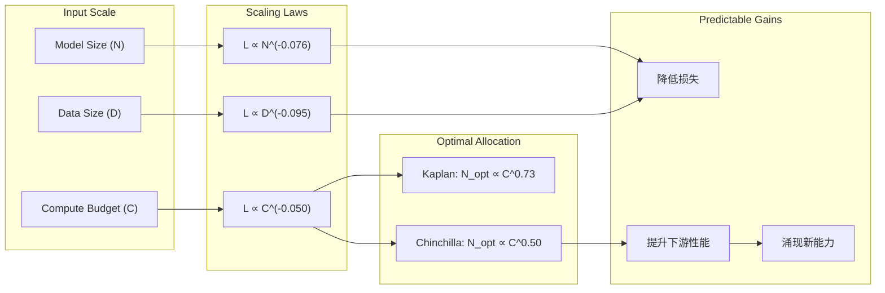
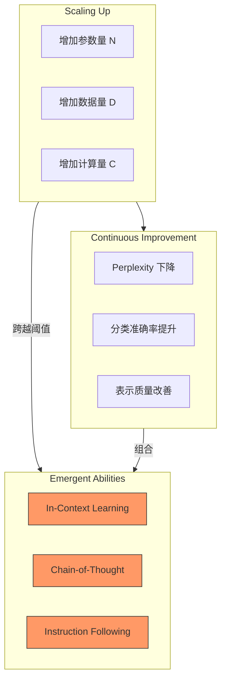

# 第4章：自回归建模与 Scaling Laws
# Chapter 4: Autoregressive Modeling and Scaling Laws

> **"Next-token prediction is all you need."** 自回归语言模型通过链式法则分解联合概率，将语言建模转化为逐词预测的序列问题。GPT 系列展示了"预测下一个词"这一简单目标如何催生出理解、推理甚至涌现能力。而 Scaling Laws 则揭示了损失、模型大小、数据量和计算量之间的幂律关系——为"越大越好"提供了理论基石。
>
> **"Next-token prediction is all you need."** Autoregressive language models factorize the joint probability via the chain rule, turning language modeling into a sequential word-by-word prediction problem. The GPT series demonstrates how the simple objective of "predicting the next token" gives rise to understanding, reasoning, and even emergent abilities. Scaling Laws reveal the power-law relationships among loss, model size, data size, and compute — providing the theoretical foundation for "bigger is better."

**前置知识 (Prerequisites):** Transformer 架构（第5章第2节）、概率论链式法则（第2卷）、信息论基础
**Code companion:** [`code/autoregressive_demo.py`](code/autoregressive_demo.py)

---

## 1. 自回归语言模型
## Autoregressive Language Models

### 1.1 链式法则分解
### Chain Rule Decomposition

语言模型的核心目标是计算一个 token 序列 $x_1, x_2, \ldots, x_n$ 的联合概率 $P(x_1, x_2, \ldots, x_n)$。根据概率论的**链式法则 (Chain Rule)**，联合概率可以分解为条件概率的乘积：

$$ P(x_1, x_2, \ldots, x_n) = \prod_{t=1}^{n} P(x_t \mid x_1, x_2, \ldots, x_{t-1}) $$

其中 $P(x_t \mid x_{<t})$ 表示在给定前面所有 token 的条件下，第 $t$ 个 token 的概率分布。

**自回归 (Autoregressive)** 一词源自时间序列分析："auto"（自我）+ "regression"（回归）= 用过去预测未来。在 NLP 语境下，自回归语言模型 (AR-LM) 逐 token 生成序列，每一步都基于已生成的所有 token 做预测。

### 1.2 自回归模型的核心

### 1.2 Core of Autoregressive Models

自回归语言模型的核心组件：

1. **因果注意力掩码 (Causal Attention Mask)** — 每个位置 $t$ 只能关注位置 $\le t$ 的 token，$M_{ij} = 0$ 当 $i \ge j$，否则 $-\infty$。
2. **自回归生成 (Autoregressive Generation)** — 生成时反复执行"预测下一个 token → 将预测结果拼接到输入 → 继续预测"的循环。
3. **Teacher Forcing 训练** — 训练时使用真实历史 token 而非模型自己的预测，加速收敛。

$$ \text{AR-LM: } P(x_t \mid x_{<t}) = \text{softmax}(W \cdot h_t) \quad \text{where } h_t = \text{Transformer}_{\text{causal}}(x_{\le t}) $$

### 1.3 AR vs MLM 对比
### AR vs MLM Comparison

| 特性 | 自回归 (AR) | BERT 式掩码语言模型 (MLM) |
|:-----|:------------|:--------------------------|
| **训练目标** | 预测下一个 token $P(x_t \mid x_{<t})$ | 预测被掩码的 token $P(x_t \mid x_{\backslash t})$ |
| **注意力模式** | 因果（单向） | 双向 |
| **生成能力** | ✅ 天然支持（从左到右生成） | ❌ 需要额外处理 |
| **理解能力** | ✅ 优秀 | ✅ 优秀（天然双向） |
| **代表模型** | GPT 系列, LLaMA | BERT, RoBERTa |
| **计算效率** | 生成时 O(n) 无法并行 | 单次前向即可获得所有表示 |
| **适用场景** | 文本生成、对话、代码补全 | 分类、NER、阅读理解 |

**关键洞察：** AR 模型把"生成"作为一等公民，理解只是生成的副产品。MLM 反之。这种哲学差异导致了后续 Scaling Laws 研究的巨大不对称——AR 模型在规模扩大时展现出更丰富的涌现能力。

---

## 2. GPT 系列
## The GPT Series

GPT (Generative Pre-trained Transformer) 系列是自回归语言模型最成功的代表。每一代都在规模、数据和训练方法上实现了质的飞跃。

### 2.1 GPT-1 (2018): 证明预训练的有效性

| 配置 | 数值 |
|:----|:-----|
| 参数量 | 117M |
| Transformer 层数 | 12 |
| 隐藏维度 | 768 |
| 注意力头数 | 12 |
| 训练数据 | BookCorpus (~800M tokens) |

**核心贡献：** 首次证明**无监督预训练 + 有监督微调**范式在 NLP 中的有效性。在 9/12 个 benchmark 上达到 SOTA。

**关键洞察：** 即使是中等规模的自回归模型，预训练学到的语言表示也远优于从头训练的随机初始化。

### 2.2 GPT-2 (2019): 零样本能力的发现

| 配置 | 数值 |
|:----|:-----|
| 参数量 | 1.5B |
| Transformer 层数 | 48 |
| 隐藏维度 | 1600 |
| 注意力头数 | 25 |
| 训练数据 | WebText (~40GB 文本) |

**核心贡献：** 首次展示**零样本 (Zero-shot) 迁移**能力——无需微调，仅通过**提示 (Prompting)** 即可完成翻译、问答、摘要等任务。

**关键洞察：** 当模型规模超过 1B 参数时，自回归训练开始产生超越"语言建模"本身的通用能力。最初 OpenAI 因安全顾虑延迟发布就是意识到这个规模带来的潜在风险。

### 2.3 GPT-3 (2020): In-Context Learning 的发现

| 配置 | 数值 |
|:----|:-----|
| 参数量 | 175B |
| Transformer 层数 | 96 |
| 隐藏维度 | 12288 |
| 注意力头数 | 96 |
| 训练数据 | CommonCrawl + WebText2 + Books (~570GB 文本) |
| 训练成本 | ~$4.6M (估计) |

**核心贡献：** 发现**上下文学习 (In-Context Learning, ICL)**——仅通过提供几个示例（Few-shot），无需梯度更新，模型就能"学会"执行新任务。

$$ \text{ICL: } P(y \mid x, \{(x_1, y_1), \ldots, (x_k, y_k)\}) \quad \text{without weight updates} $$

**关键洞察：** GPT-3 证明了**涌现 (Emergence)**——当模型规模跨越某个阈值，之前不存在的全新能力会突然出现。In-Context Learning 在 ~10B 参数以下基本不存在，在 175B 时显著显现。

### 2.4 演进路线总结

| 代际 | 规模 | 核心发现 | 对 AI 的影响 |
|:-----|:-----|:---------|:------------|
| GPT-1 | 117M | 预训练 + 微调 | NLP 预训练范式确立 |
| GPT-2 | 1.5B | 零样本能力 | 引发安全担忧和可扩展性研究 |
| GPT-3 | 175B | In-Context Learning | Scaling Laws 的实践验证 |
| GPT-3.5/InstructGPT | — | RLHF + Instruction Tuning | 对齐人类偏好 |
| GPT-4 | 推测 >1T | 多模态 + 推理 | 接近通用人工智能的里程碑 |

---

## 3. 为什么自回归能学到世界知识
## Why Autoregressive Modeling Learns World Knowledge

### 3.1 学习的本质
### The Nature of Learning

自回归语言模型的损失函数是交叉熵：

$$ \mathcal{L} = -\frac{1}{N} \sum_{i=1}^{N} \sum_{t=1}^{n} \log P_\theta(x_t^{(i)} \mid x_{<t}^{(i)}) $$

要最小化这个损失，模型必须学会编码训练数据中所有的统计规律。而互联网规模的文本数据包含了：

- **语法知识** — 词语搭配、句法结构
- **事实知识** — "巴黎是法国的首都"、"水在100°C沸腾"
- **推理模式** — "如果 A 大于 B 且 B 大于 C，则 A 大于 C"
- **世界知识** — 物理规律、社会常识、文化背景
- **潜在知识** — 隐式的因果关系、情感逻辑、修辞手法

### 3.2 唯一监督信号
### The Universal Training Signal

自回归损失是一个**通用监督信号 (Universal Supervision Signal)**。与分类、QA 等定制化任务不同，next-token prediction 不要求我们预先定义"什么知识重要"——模型自主决定哪些统计模式值得学习。

> **核心论点：** Next-token prediction 本质上是对压缩的追求。一个能够完美预测下一个 token 的模型，必然已经在内部构建了生成文本所需的世界模型。

这可以联系到**压缩即智能 (Compression is Understanding)** 的观点：
- 文本是人类知识的投影
- 预测下一个 token 需要理解产生该 token 背后的底层因果结构
- 因此，优秀的自回归模型必然编码了丰富的世界知识

### 3.3 局限性
### Limitations

当然，自回归训练并非万能：

1. **相关性 ≠ 因果性** — 模型学习的只是统计关联，而非真正的因果关系 (Pearl, 2019)
2. **分布外泛化** — 当测试分布与训练分布不同时，模型可能失败
3. **表面形式偏见** — 模型可能依赖浅层模式（如位置、长度）而非深层理解
4. **知识更新困难** — 模型学到的知识固化在权重中，难以增量更新

但这些局限性并没有阻止自回归模型成为当前 AI 能力最强的技术路线之一。

---

## 4. Scaling Laws
## Scaling Laws

### 4.1 Kaplan Scaling Laws (OpenAI, 2020)

Kaplan et al. (2020) 首次系统地研究了 Transformer 语言模型的**扩展行为**，发现损失与三个关键因素之间存在**幂律关系 (Power-Law Relationship)**：

#### 损失 vs 模型参数量 (N)

$$ L(N) \propto N^{-\alpha_N}, \quad \alpha_N \approx 0.076 $$

当模型参数量 $N$ 增加时，交叉熵损失呈幂律下降。但边际收益递减——每增加 10 倍参数量，损失下降约 $10^{-0.076} \approx 0.84$ 倍。

#### 损失 vs 数据量 (D)

$$ L(D) \propto D^{-\alpha_D}, \quad \alpha_D \approx 0.095 $$

数据量 $D$ 的增加同样带来幂律下降。$\alpha_D > \alpha_N$ 意味着增加数据量比增加模型大小略微更有效。

#### 损失 vs 计算量 (C)

$$ L(C) \propto C^{-\alpha_C}, \quad \alpha_C \approx 0.050 $$

这里的 $C$ 是训练总 FLOPs（浮点运算次数），$C \approx 6 \cdot N \cdot D$。

#### 计算最优分配 (Compute-Optimal Allocation)

对于给定的计算预算 $C$，最优的模型参数量 $N_{\text{opt}}$ 和数据量 $D_{\text{opt}}$ 满足：

$$ N_{\text{opt}} \propto C^{0.73} $$
$$ D_{\text{opt}} \propto C^{0.27} $$

这意味着当计算预算增加时，**应该更多地增加模型大小，而非数据量**（至少在 Kaplan 的结论中）。

### 4.2 Chinchilla Scaling Laws (DeepMind, 2022)

Hoffmann et al. (2022) 重新审视了 Scaling Laws，发现 Kaplan 的结论存在偏差——主要原因是对学习率调度和训练步数的影响估计不足。

#### 修正后的最优分配

通过训练超过 400 个不同规模的模型，Chinchilla 论文给出了修正的最优分配：

$$ N_{\text{opt}} \propto C^{0.50} $$
$$ D_{\text{opt}} \propto C^{0.50} $$

即**模型大小和数据量应该等比例扩展**。

| 指标 | Kaplan (2020) | Chinchilla (2022) |
|:-----|:--------------|:------------------|
| $N_{\text{opt}} \propto C^{\alpha}$ | $\alpha \approx 0.73$ | $\alpha \approx 0.50$ |
| $D_{\text{opt}} \propto C^{\beta}$ | $\beta \approx 0.27$ | $\beta \approx 0.50$ |
| 推荐 70B 模型的数据量 | ~200B tokens | ~1.4T tokens |
| 训练同一模型的计算成本 | 基线 | 约为 Kaplan 的 1/4（用更多数据） |

#### 实际影响

| 模型 | 参数量 | 训练 tokens | 是否符合 Chinchilla |
|:-----|:-------|:------------|:-------------------|
| GPT-3 (2020) | 175B | 300B | ❌ 严重欠训练 |
| LLaMA (2023) | 7B-65B | 1.0T-1.4T | ✅ 接近最优 |
| Chinchilla (2022) | 70B | 1.4T | ✅ 最优 |
| GPT-4 (2023) | 推测 >1T | 推测 >10T | ✅ 推测 |

### 4.3 Scaling Laws 的数学表述

$$
\min_{N, D} L(N, D) = \frac{A}{N^{\alpha}} + \frac{B}{D^{\beta}} + E
$$

其中：
- $A, B$ 是常数
- $\alpha, \beta$ 是幂律指数（各文献数值略有不同）
- $E$ 是**不可约损失 (Irreducible Loss)**——即使是完美模型也无法避免的损失（数据本身的熵）

**关键含义：**

1. **无免费午餐** — 仅增加模型大小而不增加数据会导致收益递减
2. **最终极限** — 当 $N \to \infty, D \to \infty$，损失趋于 $E$，即数据本身的噪声水平
3. **规模扩展的预测性** — 可以通过小模型的 Scaling Laws 预测大模型的行为

### 4.4 经验验证

---

## 5. 涌现能力
## Emergent Abilities

### 5.1 什么是涌现？
### What is Emergence?

**涌现 (Emergence)** 是指当系统规模超过某个阈值时，突然出现的小系统不具备的、不可预测的新能力。在 AI 中，涌现能力是指只有在模型超过一定规模时才出现的特定能力。

Wei et al. (2022) 将涌现能力定义为：

> "在较小模型中不存在、但在较大模型中存在的能力。"

### 5.2 涌现能力的分类

| 能力类别 | 具体能力 | 涌现阈值（估计） | 说明 |
|:---------|:---------|:----------------|:-----|
| **上下文学习 (ICL)** | Few-shot 任务学习 | ~10B | GPT-3 首次明确展现 |
| **多步推理** | 算术、逻辑推理 | ~50B | Chain-of-Thought 触发 |
| **指令遵循** | 理解和遵循指令 | ~20B | InstructGPT 核心能力 |
| **代码理解** | 生成/理解代码 | ~10B | Codex/Copilot 基础 |
| **世界知识** | 事实性知识 | ~1B | 随规模平滑增长 |
| **翻译** | 多语言翻译 | ~10B | 零样本翻译能力 |

### 5.3 涌现的机制解释

目前有几种理论试图解释为什么涌现发生在特定规模：

**1. 能力重组 (Skill Recombination)**

模型在训练过程中学到了大量基本能力（词汇、语法、简单推理）。当模型足够大时，这些能力可以**组合 (Recombine)** 产生更复杂的能力。例如，Chain-of-Thought 需要"分解问题" + "逐步推理" + "结果聚合"的组合。

**2. 表征质量阈值**

某些任务需要对输入形成**足够精确的内部表征**。当模型容量不足时，表征噪声过大，下游能力无法"浮现"。超过容量阈值后，表征质量急剧提升。

**3. 稀疏子网络激活**

大模型包含大量**稀疏子网络 (Sparse Sub-networks)**。不同能力由不同的子网络支持。当模型规模增大时，特定子网络的规模也增大到足以执行复杂任务。

### 5.4 涌现 vs 平滑增长

并非所有能力都是"突然涌现"的。Schaeffer et al. (2023) 指出，很多看似"涌现"的能力实际上是由于**评估指标的离散性和非线性**造成的：

- **连续指标**（如 perplexity）→ 平滑改进
- **离散指标**（如准确率、F1）→ 看似"涌现"
- **度量选择** → 使用 log-odds 替代准确率，很多"涌现"消失

**实践启示：** 涌现部分源于评估方式，但不可否认，某些能力（如 ICL、CoT）在跨过特定规模后确实表现出质变。

### 5.5 Scaling Laws 与涌现的关系

---

## 总结与展望 (Summary & Outlook)

### 核心要点 (Key Takeaways)

| 主题 | 一句话总结 |
|:-----|:----------|
| **自回归语言模型** | 通过链式法则分解联合概率，用因果注意力实现逐 token 预测 |
| **GPT 系列** | GPT-1 证明预训练、GPT-2 发现零样本、GPT-3 发现 In-Context Learning |
| **自回归为什么有效** | Next-token prediction 是通用监督信号，模型被迫学习编码世界知识 |
| **Scaling Laws** | 损失与 $N, D, C$ 之间存在幂律关系；Chinchilla 修正了最优分配比 |
| **涌现能力** | 超过一定规模后，模型展现出小模型不具备的新能力 |

### 延伸思考 (Further Thoughts)

1. **Scaling Laws 还会继续吗？** 当前瓶颈已经从计算量转向数据量。合成数据、多模态数据可能是下一个突破口。
2. **涌现是真正的理解吗？** 从统计相关性到因果关系，AR-LM 还有多远？神经符号方法可能是桥梁。
3. **更大 ≠ 更好？** 模型效率研究（MoE、蒸馏、量化）正在探索如何在有限资源下获得更大模型的性能。
4. **向后兼容性** — Chinchilla 定律告诉我们，很多大模型实际上"欠训练"了。这也意味着，对于很多现有模型，增加训练数据和步数仍然能带来显著收益。

### 参考文献 (References)

- Radford et al. (2018). "Improving Language Understanding by Generative Pre-Training." (GPT-1)
- Radford et al. (2019). "Language Models are Unsupervised Multitask Learners." (GPT-2)
- Brown et al. (2020). "Language Models are Few-Shot Learners." (GPT-3)
- Kaplan et al. (2020). "Scaling Laws for Neural Language Models."
- Hoffmann et al. (2022). "Training Compute-Optimal Large Language Models." (Chinchilla)
- Wei et al. (2022). "Emergent Abilities of Large Language Models."
- Schaeffer et al. (2023). "Are Emergent Abilities of Large Language Models a Mirage?"
