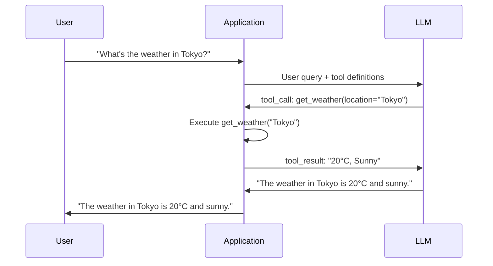

# 9.3 Tool Calling（函数调用）

> **让 LLM 不仅仅是"聊天"——学会调用工具，连接真实世界。**
> **Empowering LLMs to go beyond chat — connecting to the real world through tool calls.**

---

## 9.3.1 什么是 Tool Calling？

**Tool Calling**（也称为 Function Calling）是指大语言模型（LLM）在生成响应时，输出结构化的工具调用指令，而非纯文本。应用程序解析这些指令，执行对应的函数，并将结果返回给模型，最终生成自然语言回复。

```
User: "What's 2+3*4?"
        │
        ▼
LLM:  {"name": "calculator", "arguments": {"expression": "2+3*4"}}
        │
        ▼
App:  Executes calculator("2+3*4") → 14
        │
        ▼
LLM:  "The answer is 14."
```

核心价值：
- **连接实时数据**：查询数据库、调用 API、获取天气/股价
- **执行操作**：发送邮件、创建订单、控制设备
- **增强推理**：让 LLM 借助计算器、代码解释器等工具解决纯文本难以处理的问题

---

## 9.3.2 Tool Calling 协议格式

### OpenAI 格式

```json
{
  "id": "call_abc123",
  "type": "function",
  "function": {
    "name": "get_weather",
    "arguments": "{\"location\": \"Tokyo\", \"unit\": \"celsius\"}"
  }
}
```

`arguments` 是 JSON 字符串，需要应用端解析。

### Anthropic（Claude）格式

```json
{
  "type": "tool_use",
  "id": "toolu_abc123",
  "name": "get_weather",
  "input": {
    "location": "Tokyo",
    "unit": "celsius"
  }
}
```

`input` 直接是 JSON 对象，无需二次解析。

### Google Gemini 格式

```json
{
  "functionCall": {
    "name": "get_weather",
    "args": {
      "location": "Tokyo",
      "unit": "celsius"
    }
  }
}
```

### 对比总结

| 特性 | OpenAI | Anthropic | Gemini |
|------|--------|-----------|--------|
| 顶层 key | `tool_calls` | `content` block | `functionCall` |
| arguments 格式 | JSON 字符串 | JSON 对象 | JSON 对象 |
| 调用 ID | `id` | `id` | 无 |
| 结果返回 | `tool_call_id` | `tool_use_id` | `functionResponse` |

---

## 9.3.3 工具定义 Schema

要让 LLM 正确调用工具，需要提供**工具定义**——包括名称、描述和参数 Schema。**描述信息至关重要**，LLM 据此判断何时使用哪个工具。

### JSON Schema 格式

工具参数使用 **JSON Schema** 描述，这是最常见的标准：

```json
{
  "name": "calculator",
  "description": "Evaluate a mathematical expression and return the result. Use this for any arithmetic or algebraic computation.",
  "parameters": {
    "type": "object",
    "properties": {
      "expression": {
        "type": "string",
        "description": "The mathematical expression to evaluate, e.g. '2+3*4' or 'sqrt(16)'"
      }
    },
    "required": ["expression"]
  }
}
```

### 工具定义的三个关键要素

| 要素 | 说明 | 重要性 |
|------|------|--------|
| **name** | 工具名称，LLM 据此选择调用哪个工具 | 保持简洁唯一 |
| **description** | 描述工具何时使用、做什么 | **最关键**——LLM 主要靠描述做决策 |
| **parameters** | JSON Schema 定义输入参数 | 类型、枚举、描述越详细越好 |

### 实战建议

1. **描述要具体**："计算数学表达式" 不如 "当用户需要计算数值表达式时使用，支持 +-*/ 和数学函数"
2. **参数描述要完整**：每个参数都写清楚含义、格式、取值范围
3. **使用枚举约束**：对于有限选项，用 `enum` 限定
4. **必填参数标记 `required`**：避免模型遗漏关键参数

---

## 9.3.4 完整的 Tool Calling 循环

完整的工具调用流程包含三个步骤：

```
Step 1: LLM 解析意图并输出工具调用
Step 2: 应用执行对应函数
Step 3: 将结果返回给 LLM 生成最终回复
```

### 流程图



### 核心代码逻辑

```python
def tool_calling_loop(messages, tools):
    """完整工具调用循环"""
    while True:
        # Step 1: 调用 LLM
        response = llm.chat(messages, tools=tools)

        if response.has_tool_calls():
            # Step 2: 执行工具调用
            for tool_call in response.tool_calls:
                result = execute_tool(tool_call)
                messages.append(tool_result_message(tool_call, result))
        else:
            # Step 3: 返回最终回复
            return response.text
```

---

## 9.3.5 并行工具调用

Parallel Tool Calling 是 GPT-4 开始支持的重要能力：**一个用户问题可以触发多个独立工具同时执行**。

### 场景示例

```
User: "Compare weather in Tokyo and London"
        │
        ▼
LLM:  ┌─ tool_call_1: get_weather(location="Tokyo")
        └─ tool_call_2: get_weather(location="London")
        │
        ▼
App:  ┌─ Executing get_weather("Tokyo")  ──→ "22°C"
        └─ Executing get_weather("London") ──→ "15°C"
        │
        ▼
LLM:  "Tokyo is 22°C and London is 15°C. Tokyo is warmer."
```

### 关键要点

1. **工具必须独立**：并行调用的工具之间无数据依赖
2. **结果合并**：所有工具结果统一返回给 LLM
3. **效率提升**：对 N 个独立查询，耗时从串行 O(N) 降为 O(1)

### 限制

- 并非所有模型支持并行调用（需检查模型能力）
- 依赖同一工具多次调用时需注意限流（rate limit）
- 并行数通常有上限（如 OpenAI 限制单个请求最多 10 个 tool calls）

---

## 9.3.6 错误处理

工具调用过程中可能出现的错误及处理策略：

| 错误类型 | 问题 | 处理策略 |
|----------|------|----------|
| **参数错误** | LLM 生成了错误的参数值 | 返回明确错误信息，让 LLM 重试 |
| **工具不存在** | LLM 调用了未定义的函数名 | 检查工具名称是否匹配，返回 "tool not found" |
| **执行异常** | 工具内部抛出异常（如除零、网络超时） | 捕获异常，返回友好错误描述 |
| **超时** | 工具执行时间过长 | 设置超时阈值，超时后返回 "timeout" |

错误信息应尽可能结构化，帮助 LLM 理解并纠正：

```python
{
    "role": "tool",
    "tool_call_id": "call_abc123",
    "content": "Error: Division by zero. The expression '1/0' is invalid."
}
```

---

## 9.3.7 实战案例

详见配套代码 [`code/tool_calling.py`](code/tool_calling.py)，其中实现了：

- `calculator`：计算数学表达式
- `search`：模拟搜索引擎查询
- `get_time`：获取指定时区当前时间

演示了完整的单次调用、串行多步调用和并行调用三种场景。

---

## 参考

- [OpenAI Function Calling Guide](https://platform.openai.com/docs/guides/function-calling)
- [Anthropic Tool Use Documentation](https://docs.anthropic.com/en/docs/build-with-claude/tool-use)
- [Google Gemini Function Calling](https://ai.google.dev/docs/function_calling)
