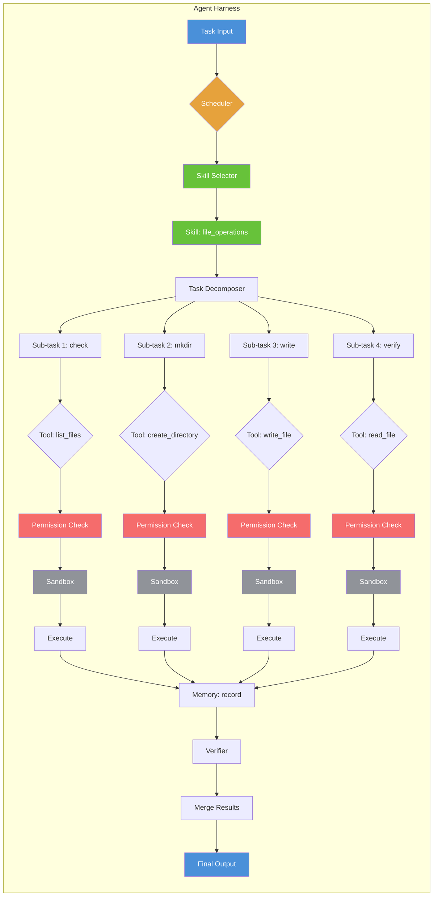

# 第2章 Agent Harness 深度解析 — 调度、工具、技能、记忆与权限
# Chapter 2: Agent Harness Deep Dive — Scheduling, Tools, Skills, Memory & Permissions

> **An agent（/ˈeɪdʒənt/） harness is the runtime that brings an LLM-powered agent to life. It is the operating system for autonomous code agents — managing their lifecycle, tool access, skill injection, memory, and safety.**
>
> **Agent Harness 是让 LLM Agent 真正"活起来"的运行时。它是自主编码代理的操作系统——管理着生命周期、工具访问、技能注入、记忆和安全性。**

**前置知识 (Prerequisites):** 了解 Agent 基本概念（第 9.4 节）、了解 Tool Calling（第 9.3 节）
**配套代码 (Code):** `code/agent_harness_demo.py`

---

## 目录 (Table of Contents)

1. [什么是 Agent Harness (What is an Agent Harness)](#1-什么是-agent-harness-what-is-an-agent-harness)
2. [调度系统 (Scheduling System)](#2-调度系统-scheduling-system)
3. [工具系统 (Tool System)](#3-工具系统-tool-system)
4. [技能系统 (Skill System)](#4-技能系统-skill-system)
5. [记忆 (Memory)](#5-记忆-memory)
6. [权限与沙箱 (Permissions & Sandbox)](#6-权限与沙箱-permissions--sandbox)
7. [完整 Agent 循环 (Complete Agent Loop)](#7-完整-agent-循环-complete-agent-loop)
8. [运行示例 (Running Example)](#8-运行示例-running-example)

---

## 1. 什么是 Agent Harness (What is an Agent Harness)

**Agent Harness** 是 Agent 的运行时基础设施。如果把 LLM 比作"大脑"，工具比作"双手"，那么 Harness 就是"神经系统 + 操作系统"——它协调大脑的思考、双手的动作、以及全身各系统的协作。

```
┌─────────────────────────────────────────────────────────┐
│                    AGENT HARNESS                         │
│                                                          │
│  ┌──────────────┐  ┌──────────────────┐                 │
│  │   Scheduler   │  │   Tool System    │                 │
│  │  (调度系统)    │  │  (工具系统)       │                 │
│  │  decompose    │  │  Tool Registry   │                 │
│  │  dispatch     │  │  Permission      │                 │
│  │  verify       │  │  MCP Protocol    │                 │
│  └──────┬───────┘  └────────┬─────────┘                 │
│         │                   │                            │
│         ▼                   ▼                            │
│  ┌──────────────┐  ┌──────────────────┐                 │
│  │  Skill System │  │    Memory        │                 │
│  │  (技能系统)    │  │  (记忆系统)       │                 │
│  │  load/inject  │  │  conversation    │                 │
│  │  chain        │  │  file state      │                 │
│  │  guardrails   │  │  facts           │                 │
│  └──────────────┘  └──────────────────┘                 │
│                                                          │
│  ┌──────────────────────────────────────────────────┐   │
│  │              Sandbox (沙箱)                       │   │
│  │     Read-only | Read-Write | Execute             │   │
│  └──────────────────────────────────────────────────┘   │
└─────────────────────────────────────────────────────────┘
```

### 核心架构分层 (Core Architecture Layers)

| 层 (Layer) | 职责 (Responsibility) | 类比 (Analogy) |
|---|---|---|
| **Scheduler** | 任务分解、子代理调度、结果收集、验证合并 | 项目经理 |
| **Tool System** | 工具注册、调用、权限检查、MCP 协议 | 员工的工作技能 |
| **Skill System** | 技能定义、动态加载、注入、链式调用 | 专业培训课程 |
| **Memory** | 对话历史、文件状态、持久化事实 | 员工的笔记本 |
| **Sandbox** | 文件路径隔离、权限控制、执行限制 | 公司的安全政策 |

---

## 2. 调度系统 (Scheduling System)

调度系统是 Agent Harness 的"大脑"——它接收高层任务，将其分解为可执行的子步骤，分派给合适的工具或子代理，收集结果，验证正确性，最后合并输出。

### 2.1 主循环 (Main Loop)

```
┌─────────────────────────────────────────────────────┐
│                AGENT MAIN LOOP                       │
│                                                      │
│  1. Receive Task                                     │
│     │                                                │
│     ▼                                                │
│  2. Choose & Load Skill                              │
│     │                                                │
│     ▼                                                │
│  3. Decompose Task → Sub-tasks                       │
│     │                                                │
│     ▼                                                │
│  4. For each sub-task:                               │
│     ├── Select Tool                                  │
│     ├── Check Permission                             │
│     ├── Execute Tool                                 │
│     ├── Collect Result                               │
│     └── Retry on Failure (optional)                  │
│     │                                                │
│     ▼                                                │
│  5. Verify Results                                   │
│     │                                                │
│     ▼                                                │
│  6. Merge & Return Final Answer                      │
│                                                      │
└─────────────────────────────────────────────────────┘
```

### 2.2 任务分解 (Task Decomposition)

将高层任务分解为原子子步骤是调度的核（kernel /ˈkɜːrnl/）心能力。一个好的分解结果应该满足：

| 原则 (Principle) | 说明 (Description) | 反例 (Anti-pattern) |
|---|---|---|
| **原子性 (Atomic)** | 每个子步骤只做一件事 | "创建文件并写入内容" → 应拆分为"创建目录"和"写入文件"两步 |
| **可验证 (Verifiable)** | 每个子步骤有明确的成功/失败标准 | "改善代码质量" → 应拆分为"添加注释"、"修复 lint 错误"等可验证项 |
| **顺序合理 (Ordered)** | 依赖关系正确表达 | 先写文件再创建目录 → 应先创建目录 |
| **可重试 (Retryable)** | 失败时可以安全重试 | 写入一半文件后重试导致重复内容 → 应为幂等操作 |

**伪代码 (Pseudocode):**

```
function decompose(task):
    if task contains "create file":
        return [
            {id: "check",  action: "verify workspace",     tool: "list_files"},
            {id: "mkdir",  action: "create directories",    tool: "create_directory"},
            {id: "write",  action: "write file content",    tool: "write_file"},
            {id: "verify", action: "verify created file",   tool: "read_file"},
        ]
    else:
        return generic_decompose(task)
```

### 2.3 子代理调度 (Sub-agent Dispatch)

复杂任务可能需要多个专用子代理协作。调度系统负责：

1. **创建子代理实例** — 每个子代理有自己的角色、工具集和记忆
2. **分派任务** — 将子步骤分配给最适合的子代理
3. **收集结果** — 等待所有子代理完成（或超时）
4. **合并输出** — 将所有结果整合为最终回答

```
┌─────────────┐     Task: "Create a file with content"
│  Master     │
│  Agent      │
└──────┬──────┘
       │
       │ decompose
       ▼
┌──────────────────────────────────────────────────┐
│           Sub-task Queue                          │
│  [st-1]  [st-2]  [st-3]  [st-4]                  │
└─────┬──────┬──────┬──────┬────────────────────────┘
      │      │      │      │
      ▼      ▼      ▼      ▼
  ┌──────┐ ┌──────┐ ┌──────┐ ┌──────┐
  │SA:   │ │SA:   │ │SA:   │ │SA:   │
  |check | |mkdir | |write | |verify│
  └──┬───┘ └──┬───┘ └──┬───┘ └──┬───┘
     │        │        │        │
     ▼        ▼        ▼        ▼
  result   result   result   result
     │        │        │        │
     └────────┴────┬───┴────────┘
                   │
                   ▼
          ┌────────────────┐
          │  Verify & Merge │
          └────────────────┘
                   │
                   ▼
            Final Answer
```

---

## 3. 工具系统 (Tool System)

工具系统是 Agent 与外部世界交互的桥梁。它定义了 Agent 可以"做什么"——读文件、写文件、执行命令、搜索网络等。

### 3.1 Tool Calling 规范

每个工具由三部分组成：

```json
{
  "name": "write_file",
  "description": "Write content to a file in the workspace",
  "input_schema": {
    "type": "object",
    "properties": {
      "path": {"type": "string", "description": "File path"},
      "content": {"type": "string", "description": "Content to write"}
    },
    "required": ["path", "content"]
  },
  "permission": "read_write"
}
```

**三要素 (Three Elements):**

| 要素 (Element) | 作用 (Purpose) | 示例 (Example) |
|---|---|---|
| **name** | 唯一标识工具 | `write_file` |
| **description** | 告诉 LLM 什么时候用这个工具 | `Write content to a file in the workspace` |
| **input_schema** | 定义参数（parameter /pəˈræmɪtər/）结构和约束 | `{path: string, content: string}` |

### 3.2 MCP 协议 (Model Context Protocol)

MCP 是一个标准化协议，定义 LLM 如何发现和调用工具。它包含两个核心角色：

- **MCP Server**: 提供工具定义和实现，监听工具调用请求
- **MCP Client** (Agent): 发现可用工具，发起调用请求，接收结果

```
┌─────────────────────┐        ┌─────────────────────┐
│  MCP Client         │        │  MCP Server         │
│  (Agent)            │        │  (Tool Provider)    │
│                     │        │                     │
│  1. List Tools ─────┼────────┤  (广播可用工具列表)   │
│                     │        │                     │
│  2. Call Tool ──────┼────────┤  read_file          │
│                     │        │  write_file         │
│  3. Get Result ◄────┼────────┤  list_files         │
│                     │        │  search_text        │
└─────────────────────┘        └─────────────────────┘
```

**MCP 的标准化 JSON-RPC 消息格式:**

```json
// Request (Agent → Server)
{
  "jsonrpc": "2.0",
  "method": "tools/call",
  "params": {
    "name": "write_file",
    "arguments": {
      "path": "output/hello.txt",
      "content": "Hello World"
    }
  },
  "id": 1
}

// Response (Server → Agent)
{
  "jsonrpc": "2.0",
  "id": 1,
  "result": {
    "content": [
      {"type": "text", "text": "Written 11 bytes to output/hello.txt"}
    ],
    "isError": false
  }
}
```

### 3.3 工具注册表 (Tool Registry)

工具注册表维护所有可用工具的索引，支持动态注册和查询。

```python
class ToolRegistry:
    def __init__(self):
        self._tools = {}

    def register(self, tool: ToolSpec):
        """注册一个工具到注册表"""
        self._tools[tool.name] = tool

    def execute(self, name, args, sandbox, memory) -> ToolCall:
        """执行工具调用（带权限检查）"""
        spec = self._tools.get(name)
        if not spec:
            return ToolCall(..., status="failure",
                            error=f"Unknown tool: {name}")
        # Permission check
        if "path" in args and not sandbox.check(...):
            return ToolCall(..., status="permission_denied")
        # Execute
        result = spec.handler(**args, sandbox=sandbox, memory=memory)
        return ToolCall(name, args, result=result, status="success")
```

### 3.4 工具调用流程

```
Agent decides to call a tool
         │
         ▼
  ┌──────────────┐
  │ 1. Resolve   │ ← 查找工具定义
  └──────┬───────┘
         ▼
  ┌──────────────┐
  │ 2. Validate  │ ← 校验参数（input_schema）
  └──────┬───────┘
         ▼
  ┌──────────────┐
  │ 3. Check     │ ← 权限检查（Sandbox）
  │ Permission   │
  └──────┬───────┘
         ▼
  ┌──────────────┐
  │ 4. Execute   │ ← 调用 handler 函数
  └──────┬───────┘
         ▼
  ┌──────────────┐
  │ 5. Return    │ ← 返回 ToolCall（含结果/错误）
  │ Result       │
  └──────────────┘
```

---

## 4. 技能系统 (Skill System)

技能是 Agent 的能力单元——每个技能包含一组相关的工具、一个系统提示模板、以及安全护栏。Agent 可以根据任务动态加载合适的技能。

### 4.1 技能定义 (Skill Definition)

```python
@dataclass
class Skill:
    name: str                    # 技能名称
    description: str             # 技能描述（用于选择）
    prompt_template: str         # 注入到 System Prompt 的模板
    required_tools: list[str]    # 需要哪些工具
    guardrails: list[str]        # 安全护栏规则
```

**示例技能:**

| 技能 (Skill) | 工具 (Tools) | 护栏 (Guardrails) |
|---|---|---|
| **file_operations** | read_file, write_file, list_files, create_directory | 不写入工作区外、读前检查、自动创建父目录 |
| **code_generator** | read_file, write_file, search_text | 包含文档字符串、遵循 PEP 8、读写前先查看 |
| **web_search** | search_web, extract_content | 验证 URL 合法性、限制并发请求、缓存结果 |

### 4.2 动态技能加载 (Dynamic Skill Injection)

```
Agent receives task: "Create a file with content"
         │
         ▼
  ┌─────────────────┐
  │ 1. Skill Select │ ← 根据任务关键词选择技能
  │                 │    "create" + "file" → file_operations
  └──────┬──────────┘
         ▼
  ┌─────────────────┐
  │ 2. Load Skill   │ ← 从注册表加载技能定义
  └──────┬──────────┘
         ▼
  ┌─────────────────┐
  │ 3. Validate     │ ← 检查所需工具是否存在
  └──────┬──────────┘
         ▼
  ┌─────────────────┐
  │ 4. Inject       │ ← 将技能 prompt 注入 system message
  │ into Prompt     │
  └──────┬──────────┘
         ▼
  ┌─────────────────┐
  │ 5. Chain        │ ← 技能可以链式调用另一个技能
  │ (optional)      │
  └─────────────────┘
```

**注入后的 System Prompt 示例:**

```
--- Skill: file_operations ---
You are a file operations specialist.
You can create files with content, read existing files,
and organize directories.

Guardrails:
  - Never write to paths outside the workspace
  - Always read before overwriting
  - Create parent directories as needed
```

### 4.3 技能链 (Skill Chaining)

技能可以链式调用——当一个技能发现需要另一个技能的能力时，可以动态加载它。

```
Task: "Create a Python script that fetches stock data"
    │
    ▼
[Skill: code_generator]
    │ 需要创建文件
    ▼
[Skill: code_generator] ──► [Skill: file_operations] (链式加载)
    │
    ▼
[Skill: code_generator] 生成代码内容
    │ 使用 file_operations 写入文件
    ▼
Result: stock_fetcher.py created
```

### 4.4 技能 vs 工具 (Skills vs Tools)

| 维度 (Dimension) | 工具 (Tool) | 技能 (Skill) |
|---|---|---|
| **粒度** | 原子操作 | 能力组合 |
| **组成** | name + description + handler | prompt + tools + guardrails |
| **生命周期** | 常驻注册表 | 按需动态加载 |
| **调用方式** | Agent → Tool | Agent → Skill → Tools |
| **依赖** | 独立 | 依赖若干工具 |
| **可替换性** | 单个替换 | 整体替换能力集 |

---

## 5. 记忆 (Memory)

记忆系统让 Agent 不再"每次都是新的"。它维护对话历史、文件操作状态和学到的知识。

### 5.1 记忆架构 (Memory Architecture)

```
┌────────────────────────────────────────────┐
│               MEMORY SYSTEM                 │
│                                              │
│  ┌──────────────────────────────────────┐   │
│  │  Conversation History (对话历史)      │   │
│  │  [user] Create a file...            │   │
│  │  [system] Loading skill...          │   │
│  │  [agent] Executing st-1...          │   │
│  │  [tool] Written 103 bytes...        │   │
│  │  Sliding window: last N messages     │   │
│  └──────────────────────────────────────┘   │
│                                              │
│  ┌──────────────────────────────────────┐   │
│  │  File State (文件状态)                │   │
│  │  output/hello.txt → "Hello..."      │   │
│  │  (跟踪 Agent 创建/修改的所有文件)     │   │
│  └──────────────────────────────────────┘   │
│                                              │
│  ┌──────────────────────────────────────┐   │
│  │  Learned Facts (学习的事实)            │   │
│  │  • Completed task: Create a file     │   │
│  │  • Created files: [output/hello.txt] │   │
│  │  (跨会话持久化的知识)                  │   │
│  └──────────────────────────────────────┘   │
└────────────────────────────────────────────┘
```

### 5.2 三种记忆层次 (Three Memory Layers)

| 层次 (Layer) | 存储 (Storage) | 持久性 (Persistence) | 容量 (Capacity) |
|---|---|---|---|
| **短期 (Short-term)** | 内存中的滑动窗口 | 当前会话 | 最近的 N 条消息 |
| **工作 (Working)** | 文件状态字典 | 当前任务 | 操作的所有文件 |
| **长期 (Long-term)** | 事实列表 | 跨任务/跨会话 | 累积知识 |

### 5.3 记忆在 Agent 循环中的角色

```python
class Memory:
    def __init__(self):
        self.conversation = []    # 对话历史
        self.file_state = {}      # 文件状态
        self.facts = []           # 学习的事实

    def add_message(self, role, content):
        """记录一条对话消息"""
        self.conversation.append({"role": role, "content": content})

    def get_context(self) -> str:
        """获取最近的上下文（滑动窗口最后 10 条）"""
        return "\n".join(
            f"[{m['role']}] {m['content']}"
            for m in self.conversation[-10:]
        )

    def record_file(self, path, content):
        """记录文件状态"""
        self.file_state[path] = content

    def add_fact(self, fact):
        """学习一个事实（去重）"""
        if fact not in self.facts:
            self.facts.append(fact)
```

**记忆直接影响 Agent 行为:**
- **对话历史** → 避免重复操作、理解上下文
- **文件状态** → 知道哪些文件已存在，避免覆盖
- **事实** → 跨任务积累经验，不断改进

---

## 6. 权限与沙箱 (Permissions & Sandbox)

安全是 Agent Harness 最重要的设计考量之一。权限系统确保 Agent 不会执行危险操作。

### 6.1 权限等级 (Permission Levels)

| 级别 (Level) | 允许操作 (Allowed) | 禁止操作 (Forbidden) | 示例工具 |
|---|---|---|---|
| **READ_ONLY** | 读取文件、搜索内容 | 写入、修改、删除、执行 | `read_file`, `search_text` |
| **READ_WRITE** | 读取、写入、创建目录 | 删除、执行命令 | `write_file`, `create_directory` |
| **EXECUTE** | 读取、写入、执行命令 | 无限制（需额外审查） | `run_shell` |

### 6.2 沙箱实现 (Sandbox Implementation)

```
┌──────────────────────────────────────────┐
│             SANDBOX                       │
│                                          │
│  Workspace: /tmp/agent_harness_xxx/      │
│                                          │
│  Allowed:                                 │
│    /tmp/agent_harness_xxx/output/        │
│    /tmp/agent_harness_xxx/hello.txt      │
│                                          │
│  Blocked:                                 │
│    /etc/passwd                ← 越权     │
│    /home/user/important/doc  ← 越权     │
│    /bin/rm -rf /             ← 危险     │
│                                          │
└──────────────────────────────────────────┘
```

```python
class Sandbox:
    def __init__(self, workspace: str):
        self.workspace = os.path.abspath(workspace)
        self.allowed_dirs = {self.workspace}

    def resolve_path(self, path: str) -> str:
        """将路径解析为沙箱内的绝对路径"""
        if os.path.isabs(path):
            resolved = os.path.normpath(path)
        else:
            resolved = os.path.normpath(
                os.path.join(self.workspace, path)
            )
        return resolved

    def check_permission(self, path, level) -> bool:
        """检查路径是否在沙箱内且满足权限等级"""
        resolved = self.resolve_path(path)
        allowed = any(resolved.startswith(d)
                      for d in self.allowed_dirs)
        if not allowed:
            return False
        if level == PermissionLevel.EXECUTE:
            return False  # 本 demo 禁止执行
        return True
```

### 6.3 权限检查流程 (Permission Check Flow)

```
Tool Call: write_file(path="/etc/passwd", content="hacked")
         │
         ▼
  ┌─────────────────┐
  │ 1. Resolve Path │ → /etc/passwd
  └──────┬──────────┘
         ▼
  ┌─────────────────┐
  │ 2. Check        │ → /etc/passwd 不在沙箱内
  │ Workspace       │
  └──────┬──────────┘
         ▼
  ┌─────────────────┐
  │ 3. Deny         │ → PermissionDenied!
  │ + Log Alert     │
  └─────────────────┘
```

### 6.4 安全设计原则 (Security Principles)

| 原则 (Principle) | 说明 (Description) | 实现 (Implementation) |
|---|---|---|
| **最小权限 (Least Privilege)** | 只给 Agent 完成任务所需的最少权限 | 每个工具标注 permission_level |
| **默认拒绝 (Deny by Default)** | 未明确允许的操作一概拒绝 | `check_permission` 默认返回 False |
| **路径白名单 (Path Allowlist)** | 只允许在指定目录下操作 | 所有路径必须解析到 workspace 内 |
| **操作审计 (Audit Trail)** | 记录所有工具调用 | `ToolCall` 记录 name, args, status, timestamp |

---

## 7. 完整 Agent 循环 (Complete Agent Loop)

将以上所有系统整合起来，就是一个完整的 Agent Harness 循环。

### 7.1 架构总图 (Architecture Overview)



### 7.2 各组件职责 (Component Responsibilities)

| 组件 (Component) | 职责 (Responsibility) | 代码位置 (Location in Code) |
|---|---|---|
| **Agent** | 主控制器：接收任务，协调各子系统 | `Agent.run()` |
| **Scheduler** | 任务分解、子任务编排 | `Agent.decompose()` |
| **Skill System** | 技能选择、加载、注入 | `load_skill()`, `inject_skill_prompt()` |
| **ToolRegistry** | 工具注册、查找、执行 | `ToolRegistry.execute()` |
| **Sandbox** | 路径解析、权限检查 | `Sandbox.check_permission()` |
| **Memory** | 对话历史、文件状态、事实 | `Memory` class |
| **SubAgent** | 子代理执行单一任务 | `SubAgent.execute()` |

### 7.3 Agent 状态机 (Agent State Machine)

```
                  ┌──────────┐
                  │  IDLE    │
                  └────┬─────┘
                       │ receive task
                       ▼
                  ┌──────────┐
                  │  LOAD    │ ← 加载匹配的技能
                  │  SKILL   │
                  └────┬─────┘
                       │
                       ▼
                  ┌──────────┐
                  │ DECOMPOSE│ ← 分解为子任务
                  └────┬─────┘
                       │
                       ▼
               ┌─────────────────┐
         ┌─────│  DISPATCH       │
         │     │  (for each st)  │
         │     └────────┬────────┘
         │              │
         │              ▼
         │     ┌─────────────────┐
         │     │  CHECK PERM     │
         │     └────────┬────────┘
         │              │
         │         ┌────┴────┐
         │         │ allow   │ deny
         │         ▼         ▼
         │  ┌──────────┐  ┌──────────┐
         │  │ EXECUTE  │  │  DENY    │
         │  └────┬─────┘  └────┬─────┘
         │       │             │
         │       ▼             │
         │  ┌──────────┐      │
         │  │ RECORD   │      │
         │  │ RESULT   │      │
         │  └────┬─────┘      │
         │       │            │
         └───────┘────────────┘
                  │ all done
                  ▼
            ┌──────────┐
            │  VERIFY  │ ← 检查所有子任务结果
            └────┬─────┘
                 │
                 ▼
            ┌──────────┐
            │  MERGE   │ ← 合并为最终输出
            └────┬─────┘
                 │
                 ▼
            ┌──────────┐
            │  OUTPUT  │
            └──────────┘
```

---

## 8. 运行示例 (Running Example)

以下是对应 `code/agent_harness_demo.py` 的完整运行输出，展示了 Agent Harness 从接收任务到输出结果的完整过程。

### 8.1 完整输出 (Full Console Output)

```
Workspace: /tmp/agent_harness_b4bof8ds

======================================================================
  AGENT HARNESS
  Task: Create a file with content: write 'Hello from Agent Harness!'
        to output/hello.txt
======================================================================
  [SKILL] Loaded: file_operations

  [STATE] Active skills: ['file_operations']
  [STATE] Available tools: ['read_file', 'write_file',
                            'list_files', 'create_directory',
                            'search_text']

  [PLANNER] Decomposing: 'Create a file with content...'
  [PLANNER] Decomposed into 4 sub-tasks:
    st-1: Verify workspace exists and is clean
          → list_files(pattern=*)
    st-2: Create necessary directory structure
          → create_directory(path=output)
    st-3: Write the actual file content
          → write_file(path=output/hello.txt, content=...)
    st-4: Verify the file was created correctly
          → read_file(path=output/hello.txt)

──────────────────────────────────────────────────────────────────────
  EXECUTION PHASE
──────────────────────────────────────────────────────────────────────

  >> Sub-task 1/4: st-1
     Action: Verify workspace exists and is clean
     Tool: list_files(pattern=*)
     Status: ✓ success
     Result: (no files found)

  >> Sub-task 2/4: st-2
     Action: Create necessary directory structure
     Tool: create_directory(path=output)
     Status: ✓ success
     Result: Directory created: output

  >> Sub-task 3/4: st-3
     Action: Write the actual file content
     Tool: write_file(path=output/hello.txt, content=...)
     Status: ✓ success
     Result: Written 103 bytes to output/hello.txt

  >> Sub-task 4/4: st-4
     Action: Verify the file was created correctly
     Tool: read_file(path=output/hello.txt)
     Status: ✓ success
     Result: Hello from Agent Harness!
             This file was created by an autonomous agent.
             Timestamp: 2026-06-02 10:19:25

──────────────────────────────────────────────────────────────────────
  VERIFICATION PHASE
──────────────────────────────────────────────────────────────────────
  Results: 4 success, 0 failure, 0 denied
  Files created/modified:
    - output/hello.txt (103 bytes)

======================================================================
  FINAL RESULT
======================================================================
  Task completed: Create a file with content: ...
  Sub-tasks: 4/4 passed
  Tools used: 4 unique tools
  Files modified: 1
  Facts learned: 2

  Created files:
    output/hello.txt: 103 bytes

──────────────────────────────────────────────────────────────────────
  AGENT STATE SUMMARY
──────────────────────────────────────────────────────────────────────
  Skills loaded: 1
  Conversation turns: 7
  Facts learned: 2
  Files tracked: 1
  Sandbox workspace: /tmp/agent_harness_b4bof8ds

  Facts:
    • Completed task: Create a file with content: ...
    • Created files: ['output/hello.txt']

──────────────────────────────────────────────────────────────────────
  VERIFICATION — File content:
──────────────────────────────────────────────────────────────────────
    Hello from Agent Harness!
    This file was created by an autonomous agent.
    Timestamp: 2026-06-02 10:19:25

  (Workspace cleaned up: /tmp/agent_harness_b4bof8ds)
```

### 8.2 各阶段对应关系 (Phase Mapping)

| 输出阶段 (Output Phase) | Harness 组件 (Component) | 说明 (Description) |
|---|---|---|
| `[SKILL] Loaded` | Skill System | 根据任务关键词匹配并加载 `file_operations` 技能 |
| `[PLANNER] Decomposing` | Scheduler | 将"创建文件"任务分解为 4 个原子子步骤 |
| `EXECUTION PHASE` | Tool System + Sandbox | 依次执行 4 个工具调用，每次调用经过权限检查 |
| `VERIFICATION PHASE` | Verifier | 统计成功/失败/拒绝，检查文件状态，记录事实 |
| `AGENT STATE SUMMARY` | Memory | 展示 Agent 的最终状态——技能、记忆、文件、事实 |

---

## 总结 (Summary)

```
Agent Harness = Scheduler + Tool System + Skill System + Memory + Sandbox
```

| 系统 (System) | 核心概念 (Core Concepts) | 一句话总结 (One-liner) |
|---|---|---|
| **调度 (Scheduling)** | 任务分解、子代理调度、验证合并 | 把"做什么"分解为"怎么做"的每个步骤 |
| **工具 (Tools)** | Tool Calling + MCP 协议 | 给 Agent 装上"手"，让它能操作环境 |
| **技能 (Skills)** | 动态加载、注入、链式调用 | 根据任务动态赋予 Agent 专业能力 |
| **记忆 (Memory)** | 对话历史、文件状态、事实 | 让 Agent 记住自己做过什么、学过什么 |
| **沙箱 (Sandbox)** | 路径隔离、权限等级、审计 | 确保 Agent 不会"越狱"做危险操作 |

**关键设计原则 (Key Design Principles):**

1. **关注点分离 (Separation of Concerns)** — 调度、工具、技能、记忆、沙箱各司其职
2. **动态组合 (Dynamic Composition)** — 技能和工具按需加载，不浪费资源
3. **渐进式安全 (Progressive Security)** — 从 READ_ONLY 到 EXECUTE 逐步开放权限
4. **可观测性 (Observability)** — 每一步的工具调用都有完整记录，便于调试和审计
5. **容错设计 (Fault Tolerance)** — 失败可重试，权限拒绝有明确错误信息

---

**参考资源 (References):**

- Yao et al., "ReAct: Synergizing Reasoning and Acting in Language Models" (ICLR 2023)
- Anthropic, "Model Context Protocol (MCP) Specification" (2024)
- OpenAI, "Function Calling & Tool Use" (2024)
- `code/agent_harness_demo.py` — 本章节配套代码
