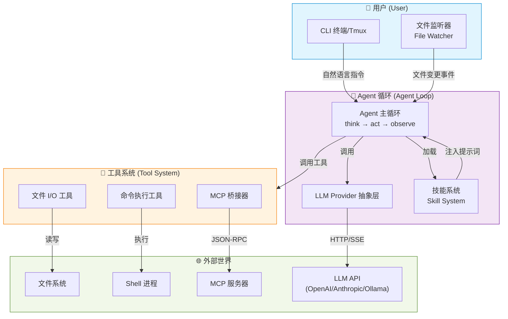
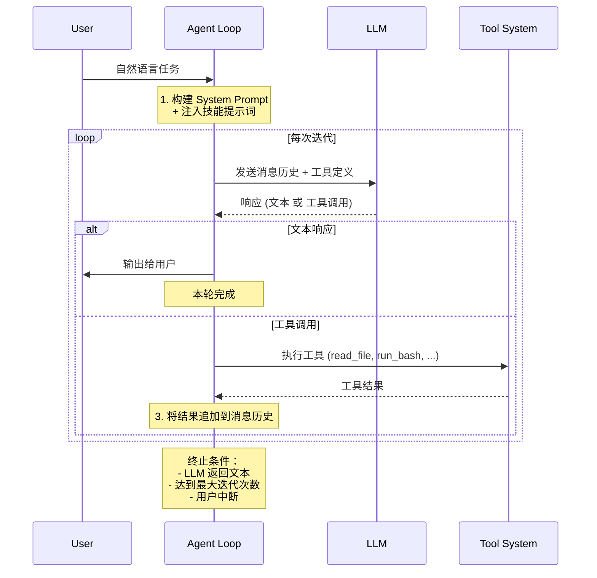
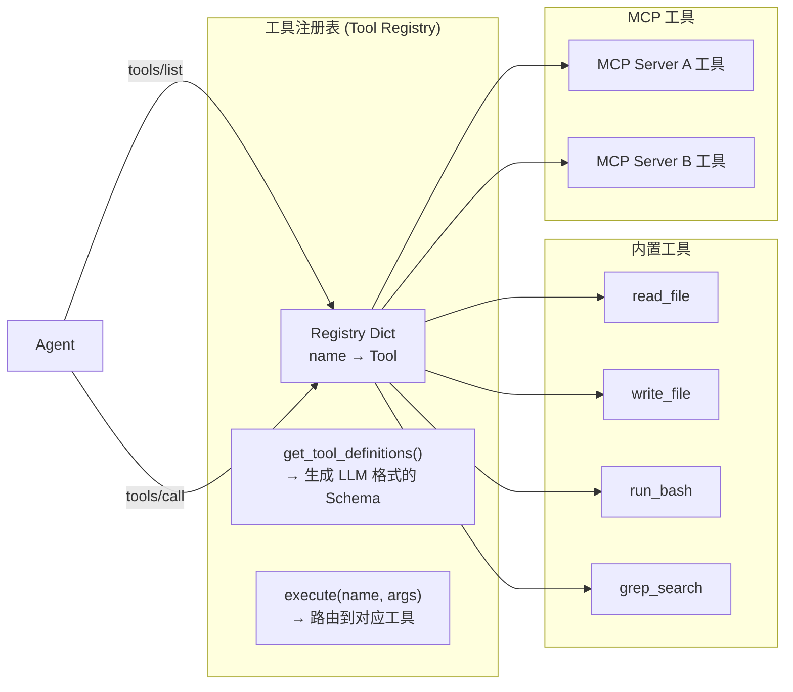
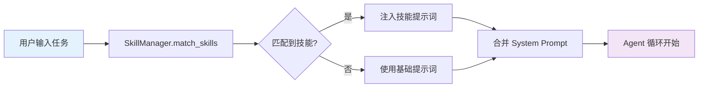
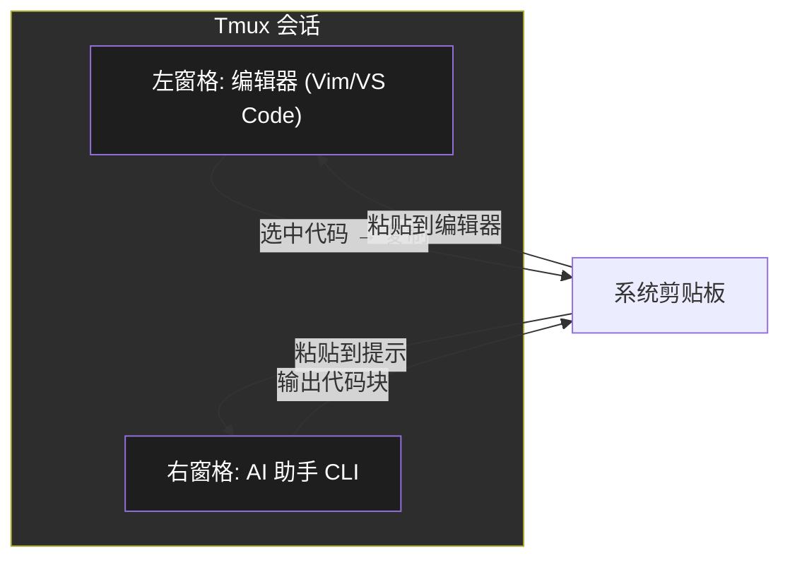

# 第5章 毕业项目：构建你的迷你 AI 编码助手
# Chapter 5: Graduation Project — Build Your Mini AI Coding Assistant

> **You've come a long way.** From understanding how LLMs generate tokens to mastering Agent（/ˈeɪdʒənt/） harnesses, MCP protocols, skill systems, and prompt engineering. Now it's time to bring it all together. In this graduation project, you will build a **Mini AI Coding Assistant** — a simplified but fully functional agent that can understand natural language instructions, read and write files, execute shell commands, and interact with MCP tools.
>
> **你已经走了很远。** 从理解 LLM 如何生成 Token 到掌握 Agent Harness、MCP 协议、技能系统和提示词工程。现在是把所有知识融会贯通的时候了。在这个毕业项目中，你将构建一个**迷你 AI 编码助手**——一个简化但功能完整的 Agent，能够理解自然语言指令、读写文件、执行 Shell 命令以及与 MCP 工具交互。

**前置知识 (Prerequisites):** 第 1-4 章全部内容、Python 基础、FastAPI / asyncio 基础
**完成时间 (Estimated Time):** 4-8 小时
**代码仓库 (Code Repo):** `code/05-mini-coding-assistant/`

---

## 目录 (Table of Contents)

1. [项目总览 (Project Overview)](#1-项目总览-project-overview)
2. [Part A: LLM Provider 抽象与 Agent 循环](#2-part-a-llm-provider-抽象与-agent-循环)
3. [Part B: 工具系统 (Tool System)](#3-part-b-工具系统-tool-system)
4. [Part C: 技能系统 (Skill System)](#4-part-c-技能系统-skill-system)
5. [Part D: IDE 集成 (IDE Integration)](#5-part-d-ide-集成-ide-integration)
6. [完整架构与运行 (Full Architecture & Running)](#6-完整架构与运行-full-architecture--running)
7. [扩展方向 (Extension Ideas)](#7-扩展方向-extension-ideas)

---

## 1. 项目总览 (Project Overview)

Your Mini AI Coding Assistant is a **local agent runtime** that connects an LLM to the developer's environment. It mimics the core loop of production assistants like OpenCode, Claude Code, or Cursor Agent — but simplified so you can understand every moving part.

你的迷你 AI 编码助手是一个**本地 Agent 运行时**，将 LLM 连接到开发者的环境。它模仿了 OpenCode、Claude Code、Cursor Agent 等生产级助手的核（kernel /ˈkɜːrnl/）心循环——但经过简化，让你能够理解每一个运动部件。

### 架构总览 (Architecture Overview)



### 组件概览 (Component Overview)

| 组件 | 职责 | 对应前序章节 |
|------|------|-------------|
| **LLM Provider 抽象层** | 统一 LLM API 调用接口，支持多 Provider 切换 | 第 7 章 (LLM), 第 9 章 (Tool Calling) |
| **Agent 主循环** | Think → Act → Observe 循环，驱动 Agent 行为 | 第 2 章 (Agent Harness) |
| **工具系统** | 文件 I/O、命令执行、MCP 桥接 | 第 3 章 (MCP & Tools) |
| **技能系统** | YAML 定义技能，动态加载与注入 | 第 4 章 (Skill & Prompt) |
| **IDE 集成** | CLI 界面、文件监听、上下文自动注入 | 第 1 章 (AI Coding Assistants) |

---

## 2. Part A: LLM Provider 抽象与 Agent 循环

This is the **heart** of your assistant. The LLM provider abstraction lets you swap models (GPT-4, Claude, local Ollama) with a single config change. The Agent loop is the runtime that drives the assistant step by step.

这是你助手的**心脏**。LLM Provider 抽象层让你只需更改一次配置就能切换模型（GPT-4、Claude、本地 Ollama）。Agent 循环是驱动助手一步步运行的运行时。

### 2.1 LLM Provider 抽象层 (Provider Abstraction)

The key insight: **all LLM APIs follow the same pattern** — send messages, receive completions, optionally handle tool calls. Abstract this into a base class:

核心思想：**所有 LLM API 都遵循相同模式**——发送消息、接收补全、可选地处理工具调用。将其抽象为一个基类：

```python
# llm_provider.py — LLM Provider 抽象层

from abc import ABC, abstractmethod
from dataclasses import dataclass, field
from typing import AsyncIterator, Optional

@dataclass
class Message:
    role: str       # "system" | "user" | "assistant" | "tool"
    content: str
    tool_calls: list = field(default_factory=list)
    tool_call_id: Optional[str] = None

@dataclass
class ToolDef:
    """工具定义，与 OpenAI/Anthropic 格式兼容"""
    name: str
    description: str
    input_schema: dict

class LLMProvider(ABC):
    """LLM Provider 抽象基类"""

    @abstractmethod
    async def chat(
        self,
        messages: list[Message],
        tools: Optional[list[ToolDef]] = None,
    ) -> AsyncIterator[Message]:
        """流式聊天补全，支持工具调用"""
        ...

    @abstractmethod
    async def chat_complete(
        self,
        messages: list[Message],
        tools: Optional[list[ToolDef]] = None,
    ) -> Message:
        """非流式聊天补全"""
        ...


class OpenAIProvider(LLMProvider):
    """OpenAI / 兼容 API 实现"""

    def __init__(self, api_key: str, base_url: str = "https://api.openai.com/v1",
                 model: str = "gpt-4o"):
        self.api_key = api_key
        self.base_url = base_url
        self.model = model

    async def chat(self, messages, tools=None):
        """将内部 Message 格式转为 OpenAI 格式，调用 API，再转回"""
        ...

    async def chat_complete(self, messages, tools=None):
        ...


class AnthropicProvider(LLMProvider):
    """Anthropic Claude 实现"""
    ...


class OllamaProvider(LLMProvider):
    """本地 Ollama 实现"""
    ...
```

**配置切换 (Configuration):**

```yaml
# config.yaml
llm:
  provider: openai          # openai | anthropic | ollama
  model: gpt-4o
  api_key: ${OPENAI_API_KEY}
  temperature: 0.3
  max_tokens: 4096
```

支持不同 Provider 的关键在于适配层：

```
你的代码 → Message 对象 → Provider Adapter → Provider API
             ↑                         ↓
         统一格式                 API 特有格式
```

### 2.2 Agent 主循环 (Agent Main Loop)

The Agent loop is a **ReAct-style** (Reasoning + Acting) cycle:

Agent 循环是一个 **ReAct 风格**（推理（inference /ˈɪnfərəns/） + 行动）的循环：



**核心实现 (Core Implementation):**

```python
# agent/core.py — Agent 主循环

class Agent:
    def __init__(self, provider: LLMProvider, tool_registry: ToolRegistry,
                 skill_manager: SkillManager, config: dict):
        self.llm = provider
        self.tools = tool_registry
        self.skills = skill_manager
        self.config = config
        self.messages: list[Message] = []
        self.max_iterations = config.get("max_iterations", 20)

    async def run(self, task: str) -> str:
        """运行 Agent 处理任务"""

        # 1. 注入技能提示词
        skill_prompt = self.skills.get_combined_prompt(task)
        system_msg = Message(role="system",
            content=self._build_system_prompt(skill_prompt))

        # 2. 添加用户消息
        self.messages = [system_msg,
            Message(role="user", content=task)]

        # 3. 获取可用工具定义
        tool_defs = self.tools.get_tool_definitions()

        # 4. Agent 循环
        for step in range(self.max_iterations):
            # Think: 调用 LLM
            response = await self.llm.chat_complete(
                self.messages, tools=tool_defs)

            self.messages.append(response)

            if response.tool_calls:
                # Act: 执行工具
                for tc in response.tool_calls:
                    result = await self.tools.execute(
                        tc.name, tc.arguments)
                    self.messages.append(Message(
                        role="tool",
                        tool_call_id=tc.id,
                        content=result,
                    ))
            else:
                # Observe: LLM 返回文本，任务完成
                return response.content

        return "Max iterations reached. Task incomplete."

    def _build_system_prompt(self, skill_prompt: str) -> str:
        return f"""You are a Mini AI Coding Assistant.

## Core Capabilities
- Read and write files
- Execute shell commands
- Search code with grep
- Use MCP tools when available

## Behavior Rules
1. Always explain your plan before making changes
2. Show the code you are about to write or modify
3. Run tests after making changes
4. If a command fails, diagnose and fix the issue
5. Ask for clarification when requirements are ambiguous

## Safety Rules
- Never execute destructive commands without confirmation
- Validate file paths are within the project
- Check for existing code before duplicating

{skill_prompt}"""
```

**关键设计决策 (Key Design Decisions):**

| 决策 | 选项 | 本项目的选择 | 理由 |
|------|------|-------------|------|
| 循环模式 | ReAct vs Plan-then-Execute | ReAct | 更简单，适合通用编码任务 |
| 工具 schema 格式 | OpenAI vs JSON Schema | 两者兼容 | 统一适配层 |
| 消息存储 | 内存 vs 数据库 | 内存 | 关注核心逻辑，简化持久化 |

---

## 3. Part B: 工具系统 (Tool System)

The tool system is how your agent **interacts with the outside world**. Every file read, every command execution, every MCP call goes through this system.

工具系统是你的 Agent **与外部世界交互**的方式。每一次文件读取、每一次命令执行、每一次 MCP 调用都通过这个系统。

### 3.1 工具注册与发现 (Tool Registry)



**工具接口 (Tool Interface):**

```python
# tools/base.py — 工具基类

from abc import ABC, abstractmethod
from dataclasses import dataclass

@dataclass
class ToolResult:
    success: bool
    output: str          # 标准输出
    error: str = ""      # 错误输出
    metadata: dict = None  # 额外信息

class BaseTool(ABC):
    """所有工具的基类"""

    name: str            # 工具名，如 "read_file"
    description: str     # LLM 看到的描述
    parameters: dict     # JSON Schema 格式的参数定义

    @abstractmethod
    async def execute(self, **kwargs) -> ToolResult:
        """执行工具逻辑"""
        ...
```

**内置工具实现 (Built-in Tools):**

```python
# tools/file_io.py — 文件 I/O 工具

class ReadFileTool(BaseTool):
    name = "read_file"
    description = "Read the contents of a file at the given path"
    parameters = {
        "type": "object",
        "properties": {
            "path": {"type": "string",
                     "description": "Absolute path to the file"},
            "offset": {"type": "integer",
                       "description": "Line number to start from"},
            "limit": {"type": "integer",
                      "description": "Maximum lines to read"},
        },
        "required": ["path"],
    }

    def __init__(self, project_root: str):
        self.project_root = project_root

    async def execute(self, path: str, offset: int = 0,
                      limit: int = 2000) -> ToolResult:
        try:
            # 安全限制：只能在项目目录内
            if not self._is_within_project(path):
                return ToolResult(False, "",
                    "Access denied: path outside project directory")
            with open(path, "r") as f:
                content = f.read()
            return ToolResult(True, content)
        except Exception as e:
            return ToolResult(False, "", str(e))

    def _is_within_project(self, path: str) -> bool:
        """安全检查：防止路径遍历攻击"""
        real = os.path.realpath(path)
        return real.startswith(self.project_root)


class WriteFileTool(BaseTool):
    name = "write_file"
    description = "Write content to a file. Creates directories if needed."
    # 类似实现，包含安全检查
    ...


class GrepSearchTool(BaseTool):
    name = "grep_search"
    description = "Search for text patterns in project files"
    # 实现代码搜索
    ...
```

**命令执行工具 (Command Execution Tool):**

```python
# tools/shell.py — Shell 执行工具

class RunBashTool(BaseTool):
    name = "run_bash"
    description = "Execute a shell command and capture its output"
    parameters = {
        "type": "object",
        "properties": {
            "command": {"type": "string",
                        "description": "Shell command to execute"},
            "timeout": {"type": "integer",
                        "description": "Timeout in seconds (default: 30)"},
            "workdir": {"type": "string",
                        "description": "Working directory"},
        },
        "required": ["command"],
    }

    def __init__(self, project_root: str):
        self.project_root = project_root

    async def execute(self, command: str, timeout: int = 30,
                      workdir: str = None) -> ToolResult:
        try:
            proc = await asyncio.create_subprocess_shell(
                command,
                stdout=asyncio.subprocess.PIPE,
                stderr=asyncio.subprocess.PIPE,
                cwd=workdir or self.project_root,
            )
            stdout, stderr = await asyncio.wait_for(
                proc.communicate(), timeout=timeout)
            return ToolResult(
                success=proc.returncode == 0,
                output=stdout.decode() if stdout else "",
                error=stderr.decode() if stderr else "",
            )
        except asyncio.TimeoutError:
            return ToolResult(False, "",
                f"Command timed out after {timeout}s")
        except Exception as e:
            return ToolResult(False, "", str(e))
```

### 3.2 MCP 桥接器 (MCP Bridge)

The MCP Bridge connects your tool system to any MCP-compatible server. This is the **universal adapter** — once you implement it, your agent can use any MCP tool.

MCP 桥接器将你的工具系统连接到任何 MCP 兼容的服务器。这是**通用适配器**——一旦实现，你的 Agent 可以使用任何 MCP 工具。

```python
# tools/mcp_bridge.py — MCP 桥接器

class MCPBridge:
    """MCP 协议桥接器，将 MCP 工具注册到 ToolRegistry"""

    def __init__(self, tool_registry: ToolRegistry):
        self.tool_registry = tool_registry
        self.servers: dict[str, MCPStdioClient] = {}

    async def connect_stdio(self, name: str, command: str,
                            args: list[str]):
        """通过 stdio 连接一个 MCP 服务器"""
        proc = await asyncio.create_subprocess_exec(
            command, *args,
            stdin=asyncio.subprocess.PIPE,
            stdout=asyncio.subprocess.PIPE,
            stderr=asyncio.subprocess.PIPE,
        )
        client = MCPStdioClient(name, proc)
        await client.initialize()
        self.servers[name] = client

        # 将 MCP 工具注册到 ToolRegistry
        for tool_def in await client.list_tools():
            self.tool_registry.register(
                MCPToolAdapter(client, tool_def))

    async def connect_sse(self, name: str, url: str):
        """通过 SSE (HTTP) 连接一个远程 MCP 服务器"""
        ...


class MCPStdioClient:
    """MCP stdio 传输客户端"""

    def __init__(self, name: str, proc):
        self.name = name
        self.proc = proc
        self._msg_id = 0

    async def send_request(self, method: str,
                           params: dict = None) -> dict:
        """发送 JSON-RPC 请求"""
        import json
        request = {
            "jsonrpc": "2.0",
            "id": self._msg_id,
            "method": method,
            "params": params or {},
        }
        self._msg_id += 1
        self.proc.stdin.write(
            json.dumps(request).encode() + b"\n")
        await self.proc.stdin.drain()

        line = await self.proc.stdout.readline()
        return json.loads(line)

    async def initialize(self):
        """MCP 初始化握手"""
        result = await self.send_request("initialize", {
            "protocolVersion": "2024-11-05",
            "capabilities": {},
            "clientInfo": {
                "name": "mini-coding-assistant",
                "version": "1.0.0",
            },
        })

    async def list_tools(self) -> list[dict]:
        """调用 tools/list 获取服务器提供的工具列表"""
        result = await self.send_request("tools/list")
        return result.get("result", {}).get("tools", [])

    async def call_tool(self, name: str, args: dict) -> dict:
        """调用 tools/call 执行工具"""
        result = await self.send_request("tools/call", {
            "name": name,
            "arguments": args,
        })
        return result.get("result", {})


class MCPToolAdapter(BaseTool):
    """将 MCP 工具适配为 BaseTool 接口"""

    def __init__(self, client: MCPStdioClient, tool_def: dict):
        self.client = client
        self.name = f"mcp_{tool_def['name']}"
        self.description = tool_def.get("description", "")
        self.parameters = tool_def.get("inputSchema", {})

    async def execute(self, **kwargs) -> ToolResult:
        result = await self.client.call_tool(
            self.name.replace("mcp_", ""), kwargs)
        content = result.get("content", [])
        text = "\n".join(
            c["text"] for c in content
            if c.get("type") == "text"
        )
        is_error = result.get("isError", False)
        return ToolResult(success=not is_error, output=text)
```

### 3.3 工具注册表 (Tool Registry)

```python
# tools/registry.py

class ToolRegistry:
    """管理所有可用工具"""

    def __init__(self):
        self._tools: dict[str, BaseTool] = {}

    def register(self, tool: BaseTool):
        """注册一个工具"""
        self._tools[tool.name] = tool

    def get_tool_definitions(self) -> list[ToolDef]:
        """生成 LLM 格式的工具定义列表"""
        return [
            ToolDef(name=t.name, description=t.description,
                    input_schema=t.parameters)
            for t in self._tools.values()
        ]

    async def execute(self, name: str, args: dict) -> str:
        """执行工具并返回序列化结果"""
        tool = self._tools.get(name)
        if not tool:
            return f"Error: Unknown tool '{name}'"
        result = await tool.execute(**args)
        if result.success:
            return result.output
        return f"Error: {result.error}"
```

---

## 4. Part C: 技能系统 (Skill System)

The skill system makes your assistant **specialized**. Instead of a generic assistant that tries to do everything, skills let you inject domain-specific instructions and tool permissions.

技能系统让你的助手**专业化**。技能不是让一个通用助手尝试做所有事情，而是让你注入特定领域的指令和工具权限。

### 4.1 YAML 技能定义 (YAML Skill Definition)

```yaml
# skills/web_dev.yaml — Web 开发技能
name: web_dev
version: 1.0.0
description: >
  Specialized in frontend and backend web development.
  Knows React, Vue, FastAPI, and common web patterns.
triggers:
  - "web"
  - "React"
  - "Vue"
  - "FastAPI"
  - "frontend"
  - "backend"
  - "API endpoint"
  - "component"
  - "CSS"

prompt: |
  You are a Web Development specialist assistant.

  ## Code Style Guidelines
  - Use TypeScript for frontend code
  - Prefer functional components with hooks over class components
  - Use async/await for all asynchronous operations
  - Follow the existing project's linting rules

  ## Best Practices
  - Add proper error handling for all API calls
  - Include loading states in UI components
  - Write responsive CSS (mobile-first)
  - Add input validation on both client and server

  ## Project Conventions
  - Components: src/components/
  - Pages: src/pages/
  - API routes: src/api/
  - Tests mirror source structure

tools:
  allowed:
    - read_file
    - write_file
    - run_bash
    - grep_search
    - mcp_fetch
  denied:
    - run_bash:
        patterns: ["rm -rf /", "sudo", "chmod 777"]
```

### 4.2 技能管理器 (Skill Manager)

```python
# skills/manager.py

import yaml
from pathlib import Path
from dataclasses import dataclass, field

@dataclass
class SkillTools:
    allowed: list[str] = field(default_factory=list)
    denied: list[str] = field(default_factory=list)

@dataclass
class Skill:
    name: str
    version: str
    description: str
    triggers: list[str]
    prompt: str
    tools: SkillTools

class SkillManager:
    """加载、匹配、注入技能"""

    def __init__(self, skills_dir: str = "./skills"):
        self.skills_dir = skills_dir
        self.skills: list[Skill] = []

    def load_all(self):
        """从 skills/ 目录加载所有 YAML 技能"""
        for file in Path(self.skills_dir).glob("*.yaml"):
            with open(file) as f:
                data = yaml.safe_load(f)
                self.skills.append(Skill(
                    name=data["name"],
                    version=data["version"],
                    description=data["description"],
                    triggers=data["triggers"],
                    prompt=data["prompt"],
                    tools=SkillTools(**data.get("tools", {})),
                ))

    def match_skills(self, task: str) -> list[Skill]:
        """根据任务内容匹配触发词"""
        matched = []
        for skill in self.skills:
            for trigger in skill.triggers:
                if trigger.lower() in task.lower():
                    matched.append(skill)
                    break
        return matched

    def get_combined_prompt(self, task: str) -> str:
        """注入匹配技能的提示词"""
        matched = self.match_skills(task)
        if not matched:
            return ""

        extra_prompts = "\n".join(s.prompt for s in matched)
        return f"\n## Active Skills\n{extra_prompts}\n"
```

### 4.3 技能加载与注入流程 (Skill Loading Pipeline)



---

## 5. Part D: IDE 集成 (IDE Integration)

An AI coding assistant needs to **integrate into the developer's workflow**. This means a CLI interface for interactive use, and file watching for automatic context injection.

AI 编码助手需要**融入开发者的工作流**。这意味着需要一个 CLI 界面用于交互式使用，以及文件监听用于自动上下文注入。

### 5.1 CLI 模式 (CLI Mode)

```python
# interface/cli.py — 交互式 CLI

from rich.console import Console
from rich.markdown import Markdown
from prompt_toolkit import PromptSession
from prompt_toolkit.history import FileHistory

console = Console()

class CodingAssistantCLI:
    """交互式编码助手 CLI"""

    def __init__(self, agent):
        self.agent = agent
        self.session = PromptSession(
            history=FileHistory(".assistant_history"))

    async def run(self):
        console.print("[bold cyan]🤖 Mini AI Coding Assistant[/]")
        console.print("Type your task, or /help for commands.\n")

        while True:
            try:
                user_input = await self.session.prompt_async(
                    ">>> ")

                if user_input.startswith("/"):
                    await self._handle_command(user_input)
                    continue

                if not user_input.strip():
                    continue

                # 运行 Agent
                result = await self.agent.run(user_input)
                console.print(Markdown(result))

            except (KeyboardInterrupt, EOFError):
                console.print("\n[yellow]Goodbye![/]")
                break

    async def _handle_command(self, cmd: str):
        """处理内部命令"""
        if cmd == "/exit" or cmd == "/quit":
            raise EOFError()
        elif cmd == "/help":
            console.print("""
# Commands
/exit, /quit  退出
/help         显示此帮助
/tools        列出可用工具
/status       显示当前状态
/clear        清屏
""")
        elif cmd == "/tools":
            defs = self.agent.tools.get_tool_definitions()
            for t in defs:
                console.print(f"  • [green]{t.name}[/]: {t.description}")
        elif cmd == "/status":
            console.print(f"LLM: {self.agent.llm.model}")
            console.print(f"Skills: {len(self.agent.skills.skills)} loaded")
            console.print(f"Tools: {len(self.agent.tools._tools)} registered")
```

### 5.2 Tmux 集成 (Tmux Integration)

For a real coding experience, integrate with **tmux** — run the assistant in a split pane alongside your editor:

为了真实的编码体验，与 **tmux** 集成——在编辑器旁边的分割窗格中运行助手：

```bash
#!/bin/bash
# tmux_assistant.sh — 在 Tmux 中启动助手

# 1. 在当前 Tmux 会话中创建垂直分割
tmux split-window -h -l 40%

# 2. 在右侧窗格启动助手
tmux send-keys -t {right-of} "python -m assistant.cli" Enter

# 3. 回到左侧编辑器窗格
tmux select-pane -L
```



### 5.3 文件监听器 (File Watcher)

A file watcher detects file changes and automatically injects relevant context (like LSP diagnostics, recent changes) into the agent's next prompt:

文件监听器检测文件变更，并自动将相关上下文（如 LSP 诊断、最近的更改）注入到 Agent 的下一个提示中：

```python
# interface/watcher.py — 文件变更监听器

from watchdog.observers import Observer
from watchdog.events import FileSystemEventHandler
import os

class ProjectContextWatcher(FileSystemEventHandler):
    """监听文件变更，收集上下文"""

    def __init__(self, project_root: str, agent):
        self.project_root = project_root
        self.agent = agent
        self.changed_files: set[str] = set()

    def on_modified(self, event):
        if event.src_path.endswith((".py", ".ts", ".js",
                                    ".tsx", ".jsx", ".go")):
            self.changed_files.add(event.src_path)

    def get_context_summary(self) -> str:
        """生成一段供 Agent 使用的上下文摘要"""
        if not self.changed_files:
            return ""
        summary = "## Recent File Changes\n"
        for f in sorted(self.changed_files)[-10:]:
            rel = os.path.relpath(f, self.project_root)
            summary += f"- Modified: {rel}\n"
        return summary

    def start(self):
        """启动文件监听"""
        observer = Observer()
        observer.schedule(self, self.project_root, recursive=True)
        observer.start()
```

**LSP 集成 (LSP Integration):**

```python
# interface/lsp_client.py — 简化版 LSP 客户端

class LSPClient:
    """轻量 LSP 客户端，收集诊断信息"""

    def __init__(self, command: str, args: list):
        import subprocess
        self.proc = subprocess.Popen(
            [command] + args,
            stdin=subprocess.PIPE,
            stdout=subprocess.PIPE,
            stderr=subprocess.PIPE,
        )

    def get_diagnostics(self, file_path: str) -> list[dict]:
        """获取文件的 LSP 诊断信息"""
        import json
        # 发送 textDocument/didOpen 通知
        self._send_notification("textDocument/didOpen", {
            "textDocument": {
                "uri": f"file://{file_path}",
                "languageId": self._detect_lang(file_path),
                "version": 1,
                "text": open(file_path).read(),
            }
        })
        return []

    def _detect_lang(self, path: str) -> str:
        ext = path.split(".")[-1]
        return {"py": "python", "ts": "typescript",
                "js": "javascript", "go": "go"}.get(ext, "plaintext")
```

---

## 6. 完整架构与运行 (Full Architecture & Running)

### 6.1 目录结构 (Project Layout)

```
mini-coding-assistant/
├── config.yaml              # 配置文件
├── main.py                  # 入口文件
├── requirements.txt         # 依赖
│
├── llm/
│   ├── __init__.py
│   ├── base.py              # LLMProvider 基类
│   ├── openai_provider.py   # OpenAI 实现
│   ├── anthropic_provider.py # Anthropic 实现
│   └── ollama_provider.py   # Ollama 实现
│
├── agent/
│   ├── __init__.py
│   ├── core.py              # Agent 主循环
│   └── message.py           # Message 数据结构
│
├── tools/
│   ├── __init__.py
│   ├── registry.py          # ToolRegistry
│   ├── base.py              # BaseTool 基类
│   ├── file_io.py           # 文件读写工具
│   ├── shell.py             # Shell 执行工具
│   ├── grep.py              # 代码搜索工具
│   └── mcp_bridge.py        # MCP 桥接器
│
├── skills/
│   ├── __init__.py
│   ├── manager.py           # SkillManager
│   ├── web_dev.yaml         # Web 开发技能
│   ├── python_dev.yaml      # Python 开发技能
│   └── system_admin.yaml    # 系统管理技能
│
└── interface/
    ├── __init__.py
    ├── cli.py               # CLI 界面
    ├── watcher.py           # 文件监听器
    └── lsp_client.py        # LSP 集成
```

### 6.2 启动流程 (Startup Sequence)

```python
# main.py — 入口文件

import asyncio
import yaml
from pathlib import Path

async def main():
    # 1. 加载配置
    with open("config.yaml") as f:
        config = yaml.safe_load(f)

    # 2. 初始化 LLM Provider
    provider = create_provider(config["llm"])

    # 3. 初始化工具注册表
    registry = ToolRegistry()
    registry.register(ReadFileTool(config["project_root"]))
    registry.register(WriteFileTool(config["project_root"]))
    registry.register(RunBashTool(config["project_root"]))
    registry.register(GrepSearchTool(config["project_root"]))

    # 4. 连接 MCP 服务器（可选）
    bridge = MCPBridge(registry)
    for mcp_config in config.get("mcp_servers", []):
        await bridge.connect_stdio(
            mcp_config["name"],
            mcp_config["command"],
            mcp_config["args"],
        )

    # 5. 加载技能
    skill_mgr = SkillManager(config["skills_dir"])
    skill_mgr.load_all()
    print(f"Loaded {len(skill_mgr.skills)} skills")

    # 6. 创建 Agent
    agent = Agent(
        provider=provider,
        tool_registry=registry,
        skill_manager=skill_mgr,
        config=config.get("agent", {}),
    )

    # 7. 启动文件监听（可选）
    if config.get("watch"):
        watcher = ProjectContextWatcher(
            config["project_root"], agent)
        watcher.start()

    # 8. 启动 CLI
    cli = CodingAssistantCLI(agent)
    await cli.run()


def create_provider(llm_config: dict) -> LLMProvider:
    """根据配置创建 LLM Provider"""
    provider_type = llm_config.pop("provider")
    if provider_type == "openai":
        return OpenAIProvider(**llm_config)
    elif provider_type == "anthropic":
        return AnthropicProvider(**llm_config)
    elif provider_type == "ollama":
        return OllamaProvider(**llm_config)
    else:
        raise ValueError(f"Unknown provider: {provider_type}")

if __name__ == "__main__":
    asyncio.run(main())
```

### 6.3 运行效果 (Demo Run)

当你启动助手后，一个典型的交互可能是这样的：

```
$ python main.py

🤖 Mini AI Coding Assistant
Type your task, or /help for commands.

>>> Add a new API endpoint GET /api/health that returns {"status": "ok"}

I'll add a health check endpoint to the FastAPI app.

Let me first check the current project structure:

  → run_bash: ls src/
     Output: main.py  models.py  routes/  __init__.py

  → read_file: src/main.py
     (reads existing FastAPI setup)

  → read_file: src/routes/__init__.py
     (reads router structure)

Now I'll create the health endpoint:

  → write_file: src/routes/health.py
     (writes the new endpoint)

  → run_bash: python -m pytest tests/ -v
     Output: All tests passed ✓

Done! Created `src/routes/health.py` with:
- GET /api/health returns {"status": "ok", "version": "1.0.0"}
- Added the router to the app in `main.py`
- Tests pass ✅
```

---

## 7. 扩展方向 (Extension Ideas)

你的迷你编码助手已经是一个完整可用的系统。但你还可以进一步扩展。以下是一些方向，按难度排序：

### 🌱 初级扩展 (Beginner)

| 扩展 | 描述 | 涉及章节 |
|------|------|---------|
| **对话历史持久化** | 将消息历史保存到 SQLite，支持多会话 | 第 2 章 (Memory) |
| **更多的内置工具** | 添加 `edit_file`（精确替换）、`diff`（比较文件）等 | 第 3 章 (Tools) |
| **更多技能定义** | 为 Go、Rust、Docker 等编写 YAML 技能 | 第 4 章 (Skills) |
| **输出流式打印** | 让 LLM 的文本响应流式输出到终端 | 第 2 章 (Agent Loop) |

### 🌿 中级扩展 (Intermediate)

| 扩展 | 描述 | 涉及章节 |
|------|------|---------|
| **多 Agent 协作** | 任务分解：规划 Agent → 执行 Agent → 审查 Agent | 第 2 章 (Scheduling) |
| **工具权限沙箱** | 按技能限制工具使用范围，实现 read-only 模式 | 第 2 章 (Sandbox) |
| **RAG 上下文增强** | 接入向量数据库，检索项目文档和历史代码 | 第 9 章 (RAG) |
| **SSE 远程 MCP** | 支持远程 MCP 服务器，通过 HTTP/SSE 传输 | 第 3 章 (MCP Transport) |

### 🌳 高级扩展 (Advanced)

| 扩展 | 描述 | 涉及章节 |
|------|------|---------|
| **终端 UI (TUI)** | 使用 Textual 或 Rich 构建全功能 TUI 界面 | 无直接对应 |
| **Git 感知** | 自动读取 git diff/stage，只在变更文件上工作 | 第 1 章 (Context) |
| **成本与 Token 追踪** | 记录每次请求的 token 消耗和成本 | 第 9 章 (LLMOps) |
| **VS Code 扩展** | 将助手打包为 VS Code Extension | 第 1 章 (IDE Plugin) |

---

> **Congratulations!** You have just designed and understood every component of a Mini AI Coding Assistant. You now know what powers tools like OpenCode, Claude Code, and Cursor under the hood. More importantly, you have built the mental model to design, debug, and extend such systems.
>
> **恭喜！** 你已经设计并理解了迷你 AI 编码助手的每一个组件。你现在知道了 OpenCode、Claude Code、Cursor 等工具的内部驱动力。更重要的是，你已经建立了设计、调试和扩展此类系统的思维模型。
>
> *This is not the end. This is where your journey as an AI systems builder truly begins.*
>
> *这不是终点。这是你作为 AI 系统构建者之旅的真正起点。*

---

*下一章: [第6章 终章：回顾与进阶之路](06-conclusion-and-roadmap.md)*
