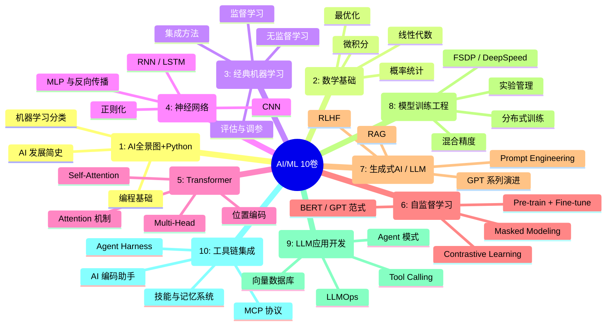

# 第6章 终章：回顾与进阶之路
# Chapter 6: Conclusion & Roadmap

> **You made it.** Ten volumes. From your first Python `print("hello world")` to building agent（/ˈeɪdʒənt/） harnesses that call MCP tools. This is the last chapter, but it is not the end. It is a launching pad.
>
> **你做到了。** 十卷。从你的第一行 `print("hello world")` 到构建能调用 MCP 工具的 Agent Harness。这是最后一章，但不是终点。这是一个起跳板。

**前置知识 (Prerequisites):** 全部之前章节
**阅读建议 (Reading Suggestion):** 找一杯你喜欢的饮料，找个舒服的角落。这一章不需要记笔记。

---

## 目录 (Table of Contents)

1. [学习路径回顾 (The Journey in Review)](#1-学习路径回顾-the-journey-in-review)
2. [三条进阶路径 (Three Advancement Paths)](#2-三条进阶路径-three-advancement-paths)
3. [推荐资源 (Recommended Resources)](#3-推荐资源-recommended-resources)
4. [持续跟进前沿 (Staying Current)](#4-持续跟进前沿-staying-current)
5. [最后的话 (Final Words)](#5-最后的话-final-words)

---

## 1. 学习路径回顾 (The Journey in Review)

Let us step back and look at the full landscape you have traversed.

让我们退后一步，看看你走过的整个知识版图。



### 关键里程碑 (Key Milestones)

**卷 1 (Volume 1):** 你迈出了最难的一步——开始。从 Python 语法到理解 AI 能做什么不能做什么，建立了一个稳固的心理模型。

**卷 2 (Volume 2):** 你啃下了硬骨头。线性代数中的矩阵乘法是神经网络的本质，概率论中的贝叶斯思维是所有机器学习的基础。看不懂没关系，回头再看。

**卷 3 (Volume 3):** 你理解了机器学习的灵魂——从数据中学习模式。决策树、SVM、聚类——这些经典算法今天仍然在生产系统中服务着数十亿用户。

**卷 4 (Volume 4):** 你见证了深度学习革命的起点。反向传播（backpropagation /ˌbækprəpəˈɡeɪʃən/）是过去十年 AI 爆发的引擎。CNN 让计算机"看见"，RNN 让机器"理解序列"。

**卷 5 (Volume 5):** Transformer（/trænsˈfɔːrmər/）。如果你只记住一卷，记住这一卷。注意力（attention /əˈtenʃən/）机制（Attention Mechanism）是 2017 年之后几乎所有重大突破的基石。GPT、BERT、DALL-E、Sora——全都建立在 Transformer 之上。

**卷 6 (Volume 6):** 你理解了"数据不需要标签"这个深刻思想。自监督学习让模型可以从无标注数据中学习，这是 GPT 和 BERT 成功的核（kernel /ˈkɜːrnl/）心原因。

**卷 7 (Volume 7):** 你站在了巨人的肩膀上。生成式 AI 不是魔术，它是大规模预训练 + 人类反馈 + 精心设计的推理（inference /ˈɪnfərəns/）策略的工程结晶。

**卷 8 (Volume 8):** 你看到了"炼丹"背后的工程科学。训练大模型不是魔法，是分布式系统、数值精度、内存管理和数据流水线的交响曲。

**卷 9 (Volume 9):** 你学会了如何驾驭 LLM。从 Prompt 到 RAG 到 Agent，你掌握了构建 AI 应用的核心模式。

**卷 10 (Volume 10):** 你走到了当前技术的前沿。理解了编码助手如何工作、Agent Harness 如何调度、MCP 如何连接模型与世界。你现在看到了"未来"的草图。

### 大图景 (The Big Picture)

把十卷连起来看，你会发现一条清晰的线索：

```
数据 → 数学建模 → 算法学习 → 神经网络 → 
注意力机制 → 自监督预训练 → 生成式模型 → 
工程化训练 → 应用开发 → 工具链集成
```

This is the pipeline from raw data to deployed intelligence. You now understand every stage.

这是从原始数据到部署智能的完整流水线。你现在理解每一个阶段。

---

## 2. 三条进阶路径 (Three Advancement Paths)

你已经完成了通识教育。现在是时候选择你的专精方向了。没有正确的选择，只有适合你的选择。

你不需要在第一天就选好。你可以在一个方向深耕几年，然后转向另一个。实际上，最好的 AI 工程师往往在两个方向的交叉点上做出最大的贡献。

### 路径 A: 研究路线 (Research Path)

**适合谁:** 你迷恋理论的美。你喜欢推导公式。你想知道"为什么"。你想发论文。你想成为下一个 Transformer 的发现者。

**接下来学什么:**
- 深入阅读经典论文（这正是下一节要列的）
- 复现论文实验（从简单模型开始）
- 学习高级数学：信息论、图论、泛函分析
- 参与开源研究项目（Hugging Face、EleutherAI）

**典型职位:**
- 研究科学家 (Research Scientist)
- 应用研究科学家 (Applied Scientist)
- 博士后 / 博士生

**核心技能:**
- 数学推导能力
- 实验设计和分析
- 论文写作和学术沟通
- 批判性思维——"所有人都这么说，但这是对的吗？"

### 路径 B: 工程路线 (Engineering Path)

**适合谁:** 你喜欢搭建系统。你关心延迟、吞吐、可靠性。你想让模型在真实世界中运行。你享受攻克工程难题。

**接下来学什么:**
- 深入学习 ML Engineering：Kubernetes、GPU 集群、模型部署
- 精通 MLOps：实验追踪、数据版本、模型注册表、A/B 测试
- 掌握推理优化：量化（quantize /ˈkwɒntaɪz/）、蒸馏（distillation /ˌdɪstɪˈleɪʃən/）、vLLM、Triton Inference Server
- 学习分布式系统：这是所有大规模 ML 的基础

**典型职位:**
- ML 工程师 (ML Engineer)
- 基础设施工程师 (Infrastructure Engineer)
- MLOps 工程师
- 推理平台工程师

**核心技能:**
- 系统设计和架构
- 编程能力（Go、Rust、Python）
- 性能分析和优化
- 运维和监控思维

### 路径 C: 产品路线 (Product Path)

**适合谁:** 你关心用户。你要用 AI 解决真实问题。你享受把技术翻译成产品。你懂得"做好"和"做对"的区别。

**接下来学什么:**
- 深入学习 LLM 应用模式：Agent、RAG、多模态、工具使用
- 学习产品设计和 UX：AI 交互有独特的设计原则
- 研究 AI 评估和安全：RLHF、红队测试、内容安全
- 学习快速原型：Streamlit、Gradio、Vercel AI SDK

**典型职位:**
- AI 产品经理 (AI PM)
- AI 应用开发者 (AI Application Developer)
- 创始工程师 / CTO
- AI 咨询顾问

**核心技能:**
- 用户思维和产品直觉
- 快速学习和原型能力
- 跨团队沟通
- 商业敏感性

> **一条实用的建议：** 即使你选择的是产品路线，也要保持至少工程路线的 30% 的深度。同样，即使你选择研究路线，也要懂得工程基础。AI 是一个交叉学科——纯理论家越来越少，能落地的人越来越值钱。
>
> **一个实用的建议：** 即使你选择了产品方向，也要保持至少 30% 的工程深度。同样，即使你选择研究路线，也要懂工程基础。AI 是一个交叉领域——纯理论家越来越少，能落地的人越来越有价值。

---

## 3. 推荐资源 (Recommended Resources)

### 必读论文 (Essential Papers)

这些论文构建了现代 AI 的骨架。按顺序阅读：

| # | 论文 | 为什么重要 |
|:--|:------|:----------|
| 1 | **Attention Is All You Need** (Vaswani et al., 2017) | Transformer 的诞生 |
| 2 | **ImageNet Classification（/ˌklæsɪfɪˈkeɪʃən/） with Deep CNNs** (Krizhevsky et al., 2012) | 深度学习爆发的起点 |
| 3 | **Deep Residual Learning** (He et al., 2015) | ResNet，让深度成为可能 |
| 4 | **BERT: Pre-training of Deep Bidirectional Transformers** (Devlin et al., 2018) | 预训练 + 微调范式 |
| 5 | **Language Models are Few-Shot Learners** (Brown et al., 2020) | GPT-3，规模的力量 |
| 6 | **Training Language Models to Follow Instructions** (Ouyang et al., 2022) | InstructGPT / RLHF |
| 7 | **Denoising Diffusion（/dɪˈfjuːʒən/） Probabilistic Models** (Ho et al., 2020) | DDPM，图像生成的基础 |
| 8 | **Generative Adversarial Nets** (Goodfellow et al., 2014) | GAN，生成对抗的思想 |
| 9 | **Mastering the Game of Go with Neural Networks** (Silver et al., 2016) | AlphaGo，强化（reinforcement /ˌriːɪnˈfɔːrsmənt/）学习的里程碑 |
| 10 | **NeRF: Representing Scenes as Neural Radiance Fields** (Mildenhall et al., 2020) | 3D 与神经渲染的结合 |

找论文的地方：arXiv (arxiv.org)、Papers with Code (paperswithcode.com)、Semantic Scholar。

### 必读书籍 (Essential Books)

| 书名 | 作者 | 适合路径 |
|:-----|:------|:---------|
| **Deep Learning** (花书) | Goodfellow, Bengio, Courville | 研究, 工程 |
| **Pattern Recognition and Machine Learning** | Bishop | 研究 |
| **Understanding Deep Learning** | Prince | 研究, 工程 |
| **The Elements of Statistical Learning** | Hastie, Tibshirani, Friedman | 研究 |
| **Designing Machine Learning Systems** | Chip Huyen | 工程 |
| **Building LLM Apps** | Valentine, Mshar | 产品, 工程 |
| **AI Engineering** | Chip Huyen | 工程, 产品 |

### 推荐课程 (Recommended Courses)

- **Stanford CS231n** (CNN / Computer Vision) — 经典中的经典
- **Stanford CS224n** (NLP) — Transformer 和语言模型的深度讲解
- **Fast.ai Practical Deep Learning** — 自上而下学习的典范，先做后懂
- **DeepLearning.AI Specialization** (Andrew Ng) — 系统、清晰、适合入门
- **UC Berkeley CS189** — 经典的 ML 课程，数学推导扎实
- **MIT 6.S191** — 深度学习入门，紧凑高效
- **Hugging Face NLP Course** — 最实用的 NLP 实战课程

### 优秀博客 (Excellent Blogs)

| 博客名称 | 链接 | 推荐理由 |
|:---------|:-----|:---------|
| **Distill** | distill.pub | 交互式可视化，对复杂概念的解释无与伦比 |
| **Lil'Log** | lilianweng.github.io | Lilian Weng 的博客，覆盖全面且深入 |
| **The Annotated Transformer** | nlpHarvard.github.io | 逐行解释 Transformer 代码 |
| **colah's blog** | colah.github.io | 深度学习的直观解释大师 |
| **inFERENCe** | inference.substack.com | Ferenc Huszar 的深刻见解 |
| **Sebastian Ruder** | ruder.io | NLP 和多任务学习的权威 |
| **Jay Alammar** | jalammar.github.io | 视觉化解释，Transformer 必读 |

---

## 4. 持续跟进前沿 (Staying Current)

AI 领域变化很快。如果你停下来一年，你会发现自己落后了两年。但这不是要你焦虑——而是要你建立系统。

### ArXiv 策略 (ArXiv Strategy)

不要试图读完所有论文。那是徒劳的。

**聪明的方法:**
1. 每天浏览 **arXiv Sanity Lite** (sanity.lit) 或 **Hugging Face Daily Papers**
2. 关注特定领域的 Top 会议论文（NeurIPS、ICML、ICLR、CVPR、ACL、EMNLP）
3. 只精读与你方向直接相关的论文（每月 3-5 篇是健康的速度）
4. 其他论文——读标题 + 摘要 + 结论就够了
5. 跟踪特定实验室：FAIR, Google DeepMind, OpenAI, Stanford AI Lab, MIT CSAIL

**推荐的 ArXiv 分类:**
- `cs.LG` — Machine Learning (最核心)
- `cs.CL` — Computation and Language (NLP / LLM)
- `cs.CV` — Computer Vision
- `cs.AI` — Artificial Intelligence
- `stat.ML` — Machine Learning (统计学视角)

### 社交媒体策略 (Social Media Strategy)

**Twitter / X 上值得关注的人:**
- Andrej Karpathy (@karpathy) — 前特斯拉 AI 总监，最好的 AI 教育家之一
- Ilya Sutskever (@ilyasut) — OpenAI 前首席科学家
- Yann LeCun (@ylecun) — Meta AI 首席，CNN 之父
- Demis Hassabis (@demishassabis) — DeepMind 创始人
- Francois Chollet (@fchollet) — Keras 作者，AI 思考者
- Sebastian Raschka (@rasbt) — 优秀的 AI 作者和教育者
- Lilian Weng (@lilianweng) — OpenAI VP，博客 Lil'Log 作者
- Chip Huyen (@chipro) — 工程路线指南作者

**LinkedIn:** 关注公司而非个人。OpenAI、Google DeepMind、Anthropic、Meta AI、Hugging Face、Mistral 的官方账号就是最好的 RSS 源。

### 学术会议 (Conferences)

| 会议 | 领域 | 投稿难度 | 适合 |
|:----|:-----|:--------|:----|
| **NeurIPS** | 全领域 ML | 极高 | 研究路线 |
| **ICML** | ML 理论和方法 | 极高 | 研究路线 |
| **ICLR** | 表征学习 | 极高 | 研究路线 |
| **CVPR** | 计算机视觉 | 很高 | 视觉方向 |
| **ACL / EMNLP** | NLP | 很高 | NLP 方向 |
| **SysML** | ML 系统 | 中等 | 工程路线 |

如果你是工程或产品路线，看会议录像和论文就够了。你不需要发论文。

### 社区 (Communities)

- **r/MachineLearning** (Reddit) — 论文讨论和行业新闻的最佳社区
- **Hugging Face Discord** — 最活跃的开源 AI 社区
- **MLOps.community** — 专注于 ML 工程和运维
- **PyTorch 社区** — GitHub Discussions + Dev Discussion 论坛
- **Twitter/X** — 实时性最强，适合跟踪最新动态
- **AI 相关的微信公众号和技术专栏** — 中文优质内容，适合日常碎片阅读

### 保持高效的方法 (Staying Efficient)

1. **不要追逐每一个新模型。** 理解原理比了解名字重要得多。知道为什么一个新模型有意义。如果它只是指标涨了 0.1%，不值得你花时间。

2. **动手实践。** 读十篇论文不如复现一篇论文。跑一个开源模型不如自己微调一个模型。动手是最快的理解方式。

3. **建立自己的笔记系统。** 写博客、写笔记、画图。教别人是最好的学习方式。你自己的"迷你百科"会逐渐变得珍贵。

4. **接受"永远学不完"。** AI 的知识网络太广阔了。没有人能精通所有领域。找到你的 niche（研究方向、工程领域、应用场景），深入下去。然后偶尔出来看看邻居在做什么。

---

## 5. 最后的话 (Final Words)

当你翻开这一卷时，你可能还是个对 AI 一知半解的新人。现在你站在了一座知识高地上——你理解了大语言模型的内部机制，你知道了如何训练和部署它们，你看到了 Agent 和工具集成的最新前沿。

但真正重要的是什么？

不是你记住了多少公式。不是你能复述多少架构。

是你现在拥有了和 AI 技术对话的语言。你能阅读论文，能理解技术讨论，能做出有根据的技术决策。你有了自学的能力。这是这份百科真正想给你的东西——不是鱼，是渔。

AI 领域正在经历一场前所未有的变革。Transformer 带来的革命还没有结束。我们可能离 AGI 还有五年，也可能还有五十年。没有人知道。但有一件事是确定的：那些理解技术本质的人，将在这场变革中最有发言权。

现在，轮到你了。

- 拿起一个你感兴趣的开源模型，跑一跑
- 找到你想解决的问题，用 AI 去解决它
- 分享你学到的东西，帮助下一个人
- 保持好奇，保持谦逊，坚持学下去

我们为这十卷投入了大量心血。如果其中有一个段落、一张图、一段代码让你感觉"啊，原来是这样"，那这一切就都值得了。

现在去构建属于你自己的东西吧。

> 路漫漫其修远兮，吾将上下而求索。
>
> The road ahead is long and winding, but you have the map. The rest is up to you.

---

*恭喜你完成了 AI/ML 十卷百科的全部学习。如果有任何问题或建议，欢迎通过 Cache 项目参与讨论。*

*Congratulations! You have completed all 10 volumes of the AI/ML Encyclopedia. If you have questions or suggestions, we welcome you to join the discussion in the Cache project.*

*—— 致每一位坚持到最后的读者*
