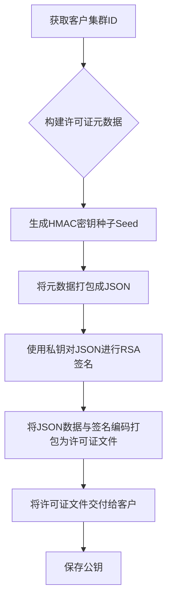
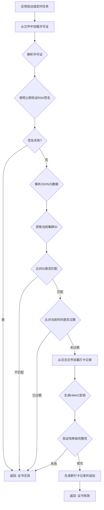

### 许可实现

#### 1. 许可证生成流程

由**服务端**执行的流程，用于为特定客户生成许可证文件。

**文字描述**：

1.  **获取集群 ID**：首先，从客户那里获取他们 Kubernetes 集群的唯一 ID。
2.  **构建元数据**：使用这个 ID，创建一个许可证元数据对象。该对象包含**集群 ID**、**许可证有效期**、**HMAC 密钥种子（Seed）** 等字段。该 Seed 是一个随机字符串，用于后续生成 HMAC 密钥。
3.  **RSA 签名**：将元数据对象序列化为 JSON 字符串，然后使用**私钥**对这个 JSON 进行签名。这个签名是许可证真实性的唯一凭证。
4.  **打包交付**：将原始 JSON 数据和生成的签名进行编码和拼接，形成最终的许可证文件。这个文件随后被交付给客户。

#### 2. 许可证校验与每日打卡流程

由**客户端**（在客户 Kubernetes Pod 中运行的应用程序）执行的流程，用于验证许可证的有效性。

**文字描述**：

1.  **加载与解析**：程序首先读取许可证文件，并分离出签名和原始数据。
2.  **RSA 签名验证**：使用**公钥**来验证签名。如果签名无效，则立即判定许可证为非法，因为它要么被篡改，要么不是由签发方生成的。
3.  **数据校验**：签名验证通过后，程序解析元数据。它会将许可证中的集群 ID 与当前 Pod 运行的集群 ID 进行比对，确保许可证未被跨集群使用。同时，它也会检查许可证的有效期。
4.  **HMAC 哈希链验证**：这是最关键的步骤。
      * 程序首先根据许可证中的**集群 ID**和**密钥种子（Seed）** 生成一个只有它自己知道的 HMAC **私有密钥**。
      * 然后，它从打卡日志中逐条读取记录，并使用这个私有密钥和哈希链的逻辑（日期与前一个哈希）来重新计算每个哈希。
      * 如果任何一条记录的重新计算哈希与存储的哈希不匹配，则判定哈希链被篡改，许可证非法。
5.  **每日打卡**：如果所有校验都通过，程序会生成一条新的打卡记录，并将其哈希追加到日志文件中，完成一次“每日打卡”。

### 整体资源结构

该许可证系统在 Kubernetes 环境下需要以下资源协同工作。

#### 1. 权限管理

* **ServiceAccount**：一个专用的账户，用于 Pod 的身份认证。
* **ClusterRole**：一个集群级别的角色，授予 Pod 访问集群资源的权限。由于 `namespaces` 资源是集群级别的，需要使用 `ClusterRole` 而非 `Role`。这个 `ClusterRole` 仅授予 `get` `namespaces` 的权限。
* **ClusterRoleBinding**：将 `ClusterRole` 绑定到 Pod 的 `ServiceAccount`，从而赋予其获取 `namespaces` 资源的权限。

#### 2. 应用部署

* **Deployment**：定义应用程序的部署方式，包括 Pod 数量、镜像、端口等。其中，最重要的是要将 Pod 的 `serviceAccountName` 字段设置为创建的 `ServiceAccount`，确保它能够获得正确的 RBAC 权限。

#### 3. 外部文件

* **`public.pem`**：包含用于验签的公钥，打包在应用程序镜像中。
* **`license.dat`**：客户的许可证文件，在部署时被挂载到 Pod 中。
* **`license_log.dat`**：每日打卡记录文件，需要在 Pod 启动时持久化存储。

#### 4. 表结构

* **`运营端表`**： 
  * issuer          签发方
  * subject_name    主体
  * license         许可信息
  * key_pair        公私钥
  * expire_at       到期时间
  * note            备注
  * uid             环境唯一标识

